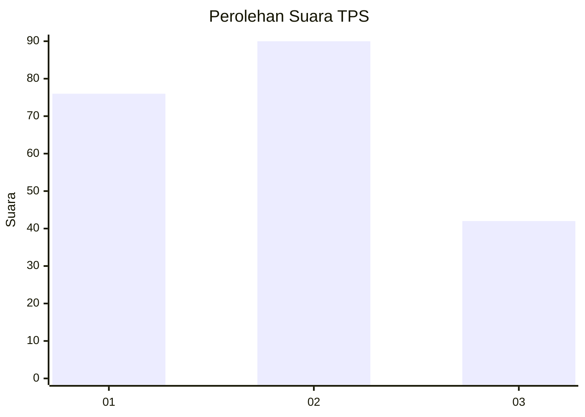
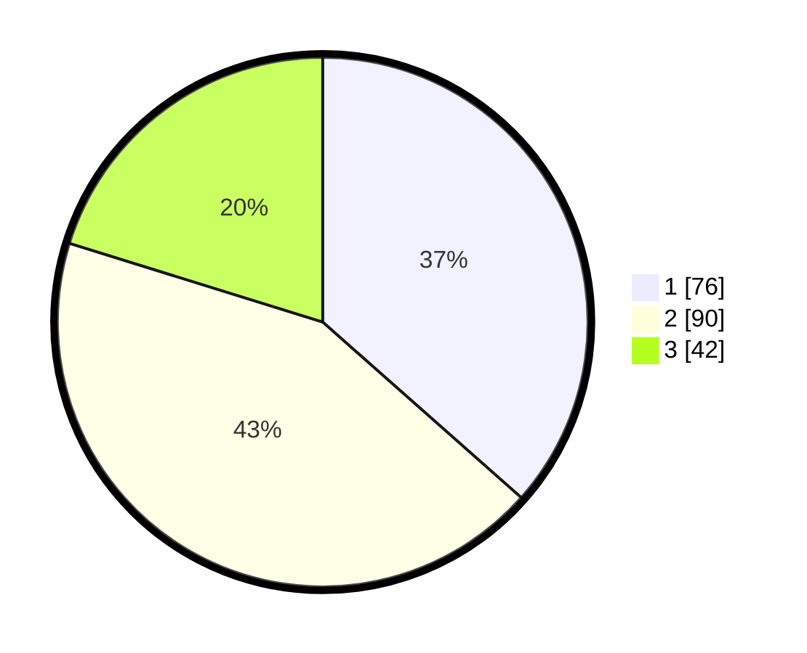

# Hasil

## Grafik

## Tabel

| No. | Nama Paslon    | Suara | Suara (raw) | Persentase |
|:--- |:-------------- | -----:| -----------:| ----------:|
| 1   | ANIES MUHAIMIN | 76    | [76][p-1]   | 36,54      |
| 2   | PRABOWO GIBRAN | 90    | [90][p-2]   | 43,27      |
| 3   | GANJAR MAHFUD  | 42    | [42][p-3]   | 20,19      |

[p-1]: https://github.com/gigit-pemilu/pemilu-2024-32-jawa-barat/blob/main/pilpres/hitung-suara/sub/32-jawa-barat/sub/18-pangandaran/sub/04-cigugur/sub/2001-cigugur/sub/001-tps/sub/paslon-1.txt
[p-2]: https://github.com/gigit-pemilu/pemilu-2024-32-jawa-barat/blob/main/pilpres/hitung-suara/sub/32-jawa-barat/sub/18-pangandaran/sub/04-cigugur/sub/2001-cigugur/sub/001-tps/sub/paslon-2.txt
[p-3]: https://github.com/gigit-pemilu/pemilu-2024-32-jawa-barat/blob/main/pilpres/hitung-suara/sub/32-jawa-barat/sub/18-pangandaran/sub/04-cigugur/sub/2001-cigugur/sub/001-tps/sub/paslon-3.txt

## Foto C Plano

https://sirekap-obj-formc.kpu.go.id/c2a8/pemilu/ppwp/32/18/04/20/01/3218042001001-20240214-201153--78cd5e57-2921-4aa5-8cca-434676c3002b.jpg

https://sirekap-obj-formc.kpu.go.id/c2a8/pemilu/ppwp/32/18/04/20/01/3218042001001-20240214-201224--fe56e581-8121-443f-84dd-fd72d7297de1.jpg

https://sirekap-obj-formc.kpu.go.id/c2a8/pemilu/ppwp/32/18/04/20/01/3218042001001-20240215-035631--4e01cf66-febb-494d-8c4f-0983e30cb5c9.jpg

## Metadata

| Key        | Value               |
| ---------- | ------------------- |
| Time Stamp | 2024-02-17 16:52:47 |

