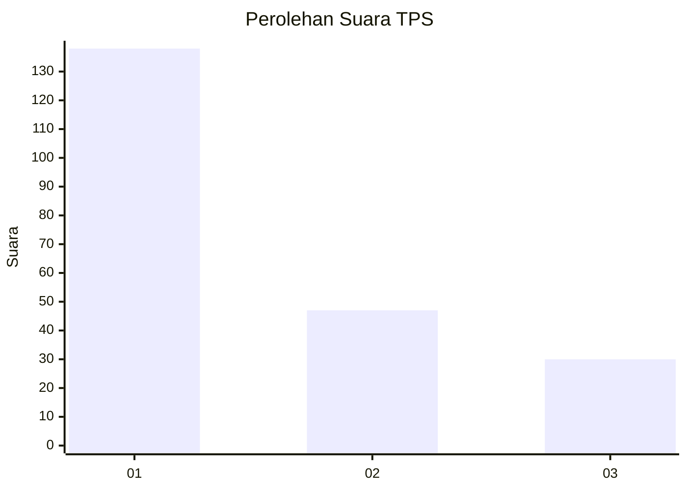
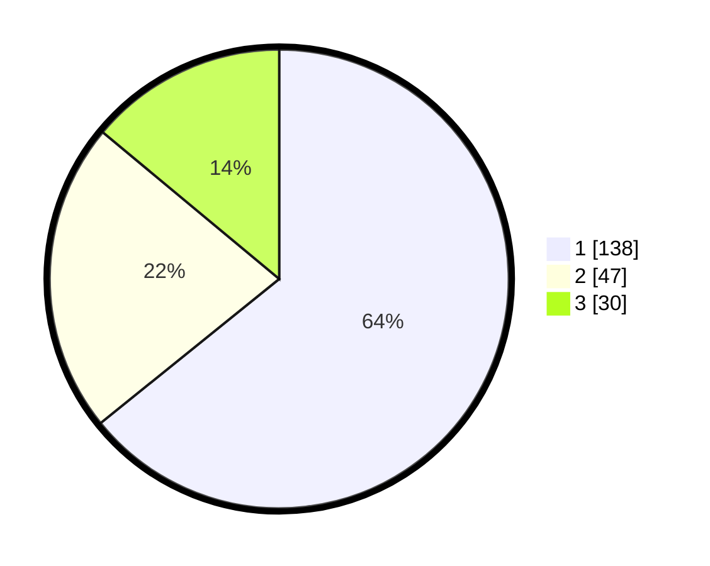

# Hasil

## Grafik

## Tabel

| No. | Nama Paslon    | Suara | Suara (raw) | Persentase |
|:--- |:-------------- | -----:| -----------:| ----------:|
| 1   | ANIES MUHAIMIN | 138   | [138][p-1]  | 64,19      |
| 2   | PRABOWO GIBRAN | 47    | [47][p-2]   | 21,86      |
| 3   | GANJAR MAHFUD  | 30    | [30][p-3]   | 13,95      |

[p-1]: https://github.com/gigit-pemilu/pemilu-2024-32-jawa-barat/blob/main/pilpres/hitung-suara/sub/32-jawa-barat/sub/18-pangandaran/sub/04-cigugur/sub/2005-bunisari/sub/003-tps/sub/paslon-1.txt
[p-2]: https://github.com/gigit-pemilu/pemilu-2024-32-jawa-barat/blob/main/pilpres/hitung-suara/sub/32-jawa-barat/sub/18-pangandaran/sub/04-cigugur/sub/2005-bunisari/sub/003-tps/sub/paslon-2.txt
[p-3]: https://github.com/gigit-pemilu/pemilu-2024-32-jawa-barat/blob/main/pilpres/hitung-suara/sub/32-jawa-barat/sub/18-pangandaran/sub/04-cigugur/sub/2005-bunisari/sub/003-tps/sub/paslon-3.txt

## Foto C Plano

https://sirekap-obj-formc.kpu.go.id/a187/pemilu/ppwp/32/18/04/20/05/3218042005003-20240214-210659--df40ab04-2f38-48de-9cc0-96b867127f4b.jpg

https://sirekap-obj-formc.kpu.go.id/a187/pemilu/ppwp/32/18/04/20/05/3218042005003-20240214-210759--f6f6f4f9-fd54-4d7f-b5d3-63ecd19552a2.jpg

https://sirekap-obj-formc.kpu.go.id/a187/pemilu/ppwp/32/18/04/20/05/3218042005003-20240214-210846--ded5ac7e-7e53-42a3-a95f-89879d04e933.jpg

## Metadata

| Key        | Value               |
| ---------- | ------------------- |
| Time Stamp | 2024-02-16 14:30:33 |

