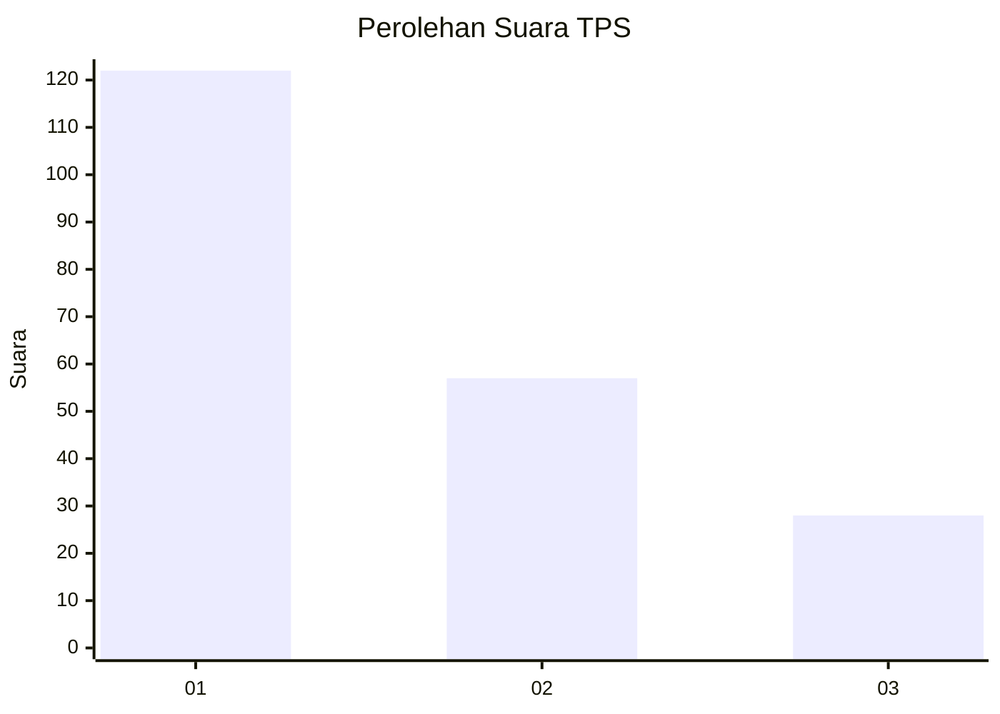
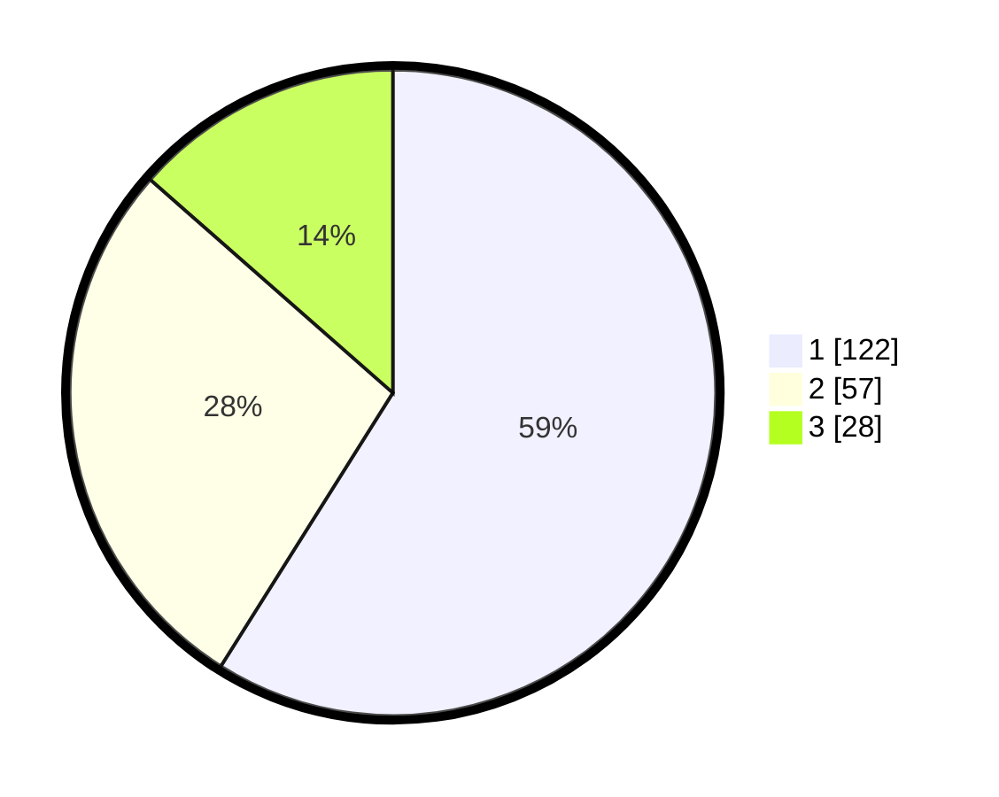

# Hasil

## Grafik

## Tabel

| No. | Nama Paslon    | Suara | Suara (raw) | Persentase |
|:--- |:-------------- | -----:| -----------:| ----------:|
| 1   | ANIES MUHAIMIN | 122   | [122][p-1]  | 58,94      |
| 2   | PRABOWO GIBRAN | 57    | [57][p-2]   | 27,54      |
| 3   | GANJAR MAHFUD  | 28    | [28][p-3]   | 13,53      |

[p-1]: https://github.com/gigit-pemilu/pemilu-2024/blob/main/pilpres/hitung-suara/sub/32-jawa-barat/sub/18-pangandaran/sub/04-cigugur/sub/2005-bunisari/sub/004-tps/sub/paslon-1.txt
[p-2]: https://github.com/gigit-pemilu/pemilu-2024/blob/main/pilpres/hitung-suara/sub/32-jawa-barat/sub/18-pangandaran/sub/04-cigugur/sub/2005-bunisari/sub/004-tps/sub/paslon-2.txt
[p-3]: https://github.com/gigit-pemilu/pemilu-2024/blob/main/pilpres/hitung-suara/sub/32-jawa-barat/sub/18-pangandaran/sub/04-cigugur/sub/2005-bunisari/sub/004-tps/sub/paslon-3.txt

## Foto C Plano

https://sirekap-obj-formc.kpu.go.id/9d6a/pemilu/ppwp/32/18/04/20/05/3218042005004-20240214-233821--0fad676c-d5f8-49f9-9c81-aaf54528cd71.jpg

https://sirekap-obj-formc.kpu.go.id/9d6a/pemilu/ppwp/32/18/04/20/05/3218042005004-20240214-213509--7c38824e-008a-4649-9070-3b12b0515a6a.jpg

https://sirekap-obj-formc.kpu.go.id/9d6a/pemilu/ppwp/32/18/04/20/05/3218042005004-20240214-213513--84dbf982-f14e-4cac-bd7d-85cede8b6a18.jpg

## Metadata

| Key        | Value               |
| ---------- | ------------------- |
| Time Stamp | 2024-02-16 14:30:33 |

