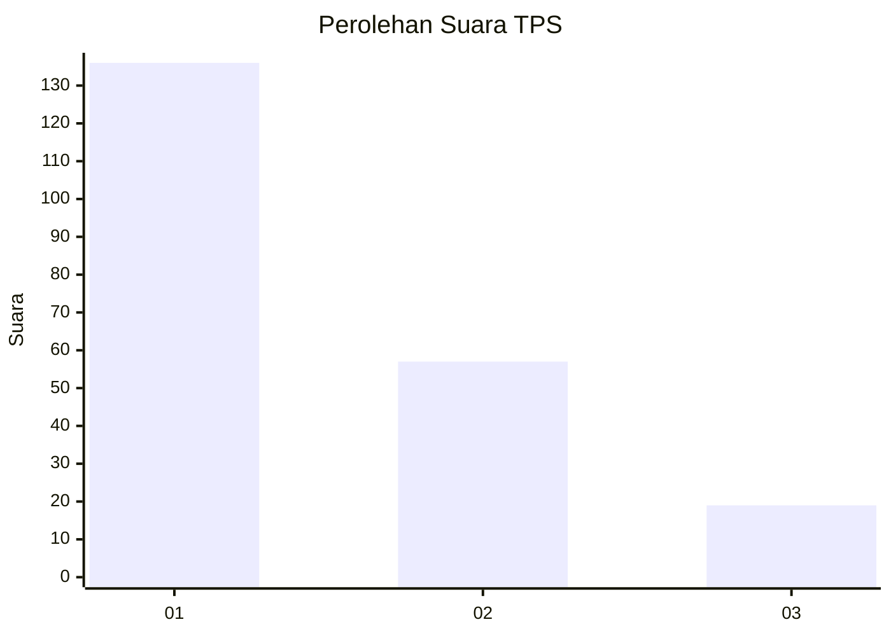
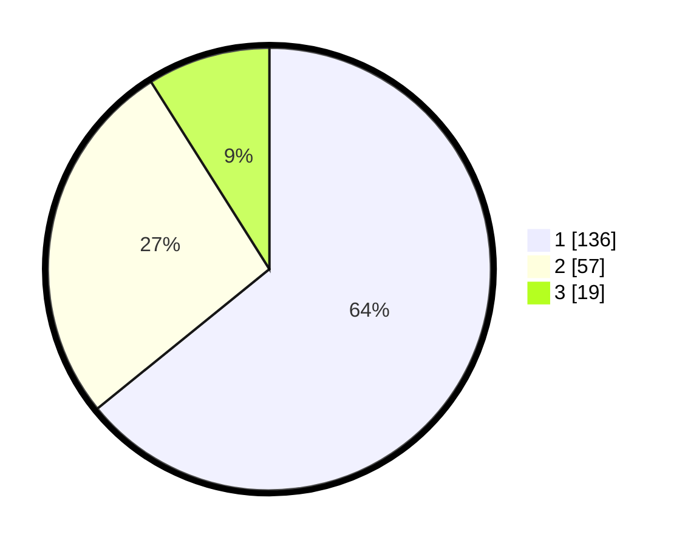

# Hasil

## Grafik

## Tabel

| No. | Nama Paslon    | Suara | Suara (raw) | Persentase |
|:--- |:-------------- | -----:| -----------:| ----------:|
| 1   | ANIES MUHAIMIN | 136   | [136][p-1]  | 64,15      |
| 2   | PRABOWO GIBRAN | 57    | [57][p-2]   | 26,89      |
| 3   | GANJAR MAHFUD  | 19    | [19][p-3]   | 8,96       |

[p-1]: https://github.com/gigit-pemilu/pemilu-2024-32-jawa-barat/blob/main/pilpres/hitung-suara/sub/32-jawa-barat/sub/18-pangandaran/sub/04-cigugur/sub/2005-bunisari/sub/006-tps/sub/paslon-1.txt
[p-2]: https://github.com/gigit-pemilu/pemilu-2024-32-jawa-barat/blob/main/pilpres/hitung-suara/sub/32-jawa-barat/sub/18-pangandaran/sub/04-cigugur/sub/2005-bunisari/sub/006-tps/sub/paslon-2.txt
[p-3]: https://github.com/gigit-pemilu/pemilu-2024-32-jawa-barat/blob/main/pilpres/hitung-suara/sub/32-jawa-barat/sub/18-pangandaran/sub/04-cigugur/sub/2005-bunisari/sub/006-tps/sub/paslon-3.txt

## Foto C Plano

https://sirekap-obj-formc.kpu.go.id/bf84/pemilu/ppwp/32/18/04/20/05/3218042005006-20240215-051609--e40c3b4b-a551-440d-ba74-e6b7a30eb1bd.jpg

https://sirekap-obj-formc.kpu.go.id/bf84/pemilu/ppwp/32/18/04/20/05/3218042005006-20240214-204630--35cd20e9-f0ed-4cb4-a348-8f725c94360d.jpg

https://sirekap-obj-formc.kpu.go.id/bf84/pemilu/ppwp/32/18/04/20/05/3218042005006-20240215-051804--b21f9ca9-61bd-4490-9173-f8a6305ffd9a.jpg

## Metadata

| Key        | Value               |
| ---------- | ------------------- |
| Time Stamp | 2024-02-15 15:30:25 |

