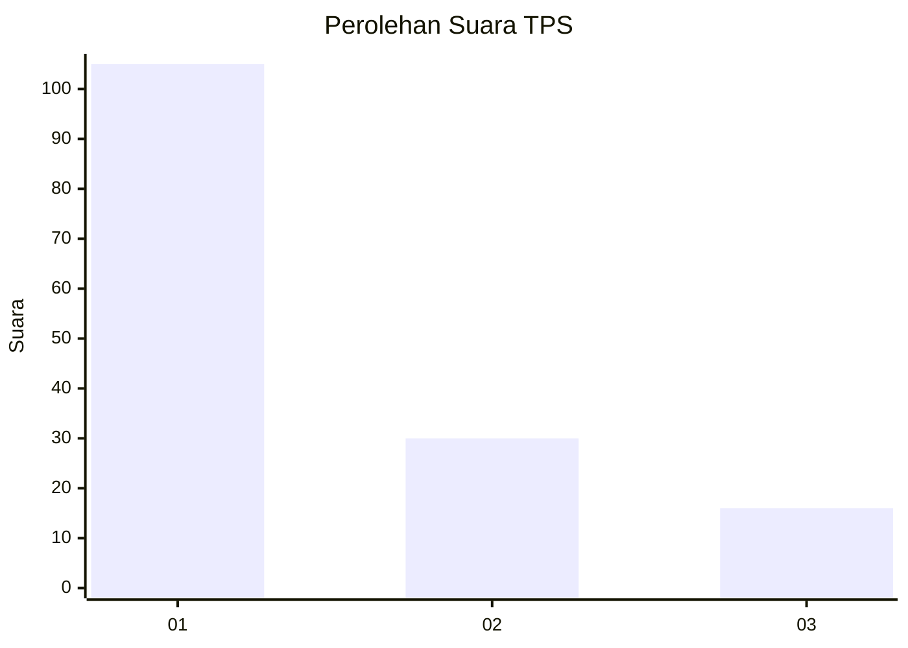
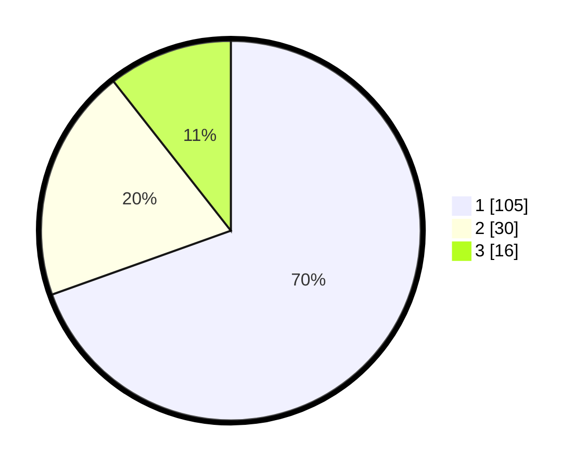

# Hasil

## Grafik

## Tabel

| No. | Nama Paslon    | Suara | Suara (raw) | Persentase |
|:--- |:-------------- | -----:| -----------:| ----------:|
| 1   | ANIES MUHAIMIN | 105   | [105][p-1]  | 69,54      |
| 2   | PRABOWO GIBRAN | 30    | [30][p-2]   | 19,87      |
| 3   | GANJAR MAHFUD  | 16    | [16][p-3]   | 10,60      |

[p-1]: https://github.com/gigit-pemilu/pemilu-2024/blob/main/pilpres/hitung-suara/sub/32-jawa-barat/sub/18-pangandaran/sub/04-cigugur/sub/2006-campaka/sub/008-tps/sub/paslon-1.txt
[p-2]: https://github.com/gigit-pemilu/pemilu-2024/blob/main/pilpres/hitung-suara/sub/32-jawa-barat/sub/18-pangandaran/sub/04-cigugur/sub/2006-campaka/sub/008-tps/sub/paslon-2.txt
[p-3]: https://github.com/gigit-pemilu/pemilu-2024/blob/main/pilpres/hitung-suara/sub/32-jawa-barat/sub/18-pangandaran/sub/04-cigugur/sub/2006-campaka/sub/008-tps/sub/paslon-3.txt

## Foto C Plano

https://sirekap-obj-formc.kpu.go.id/1714/pemilu/ppwp/32/18/04/20/06/3218042006008-20240215-014428--e25a02c8-5ab8-407d-87e2-897786dfb664.jpg

https://sirekap-obj-formc.kpu.go.id/1714/pemilu/ppwp/32/18/04/20/06/3218042006008-20240215-014554--fe9a181f-7f8e-475b-aa94-03ddd2cc875f.jpg

https://sirekap-obj-formc.kpu.go.id/1714/pemilu/ppwp/32/18/04/20/06/3218042006008-20240215-014621--05382779-ed6f-40ad-9514-4acd1c18c9c3.jpg

## Metadata

| Key        | Value               |
| ---------- | ------------------- |
| Time Stamp | 2024-02-24 22:31:28 |

