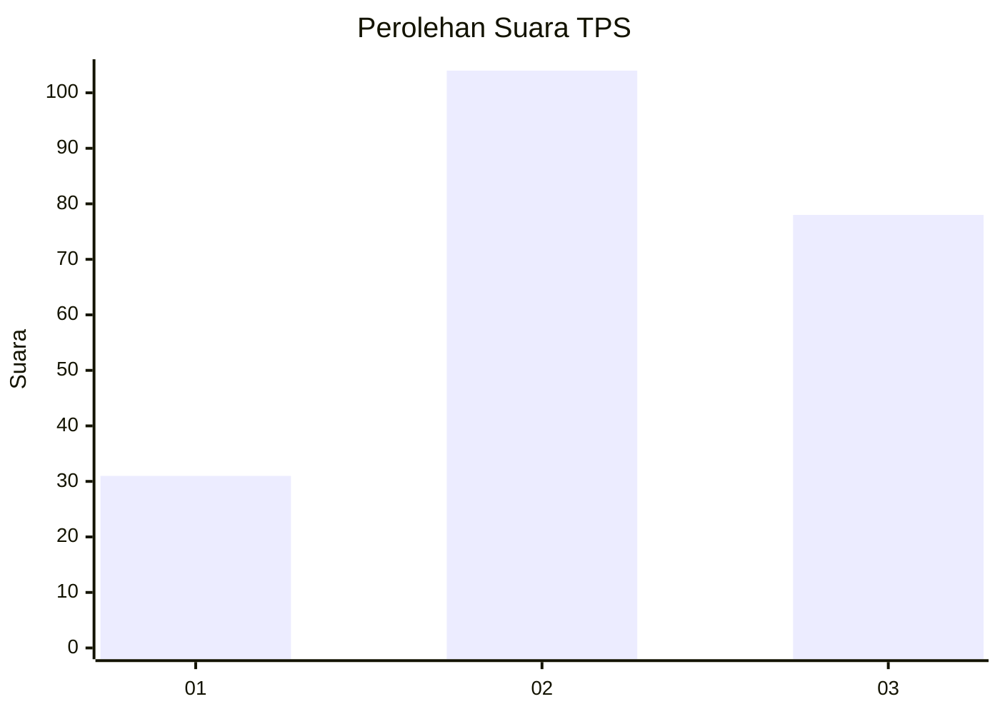
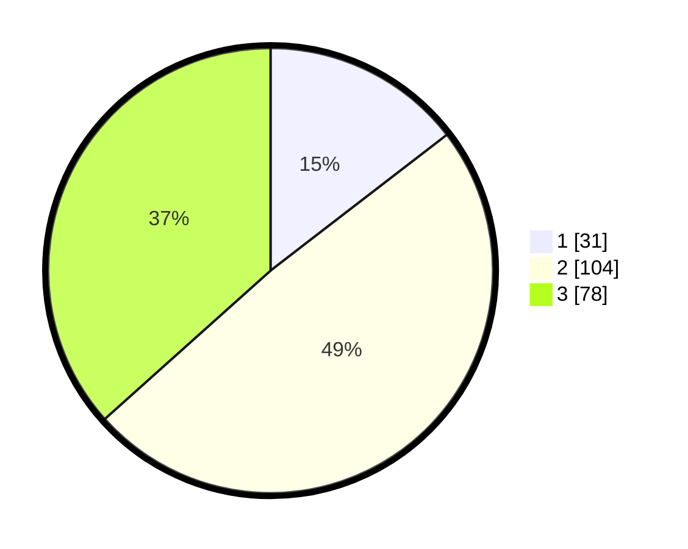

# Hasil

## Grafik

## Tabel

| No. | Nama Paslon    | Suara | Suara (raw) | Persentase |
|:--- |:-------------- | -----:| -----------:| ----------:|
| 1   | ANIES MUHAIMIN | 31    | [31][p-1]   | 14,55      |
| 2   | PRABOWO GIBRAN | 104   | [104][p-2]  | 48,83      |
| 3   | GANJAR MAHFUD  | 78    | [78][p-3]   | 36,62      |

[p-1]: https://github.com/gigit-pemilu/pemilu-2024-32-jawa-barat/blob/main/pilpres/hitung-suara/sub/32-jawa-barat/sub/18-pangandaran/sub/05-langkaplancar/sub/2001-karangkamiri/sub/002-tps/sub/paslon-1.txt
[p-2]: https://github.com/gigit-pemilu/pemilu-2024-32-jawa-barat/blob/main/pilpres/hitung-suara/sub/32-jawa-barat/sub/18-pangandaran/sub/05-langkaplancar/sub/2001-karangkamiri/sub/002-tps/sub/paslon-2.txt
[p-3]: https://github.com/gigit-pemilu/pemilu-2024-32-jawa-barat/blob/main/pilpres/hitung-suara/sub/32-jawa-barat/sub/18-pangandaran/sub/05-langkaplancar/sub/2001-karangkamiri/sub/002-tps/sub/paslon-3.txt

## Foto C Plano

https://sirekap-obj-formc.kpu.go.id/8873/pemilu/ppwp/32/18/05/20/01/3218052001002-20240214-225711--0e324733-48f9-4fd9-b814-e95ee7d2b209.jpg

https://sirekap-obj-formc.kpu.go.id/8873/pemilu/ppwp/32/18/05/20/01/3218052001002-20240214-225810--9d902ec5-ab91-42d2-88ff-b3879630ad92.jpg

https://sirekap-obj-formc.kpu.go.id/8873/pemilu/ppwp/32/18/05/20/01/3218052001002-20240214-225925--5ae1dc75-eb04-4e51-816e-7989c20edb89.jpg

## Metadata

| Key        | Value               |
| ---------- | ------------------- |
| Time Stamp | 2024-02-15 12:00:28 |

