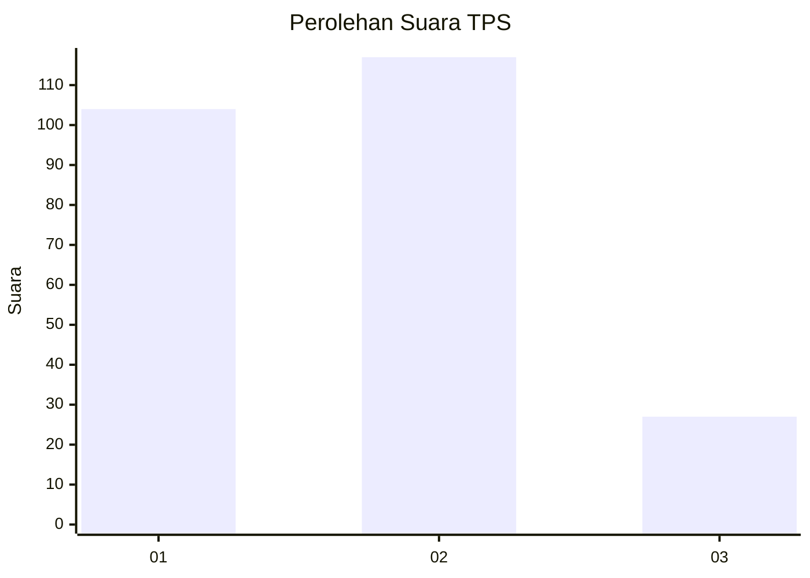
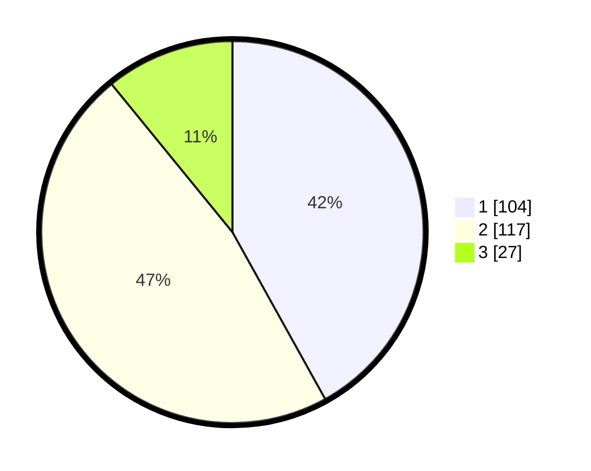

# Hasil

## Grafik

## Tabel

| No. | Nama Paslon    | Suara | Suara (raw) | Persentase |
|:--- |:-------------- | -----:| -----------:| ----------:|
| 1   | ANIES MUHAIMIN | 104   | [104][p-1]  | 41,94      |
| 2   | PRABOWO GIBRAN | 117   | [117][p-2]  | 47,18      |
| 3   | GANJAR MAHFUD  | 27    | [27][p-3]   | 10,89      |

[p-1]: https://github.com/gigit-pemilu/pemilu-2024/blob/main/pilpres/hitung-suara/sub/32-jawa-barat/sub/18-pangandaran/sub/05-langkaplancar/sub/2001-karangkamiri/sub/007-tps/sub/paslon-1.txt
[p-2]: https://github.com/gigit-pemilu/pemilu-2024/blob/main/pilpres/hitung-suara/sub/32-jawa-barat/sub/18-pangandaran/sub/05-langkaplancar/sub/2001-karangkamiri/sub/007-tps/sub/paslon-2.txt
[p-3]: https://github.com/gigit-pemilu/pemilu-2024/blob/main/pilpres/hitung-suara/sub/32-jawa-barat/sub/18-pangandaran/sub/05-langkaplancar/sub/2001-karangkamiri/sub/007-tps/sub/paslon-3.txt

## Foto C Plano

https://sirekap-obj-formc.kpu.go.id/b11c/pemilu/ppwp/32/18/05/20/01/3218052001007-20240215-040952--0056e68e-a4ff-48d5-8a13-fa59098e8fbf.jpg

https://sirekap-obj-formc.kpu.go.id/b11c/pemilu/ppwp/32/18/05/20/01/3218052001007-20240215-041026--47fb0a0f-73c7-49c9-bb16-c201c3e6a0f0.jpg

https://sirekap-obj-formc.kpu.go.id/b11c/pemilu/ppwp/32/18/05/20/01/3218052001007-20240215-041108--c9bb4eb3-3bdb-4161-9ad7-3d54e477312b.jpg

## Metadata

| Key        | Value               |
| ---------- | ------------------- |
| Time Stamp | 2024-02-15 17:00:25 |

