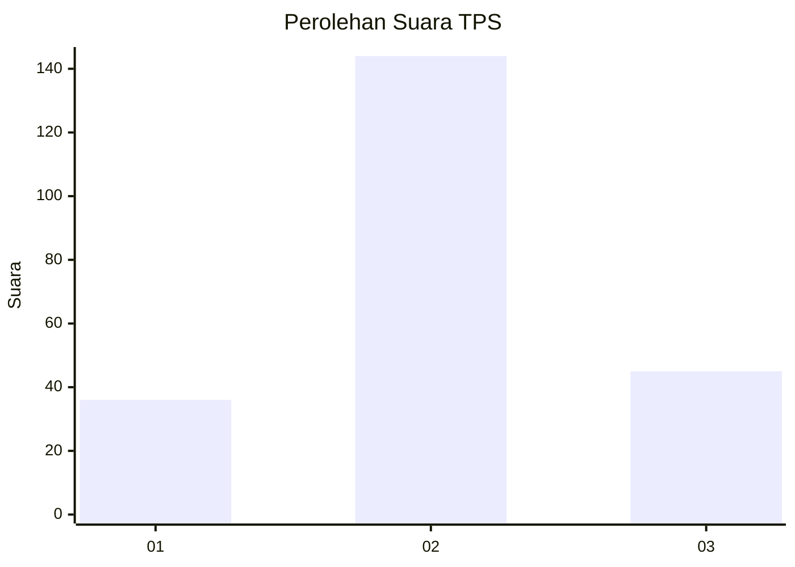
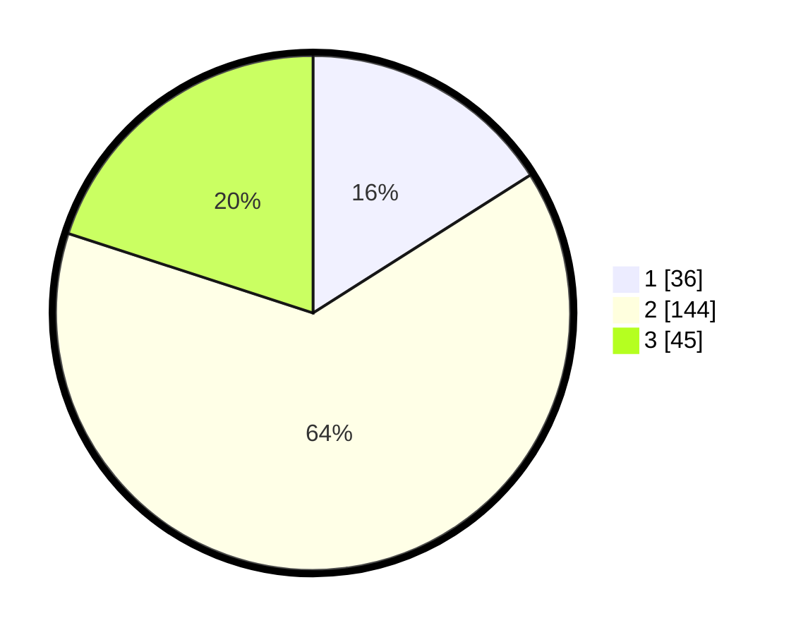

# Hasil

## Grafik

## Tabel

| No. | Nama Paslon    | Suara | Suara (raw) | Persentase |
|:--- |:-------------- | -----:| -----------:| ----------:|
| 1   | ANIES MUHAIMIN | 36    | [36][p-1]   | 16,00      |
| 2   | PRABOWO GIBRAN | 144   | [144][p-2]  | 64,00      |
| 3   | GANJAR MAHFUD  | 45    | [45][p-3]   | 20,00      |

[p-1]: https://github.com/gigit-pemilu/pemilu-2024/blob/main/pilpres/hitung-suara/sub/32-jawa-barat/sub/18-pangandaran/sub/06-mangunjaya/sub/2001-sukamaju/sub/006-tps/sub/paslon-1.txt
[p-2]: https://github.com/gigit-pemilu/pemilu-2024/blob/main/pilpres/hitung-suara/sub/32-jawa-barat/sub/18-pangandaran/sub/06-mangunjaya/sub/2001-sukamaju/sub/006-tps/sub/paslon-2.txt
[p-3]: https://github.com/gigit-pemilu/pemilu-2024/blob/main/pilpres/hitung-suara/sub/32-jawa-barat/sub/18-pangandaran/sub/06-mangunjaya/sub/2001-sukamaju/sub/006-tps/sub/paslon-3.txt

## Foto C Plano

https://sirekap-obj-formc.kpu.go.id/6aa0/pemilu/ppwp/32/18/06/20/01/3218062001006-20240214-215847--b2a8e0c3-bb6c-4573-a8dd-c161e42a751d.jpg

https://sirekap-obj-formc.kpu.go.id/6aa0/pemilu/ppwp/32/18/06/20/01/3218062001006-20240214-203541--4d282ee8-3c8d-49a6-999a-d52bd44f0b89.jpg

https://sirekap-obj-formc.kpu.go.id/6aa0/pemilu/ppwp/32/18/06/20/01/3218062001006-20240214-203642--bc373e81-76bd-42b3-a13d-3f4d55fe080a.jpg

## Metadata

| Key        | Value               |
| ---------- | ------------------- |
| Time Stamp | 2024-02-15 19:30:26 |

