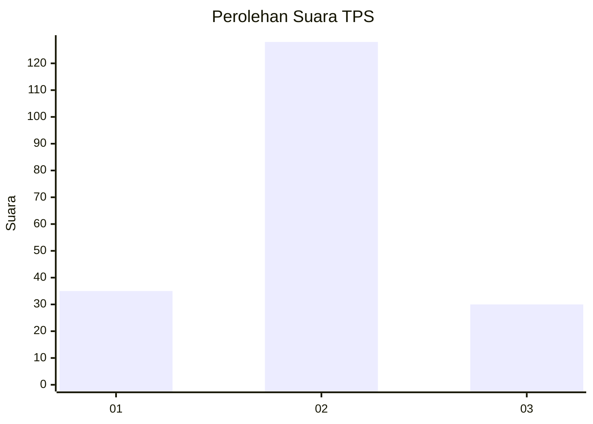
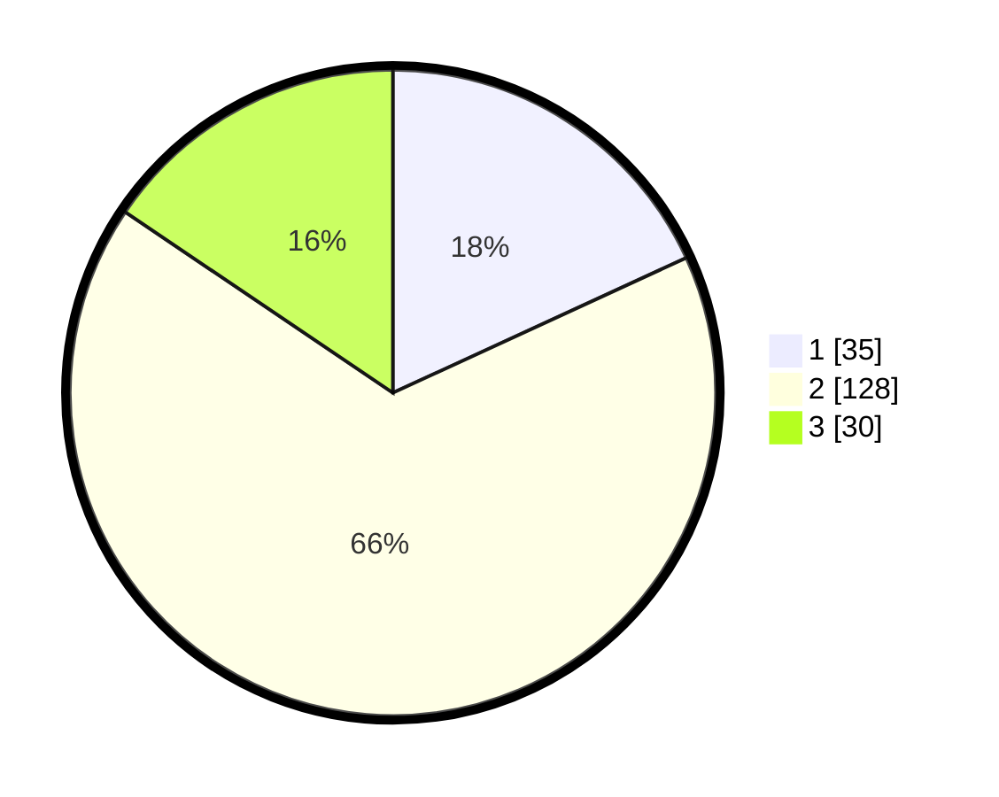

# Hasil

## Grafik

## Tabel

| No. | Nama Paslon    | Suara | Suara (raw) | Persentase |
|:--- |:-------------- | -----:| -----------:| ----------:|
| 1   | ANIES MUHAIMIN | 35    | [35][p-1]   | 18,13      |
| 2   | PRABOWO GIBRAN | 128   | [128][p-2]  | 66,32      |
| 3   | GANJAR MAHFUD  | 30    | [30][p-3]   | 15,54      |

[p-1]: https://github.com/gigit-pemilu/pemilu-2024-32-jawa-barat/blob/main/pilpres/hitung-suara/sub/32-jawa-barat/sub/18-pangandaran/sub/06-mangunjaya/sub/2001-sukamaju/sub/009-tps/sub/paslon-1.txt
[p-2]: https://github.com/gigit-pemilu/pemilu-2024-32-jawa-barat/blob/main/pilpres/hitung-suara/sub/32-jawa-barat/sub/18-pangandaran/sub/06-mangunjaya/sub/2001-sukamaju/sub/009-tps/sub/paslon-2.txt
[p-3]: https://github.com/gigit-pemilu/pemilu-2024-32-jawa-barat/blob/main/pilpres/hitung-suara/sub/32-jawa-barat/sub/18-pangandaran/sub/06-mangunjaya/sub/2001-sukamaju/sub/009-tps/sub/paslon-3.txt

## Foto C Plano

https://sirekap-obj-formc.kpu.go.id/ce90/pemilu/ppwp/32/18/06/20/01/3218062001009-20240214-215746--a2b3e7b4-602c-4e82-91b3-2f3ff20cf49e.jpg

https://sirekap-obj-formc.kpu.go.id/ce90/pemilu/ppwp/32/18/06/20/01/3218062001009-20240214-220306--e9095c77-d062-4cc5-a8fd-f02120840d67.jpg

https://sirekap-obj-formc.kpu.go.id/ce90/pemilu/ppwp/32/18/06/20/01/3218062001009-20240214-220624--3a1d16a3-8a5f-4af3-bf89-5c407d28be60.jpg

## Metadata

| Key        | Value               |
| ---------- | ------------------- |
| Time Stamp | 2024-02-15 17:00:25 |

