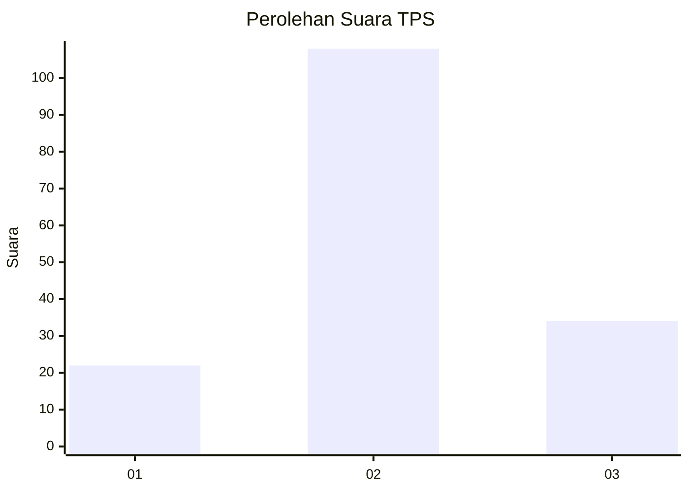
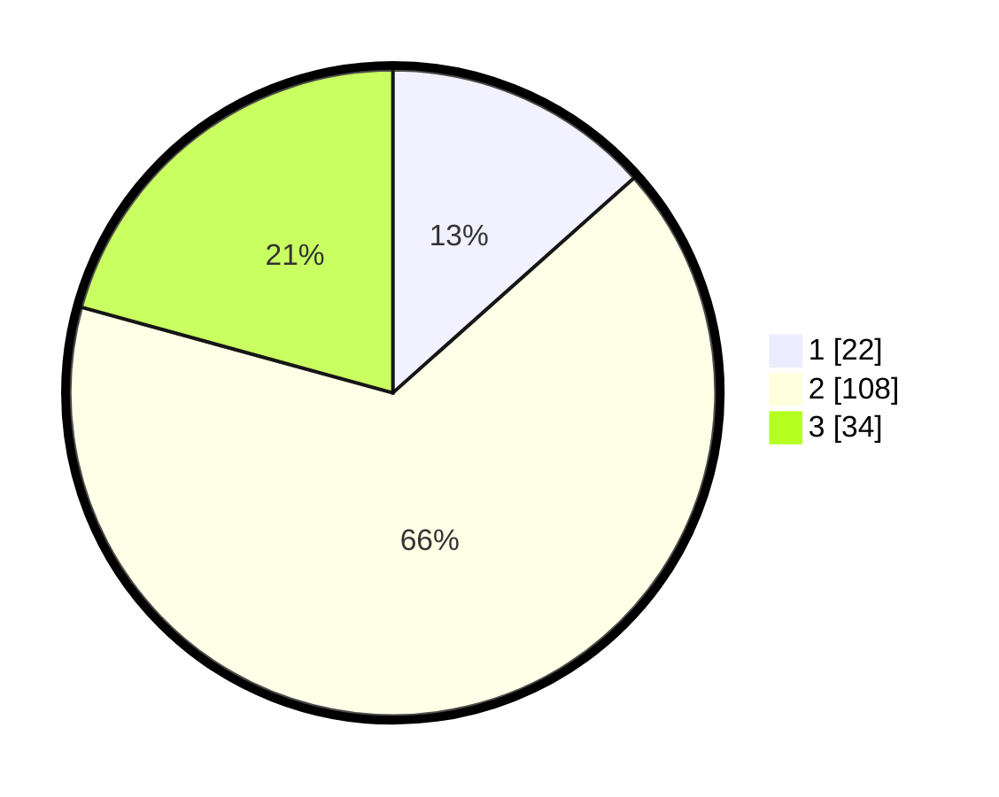

# Hasil

## Grafik

## Tabel

| No. | Nama Paslon    | Suara | Suara (raw) | Persentase |
|:--- |:-------------- | -----:| -----------:| ----------:|
| 1   | ANIES MUHAIMIN | 22    | [22][p-1]   | 13,41      |
| 2   | PRABOWO GIBRAN | 108   | [108][p-2]  | 65,85      |
| 3   | GANJAR MAHFUD  | 34    | [34][p-3]   | 20,73      |

[p-1]: https://github.com/gigit-pemilu/pemilu-2024/blob/main/pilpres/hitung-suara/sub/32-jawa-barat/sub/18-pangandaran/sub/08-kalipucang/sub/2001-putrapinggan/sub/001-tps/sub/paslon-1.txt
[p-2]: https://github.com/gigit-pemilu/pemilu-2024/blob/main/pilpres/hitung-suara/sub/32-jawa-barat/sub/18-pangandaran/sub/08-kalipucang/sub/2001-putrapinggan/sub/001-tps/sub/paslon-2.txt
[p-3]: https://github.com/gigit-pemilu/pemilu-2024/blob/main/pilpres/hitung-suara/sub/32-jawa-barat/sub/18-pangandaran/sub/08-kalipucang/sub/2001-putrapinggan/sub/001-tps/sub/paslon-3.txt

## Foto C Plano

https://sirekap-obj-formc.kpu.go.id/2a62/pemilu/ppwp/32/18/08/20/01/3218082001001-20240216-093953--a792031e-2a88-485d-a8fe-bd8c4f3a8df0.jpg

https://sirekap-obj-formc.kpu.go.id/2a62/pemilu/ppwp/32/18/08/20/01/3218082001001-20240221-102101--05e40ec8-bff3-4ca6-8b1b-fd72fdde0cb4.jpg

https://sirekap-obj-formc.kpu.go.id/2a62/pemilu/ppwp/32/18/08/20/01/3218082001001-20240221-124037--9d20f991-4b49-41b9-87cc-b6fc4c36a493.jpg

## Metadata

| Key        | Value               |
| ---------- | ------------------- |
| Time Stamp | 2024-02-25 21:00:00 |

