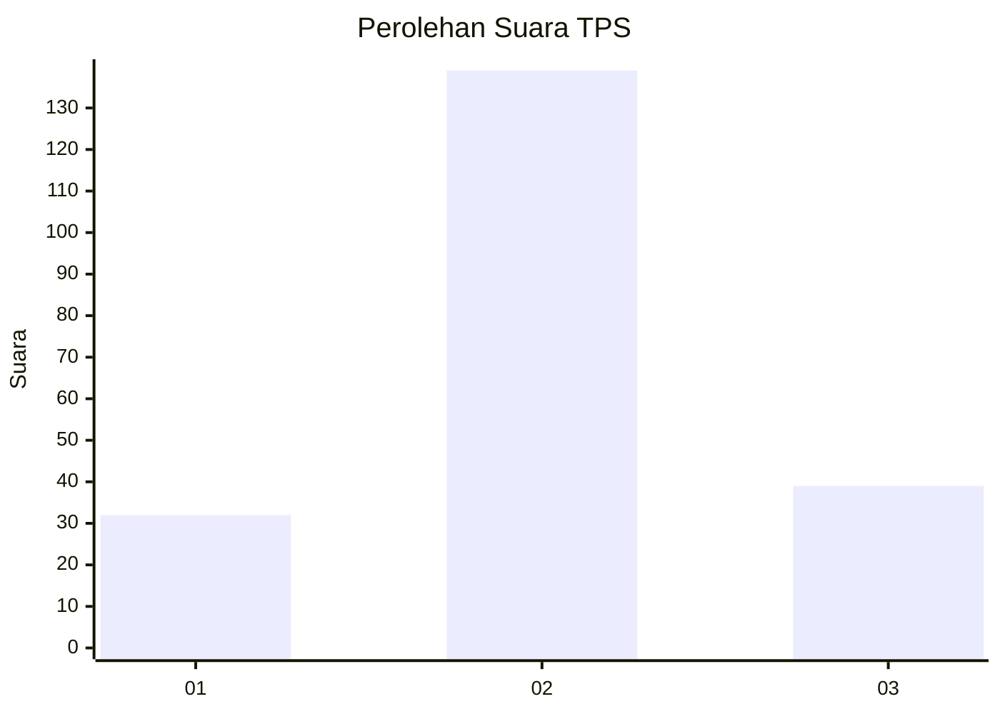
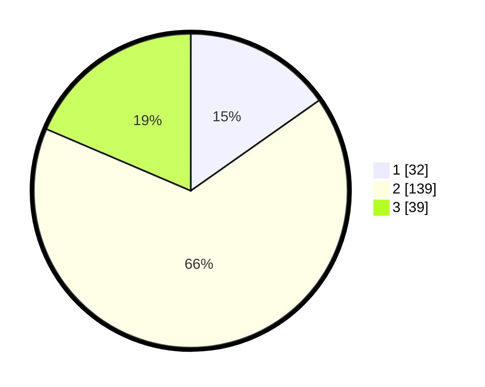

# Hasil

## Grafik

## Tabel

| No. | Nama Paslon    | Suara | Suara (raw) | Persentase |
|:--- |:-------------- | -----:| -----------:| ----------:|
| 1   | ANIES MUHAIMIN | 32    | [32][p-1]   | 15,24      |
| 2   | PRABOWO GIBRAN | 139   | [139][p-2]  | 66,19      |
| 3   | GANJAR MAHFUD  | 39    | [39][p-3]   | 18,57      |

[p-1]: https://github.com/gigit-pemilu/pemilu-2024-32-jawa-barat/blob/main/pilpres/hitung-suara/sub/32-jawa-barat/sub/18-pangandaran/sub/08-kalipucang/sub/2001-putrapinggan/sub/006-tps/sub/paslon-1.txt
[p-2]: https://github.com/gigit-pemilu/pemilu-2024-32-jawa-barat/blob/main/pilpres/hitung-suara/sub/32-jawa-barat/sub/18-pangandaran/sub/08-kalipucang/sub/2001-putrapinggan/sub/006-tps/sub/paslon-2.txt
[p-3]: https://github.com/gigit-pemilu/pemilu-2024-32-jawa-barat/blob/main/pilpres/hitung-suara/sub/32-jawa-barat/sub/18-pangandaran/sub/08-kalipucang/sub/2001-putrapinggan/sub/006-tps/sub/paslon-3.txt

## Foto C Plano

https://sirekap-obj-formc.kpu.go.id/867e/pemilu/ppwp/32/18/08/20/01/3218082001006-20240214-213027--64bf51cc-b828-43aa-bcb1-a91592c65916.jpg

https://sirekap-obj-formc.kpu.go.id/867e/pemilu/ppwp/32/18/08/20/01/3218082001006-20240214-205331--20f7ee85-c6db-4307-938d-b7a390547ba6.jpg

https://sirekap-obj-formc.kpu.go.id/867e/pemilu/ppwp/32/18/08/20/01/3218082001006-20240214-205453--b7939ff4-95ff-4910-a266-f0e7d779915d.jpg

## Metadata

| Key        | Value               |
| ---------- | ------------------- |
| Time Stamp | 2024-02-16 21:01:00 |

