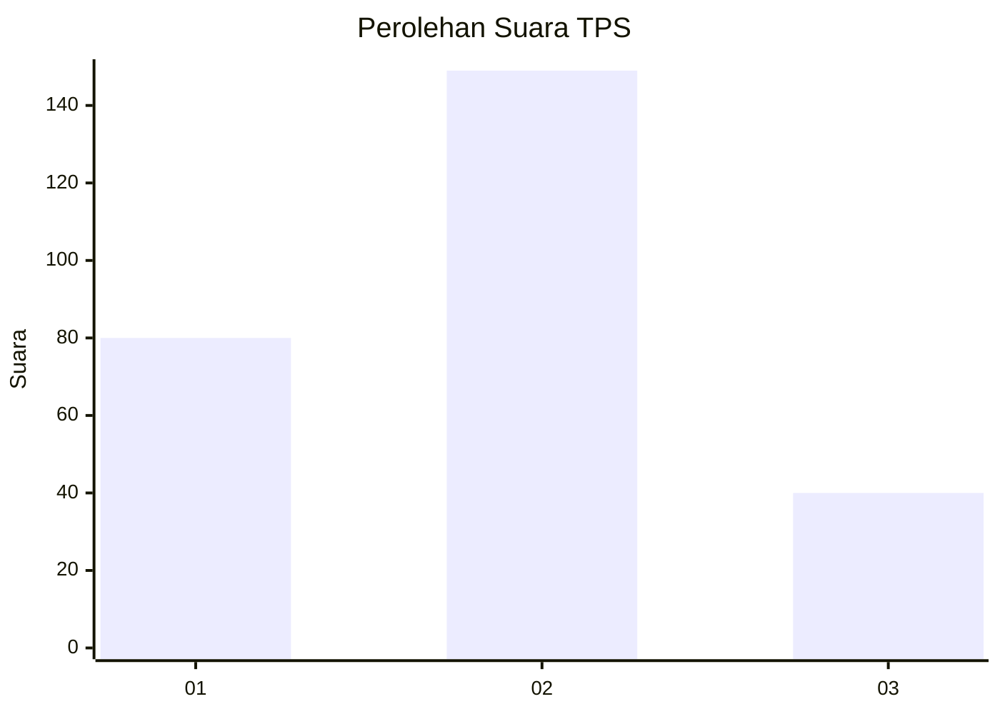
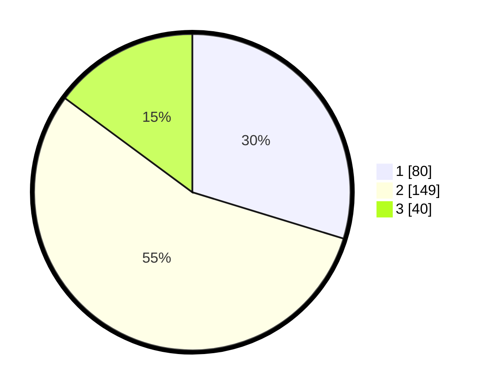

# Hasil

## Grafik

## Tabel

| No. | Nama Paslon    | Suara | Suara (raw) | Persentase |
|:--- |:-------------- | -----:| -----------:| ----------:|
| 1   | ANIES MUHAIMIN | 80    | [80][p-1]   | 29,74      |
| 2   | PRABOWO GIBRAN | 149   | [149][p-2]  | 55,39      |
| 3   | GANJAR MAHFUD  | 40    | [40][p-3]   | 14,87      |

[p-1]: https://github.com/gigit-pemilu/pemilu-2024/blob/main/pilpres/hitung-suara/sub/32-jawa-barat/sub/18-pangandaran/sub/10-sidamulih/sub/2005-pajaten/sub/003-tps/sub/paslon-1.txt
[p-2]: https://github.com/gigit-pemilu/pemilu-2024/blob/main/pilpres/hitung-suara/sub/32-jawa-barat/sub/18-pangandaran/sub/10-sidamulih/sub/2005-pajaten/sub/003-tps/sub/paslon-2.txt
[p-3]: https://github.com/gigit-pemilu/pemilu-2024/blob/main/pilpres/hitung-suara/sub/32-jawa-barat/sub/18-pangandaran/sub/10-sidamulih/sub/2005-pajaten/sub/003-tps/sub/paslon-3.txt

## Foto C Plano

https://sirekap-obj-formc.kpu.go.id/ee67/pemilu/ppwp/32/18/10/20/05/3218102005003-20240214-232134--227da5de-f330-4f70-b734-2a675cd7e5c4.jpg

https://sirekap-obj-formc.kpu.go.id/ee67/pemilu/ppwp/32/18/10/20/05/3218102005003-20240214-232148--50f5b061-fede-4a5e-a24f-549c4088fdff.jpg

https://sirekap-obj-formc.kpu.go.id/ee67/pemilu/ppwp/32/18/10/20/05/3218102005003-20240214-232219--7e8e2773-fb8e-4cab-9ac8-d09e641b6a97.jpg

## Metadata

| Key        | Value               |
| ---------- | ------------------- |
| Time Stamp | 2024-02-15 15:00:29 |

