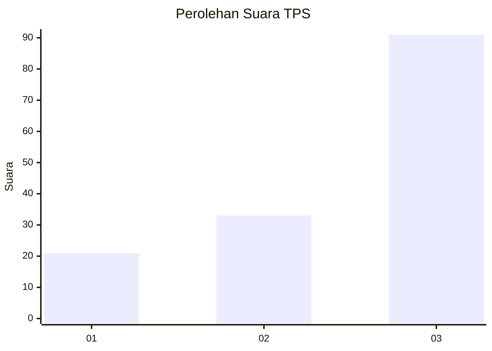
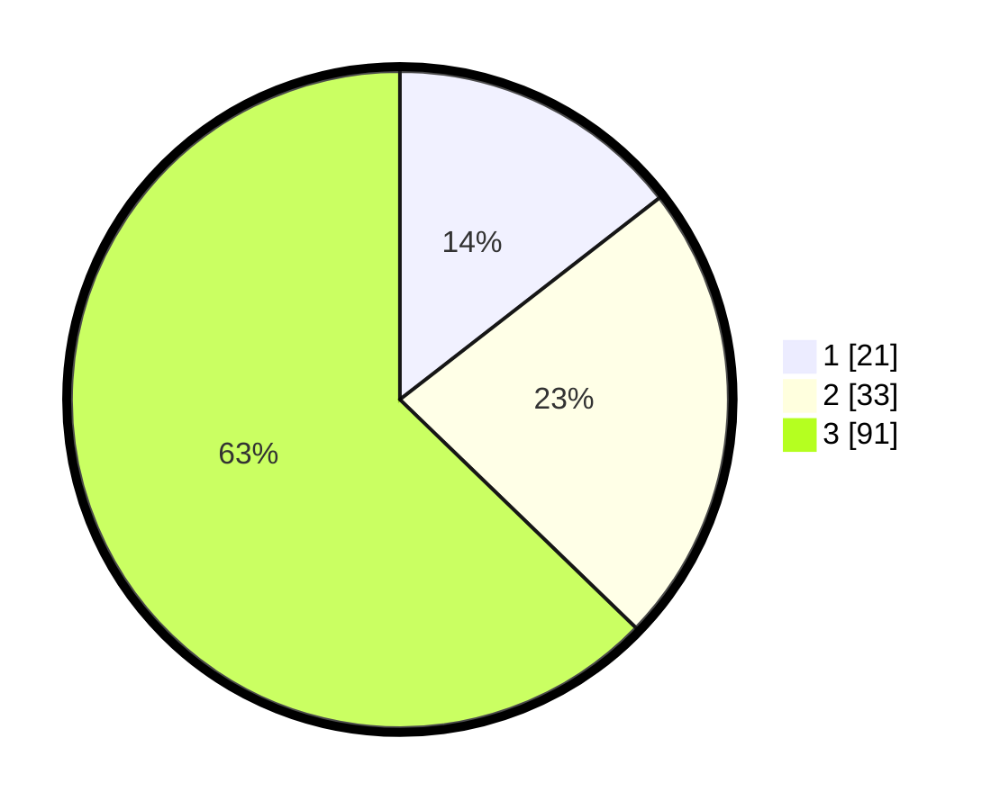

# Hasil

## Grafik

## Tabel

| No. | Nama Paslon    | Suara | Suara (raw) | Persentase |
|:--- |:-------------- | -----:| -----------:| ----------:|
| 1   | ANIES MUHAIMIN | 21    | [21][p-1]   | 14,48      |
| 2   | PRABOWO GIBRAN | 33    | [33][p-2]   | 22,76      |
| 3   | GANJAR MAHFUD  | 91    | [91][p-3]   | 62,76      |

[p-1]: https://github.com/gigit-pemilu/pemilu-2024-32-jawa-barat/blob/main/pilpres/hitung-suara/sub/32-jawa-barat/sub/71-kota-bogor/sub/02-bogor-timur/sub/1002-baranangsiang/sub/012-tps/sub/paslon-1.txt
[p-2]: https://github.com/gigit-pemilu/pemilu-2024-32-jawa-barat/blob/main/pilpres/hitung-suara/sub/32-jawa-barat/sub/71-kota-bogor/sub/02-bogor-timur/sub/1002-baranangsiang/sub/012-tps/sub/paslon-2.txt
[p-3]: https://github.com/gigit-pemilu/pemilu-2024-32-jawa-barat/blob/main/pilpres/hitung-suara/sub/32-jawa-barat/sub/71-kota-bogor/sub/02-bogor-timur/sub/1002-baranangsiang/sub/012-tps/sub/paslon-3.txt

## Foto C Plano

https://sirekap-obj-formc.kpu.go.id/eab9/pemilu/ppwp/32/71/02/10/02/3271021002012-20240214-215601--7daab2b9-93c3-40ba-9014-ea99425bed0f.jpg

https://sirekap-obj-formc.kpu.go.id/eab9/pemilu/ppwp/32/71/02/10/02/3271021002012-20240214-215528--a6445b86-078a-40c7-84ed-6fa105d5d2ba.jpg

https://sirekap-obj-formc.kpu.go.id/eab9/pemilu/ppwp/32/71/02/10/02/3271021002012-20240214-215622--5963ba4c-d51c-4b45-a271-bc1c2d5e3c22.jpg

## Metadata

| Key        | Value               |
| ---------- | ------------------- |
| Time Stamp | 2024-02-16 00:00:26 |

