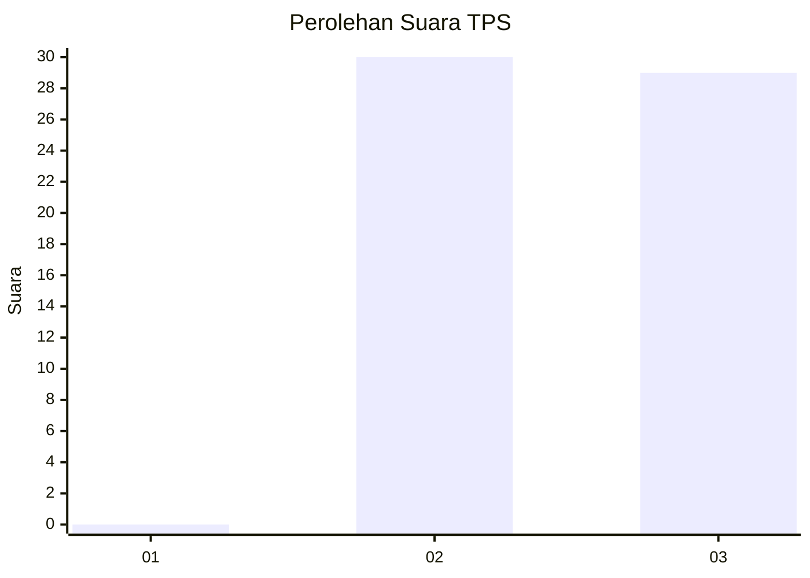
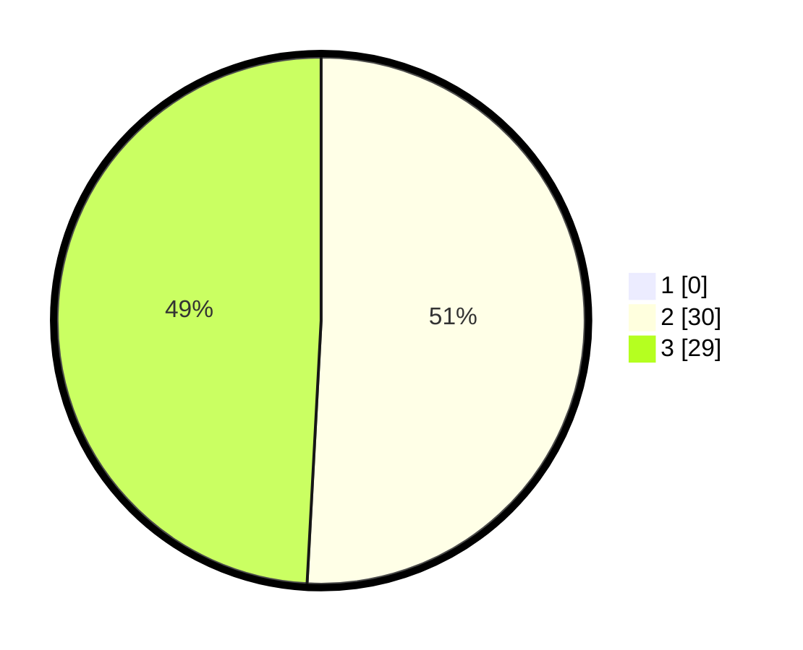

# Hasil

## Grafik

## Tabel

| No. | Nama Paslon    | Suara | Suara (raw) | Persentase |
|:--- |:-------------- | -----:| -----------:| ----------:|
| 1   | ANIES MUHAIMIN | 0     | [0][p-1]    | 0,00       |
| 2   | PRABOWO GIBRAN | 30    | [30][p-2]   | 50,85      |
| 3   | GANJAR MAHFUD  | 29    | [29][p-3]   | 49,15      |

[p-1]: https://github.com/gigit-pemilu/pemilu-2024-32-jawa-barat/blob/main/pilpres/hitung-suara/sub/32-jawa-barat/sub/71-kota-bogor/sub/02-bogor-timur/sub/1005-sindangrasa/sub/028-tps/sub/paslon-1.txt
[p-2]: https://github.com/gigit-pemilu/pemilu-2024-32-jawa-barat/blob/main/pilpres/hitung-suara/sub/32-jawa-barat/sub/71-kota-bogor/sub/02-bogor-timur/sub/1005-sindangrasa/sub/028-tps/sub/paslon-2.txt
[p-3]: https://github.com/gigit-pemilu/pemilu-2024-32-jawa-barat/blob/main/pilpres/hitung-suara/sub/32-jawa-barat/sub/71-kota-bogor/sub/02-bogor-timur/sub/1005-sindangrasa/sub/028-tps/sub/paslon-3.txt

## Foto C Plano

https://sirekap-obj-formc.kpu.go.id/f007/pemilu/ppwp/32/71/02/10/05/3271021005028-20240227-133540--0e09d43c-82c9-4d12-87a5-0db81aa09f3d.jpg

https://sirekap-obj-formc.kpu.go.id/f007/pemilu/ppwp/32/71/02/10/05/3271021005028-20240227-133635--8b048434-4b4c-44f6-ac11-75172903bfc3.jpg

https://sirekap-obj-formc.kpu.go.id/f007/pemilu/ppwp/32/71/02/10/05/3271021005028-20240227-133752--96f2d109-6cd4-4df0-9cb5-5ec81a6b43bc.jpg

## Metadata

| Key        | Value               |
| ---------- | ------------------- |
| Time Stamp | 2024-02-27 14:00:00 |

## DATA PEMILIH TETAP

Jumlah pemilih dalam DPT: **253**.
 * L: **439**.
 * P: **243**.

## DATA PENGGUNA HAK PILIH

Jumlah pengguna hak pilih dalam DPT: **234**.
 * L: **420**.
 * P: **363**.

Jumlah pengguna hak pilih dalam DPTb: **8**.
 * L: **990**.
 * P: **2**.

Jumlah pengguna hak pilih dalam DPK: **95**.
 * L: **90**.
 * P: **4**.

Jumlah pengguna hak pilih: **233**.
 * L: **624**.
 * P: **405**.

## JUMLAH SUARA SAH DAN TIDAK SAH

JUMLAH SELURUH SUARA SAH: **219**.

JUMLAH SUARA TIDAK SAH: **7**.

JUMLAH SELURUH SUARA SAH DAN SUARA TIDAK SAH: **226**.

