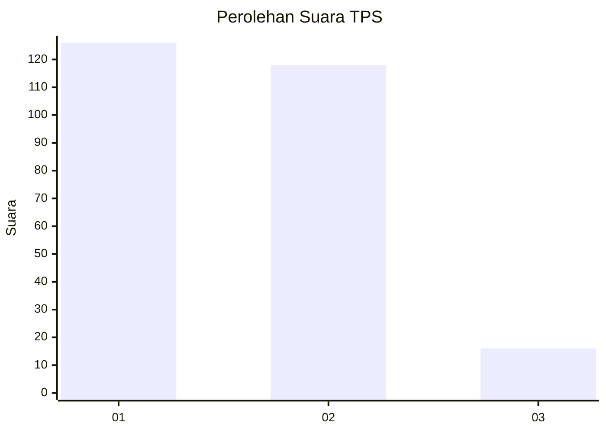
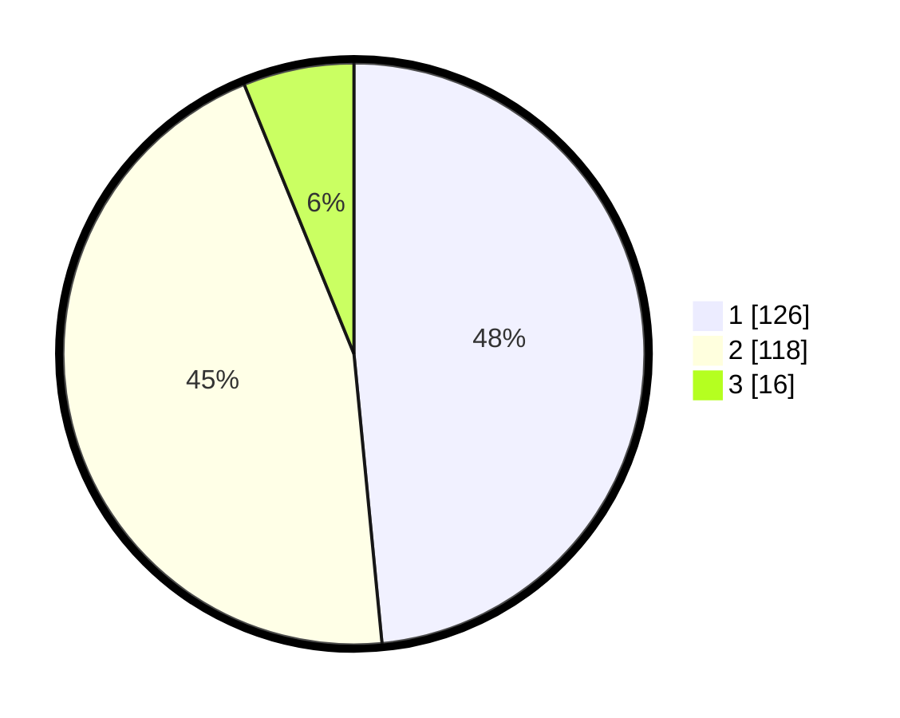

# Hasil

## Grafik

## Tabel

| No. | Nama Paslon    | Suara | Suara (raw) | Persentase |
|:--- |:-------------- | -----:| -----------:| ----------:|
| 1   | ANIES MUHAIMIN | 126   | [126][p-1]  | 48,46      |
| 2   | PRABOWO GIBRAN | 118   | [118][p-2]  | 45,38      |
| 3   | GANJAR MAHFUD  | 16    | [16][p-3]   | 6,15       |

[p-1]: https://github.com/gigit-pemilu/pemilu-2024/blob/main/pilpres/hitung-suara/sub/32-jawa-barat/sub/71-kota-bogor/sub/03-bogor-tengah/sub/1007-tegallega/sub/015-tps/sub/paslon-1.txt
[p-2]: https://github.com/gigit-pemilu/pemilu-2024/blob/main/pilpres/hitung-suara/sub/32-jawa-barat/sub/71-kota-bogor/sub/03-bogor-tengah/sub/1007-tegallega/sub/015-tps/sub/paslon-2.txt
[p-3]: https://github.com/gigit-pemilu/pemilu-2024/blob/main/pilpres/hitung-suara/sub/32-jawa-barat/sub/71-kota-bogor/sub/03-bogor-tengah/sub/1007-tegallega/sub/015-tps/sub/paslon-3.txt

## Foto C Plano

https://sirekap-obj-formc.kpu.go.id/d901/pemilu/ppwp/32/71/03/10/07/3271031007015-20240215-001814--cff1ce7f-27b5-4208-9f53-c93bda04c6b5.jpg

https://sirekap-obj-formc.kpu.go.id/d901/pemilu/ppwp/32/71/03/10/07/3271031007015-20240215-001958--1b682662-a69a-42c0-905e-6a6514f6c29e.jpg

https://sirekap-obj-formc.kpu.go.id/d901/pemilu/ppwp/32/71/03/10/07/3271031007015-20240215-002250--48aca38d-8f34-4042-91d9-50c68b47bb10.jpg

## Metadata

| Key        | Value               |
| ---------- | ------------------- |
| Time Stamp | 2024-02-15 23:29:50 |

