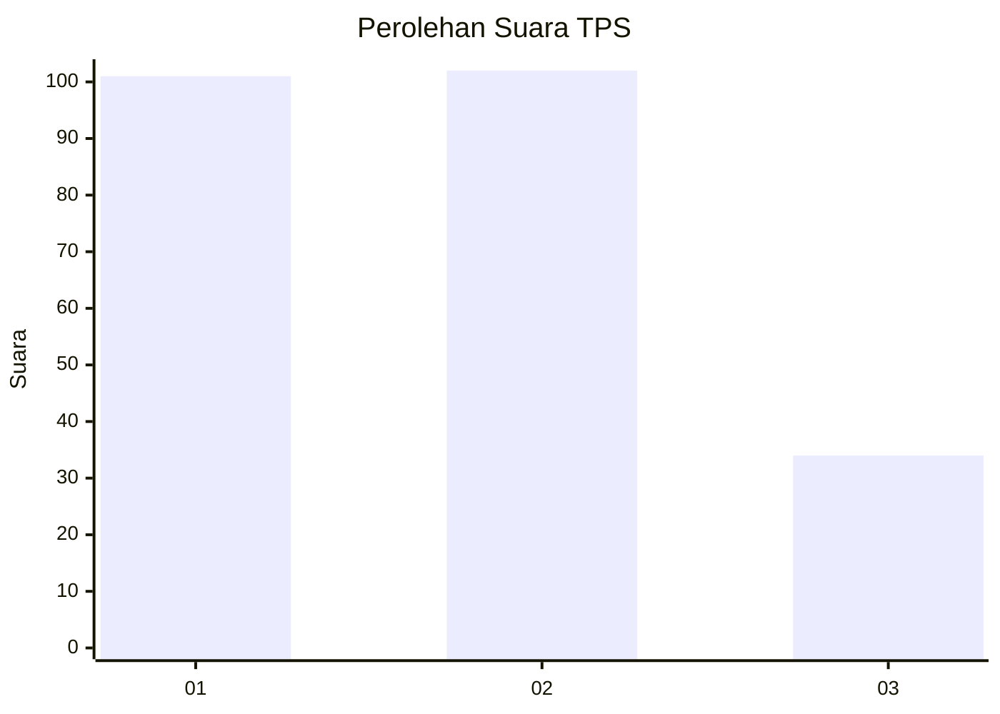
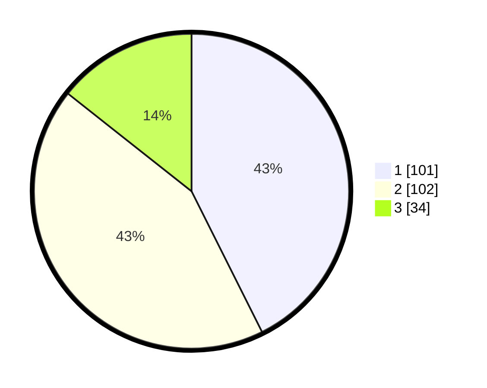

# Hasil

## Grafik

## Tabel

| No. | Nama Paslon    | Suara | Suara (raw) | Persentase |
|:--- |:-------------- | -----:| -----------:| ----------:|
| 1   | ANIES MUHAIMIN | 101   | [101][p-1]  | 42,62      |
| 2   | PRABOWO GIBRAN | 102   | [102][p-2]  | 43,04      |
| 3   | GANJAR MAHFUD  | 34    | [34][p-3]   | 14,35      |

[p-1]: https://github.com/gigit-pemilu/pemilu-2024/blob/main/pilpres/hitung-suara/sub/32-jawa-barat/sub/71-kota-bogor/sub/03-bogor-tengah/sub/1008-babakan-pasar/sub/011-tps/sub/paslon-1.txt
[p-2]: https://github.com/gigit-pemilu/pemilu-2024/blob/main/pilpres/hitung-suara/sub/32-jawa-barat/sub/71-kota-bogor/sub/03-bogor-tengah/sub/1008-babakan-pasar/sub/011-tps/sub/paslon-2.txt
[p-3]: https://github.com/gigit-pemilu/pemilu-2024/blob/main/pilpres/hitung-suara/sub/32-jawa-barat/sub/71-kota-bogor/sub/03-bogor-tengah/sub/1008-babakan-pasar/sub/011-tps/sub/paslon-3.txt

## Foto C Plano

https://sirekap-obj-formc.kpu.go.id/a16d/pemilu/ppwp/32/71/03/10/08/3271031008011-20240214-155809--6531a5e8-cac2-4852-b4c2-4d05a65cc62c.jpg

https://sirekap-obj-formc.kpu.go.id/a16d/pemilu/ppwp/32/71/03/10/08/3271031008011-20240214-160137--ac5c2678-aaa0-40f0-959b-b1bcbdc56a25.jpg

https://sirekap-obj-formc.kpu.go.id/a16d/pemilu/ppwp/32/71/03/10/08/3271031008011-20240214-155918--173cf022-ada9-48bd-9253-191a66f0e332.jpg

## Metadata

| Key        | Value               |
| ---------- | ------------------- |
| Time Stamp | 2024-02-15 22:30:27 |

