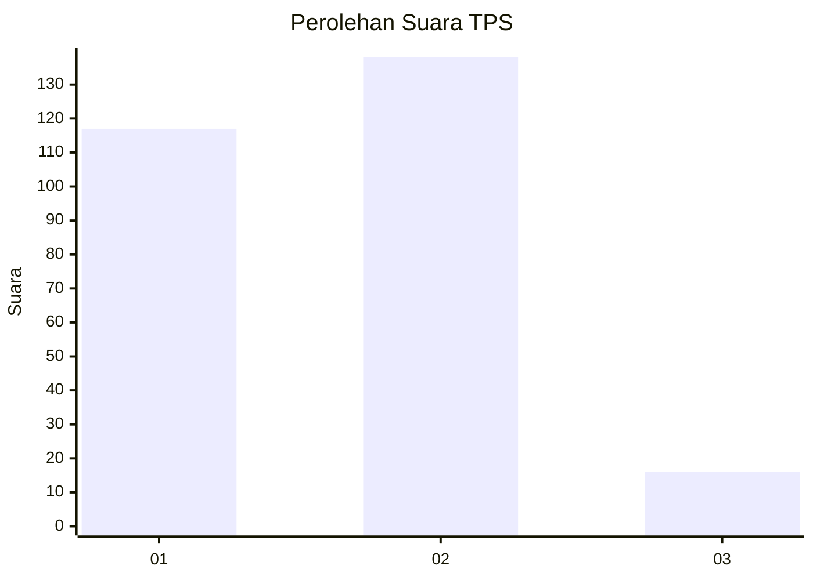
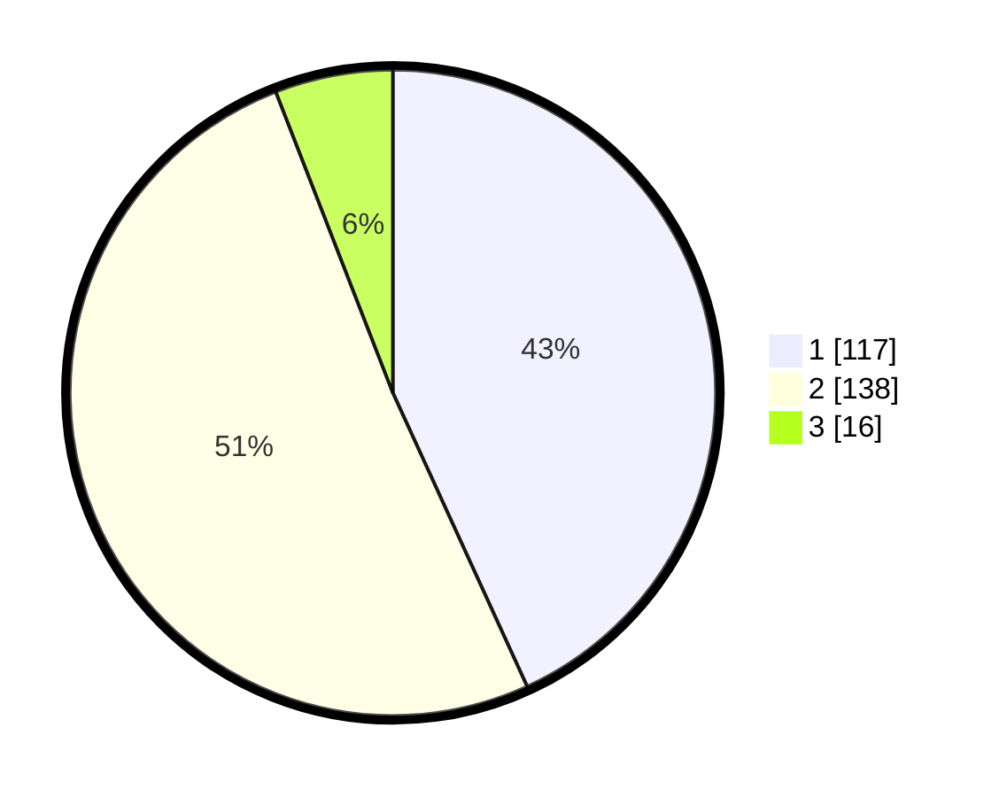

# Hasil

## Grafik

## Tabel

| No. | Nama Paslon    | Suara | Suara (raw) | Persentase |
|:--- |:-------------- | -----:| -----------:| ----------:|
| 1   | ANIES MUHAIMIN | 117   | [117][p-1]  | 43,17      |
| 2   | PRABOWO GIBRAN | 138   | [138][p-2]  | 50,92      |
| 3   | GANJAR MAHFUD  | 16    | [16][p-3]   | 5,90       |

[p-1]: https://github.com/gigit-pemilu/pemilu-2024/blob/main/pilpres/hitung-suara/sub/32-jawa-barat/sub/71-kota-bogor/sub/04-bogor-barat/sub/1003-bubulak/sub/040-tps/sub/paslon-1.txt
[p-2]: https://github.com/gigit-pemilu/pemilu-2024/blob/main/pilpres/hitung-suara/sub/32-jawa-barat/sub/71-kota-bogor/sub/04-bogor-barat/sub/1003-bubulak/sub/040-tps/sub/paslon-2.txt
[p-3]: https://github.com/gigit-pemilu/pemilu-2024/blob/main/pilpres/hitung-suara/sub/32-jawa-barat/sub/71-kota-bogor/sub/04-bogor-barat/sub/1003-bubulak/sub/040-tps/sub/paslon-3.txt

## Foto C Plano

https://sirekap-obj-formc.kpu.go.id/c381/pemilu/ppwp/32/71/04/10/03/3271041003040-20240302-120926--0208d8fa-faf1-4b34-8f9c-9ed5c598d04d.jpg

https://sirekap-obj-formc.kpu.go.id/c381/pemilu/ppwp/32/71/04/10/03/3271041003040-20240214-190900--1b5f4dad-9991-4526-aaf2-0ed54f0b7938.jpg

https://sirekap-obj-formc.kpu.go.id/c381/pemilu/ppwp/32/71/04/10/03/3271041003040-20240214-190828--f671cecf-6e54-422c-8c96-f989ea0cf90d.jpg

## Metadata

| Key        | Value               |
| ---------- | ------------------- |
| Time Stamp | 2024-03-02 13:00:00 |

