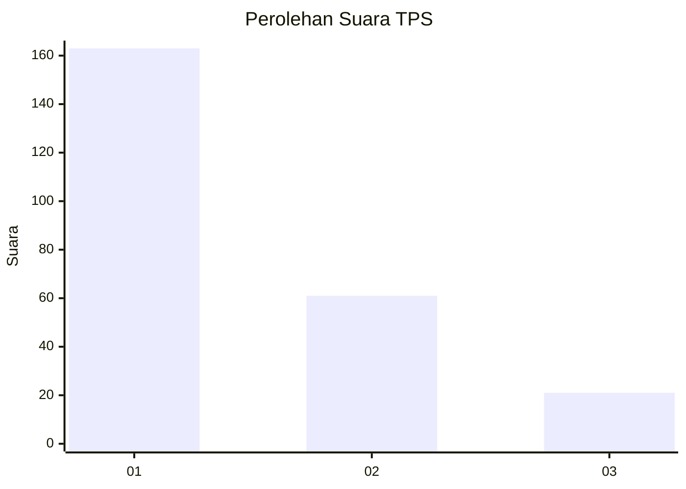
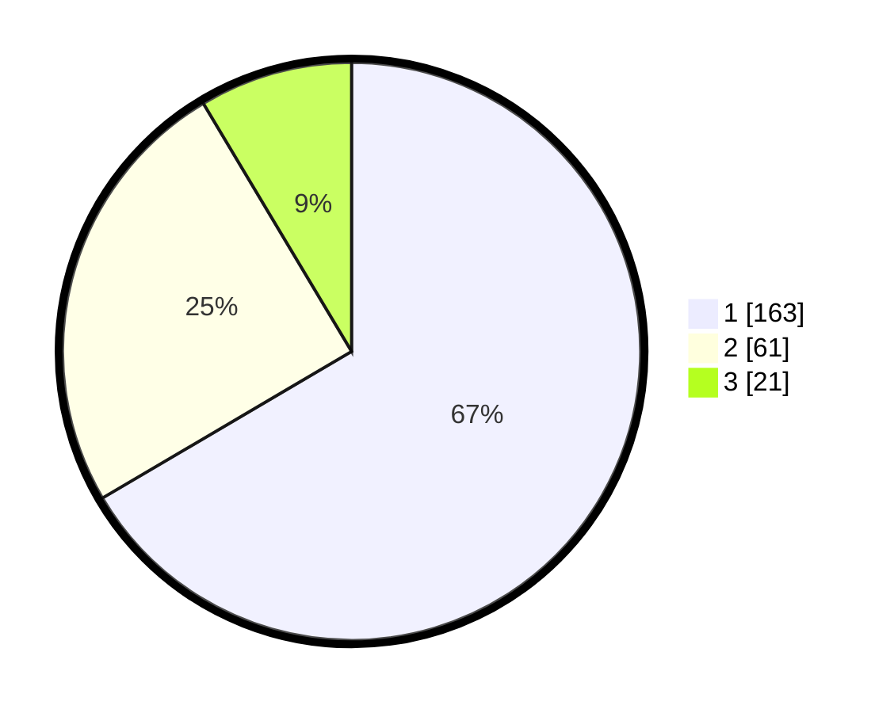

# Hasil

## Grafik

## Tabel

| No. | Nama Paslon    | Suara | Suara (raw) | Persentase |
|:--- |:-------------- | -----:| -----------:| ----------:|
| 1   | ANIES MUHAIMIN | 163   | [163][p-1]  | 66,53      |
| 2   | PRABOWO GIBRAN | 61    | [61][p-2]   | 24,90      |
| 3   | GANJAR MAHFUD  | 21    | [21][p-3]   | 8,57       |

[p-1]: https://github.com/gigit-pemilu/pemilu-2024/blob/main/pilpres/hitung-suara/sub/32-jawa-barat/sub/71-kota-bogor/sub/05-bogor-utara/sub/1006-ciluar/sub/043-tps/sub/paslon-1.txt
[p-2]: https://github.com/gigit-pemilu/pemilu-2024/blob/main/pilpres/hitung-suara/sub/32-jawa-barat/sub/71-kota-bogor/sub/05-bogor-utara/sub/1006-ciluar/sub/043-tps/sub/paslon-2.txt
[p-3]: https://github.com/gigit-pemilu/pemilu-2024/blob/main/pilpres/hitung-suara/sub/32-jawa-barat/sub/71-kota-bogor/sub/05-bogor-utara/sub/1006-ciluar/sub/043-tps/sub/paslon-3.txt

## Foto C Plano

https://sirekap-obj-formc.kpu.go.id/f6ff/pemilu/ppwp/32/71/05/10/06/3271051006043-20240214-234822--3b3b7a1e-1359-4b34-bf58-713cba08772f.jpg

https://sirekap-obj-formc.kpu.go.id/f6ff/pemilu/ppwp/32/71/05/10/06/3271051006043-20240214-234904--ec2d53ee-2047-42ba-a2a0-5f25b3ffb93a.jpg

https://sirekap-obj-formc.kpu.go.id/f6ff/pemilu/ppwp/32/71/05/10/06/3271051006043-20240214-234911--aaa6daf6-6a80-4282-addd-b58bfa0ec8d2.jpg

## Metadata

| Key        | Value               |
| ---------- | ------------------- |
| Time Stamp | 2024-02-16 02:00:27 |

