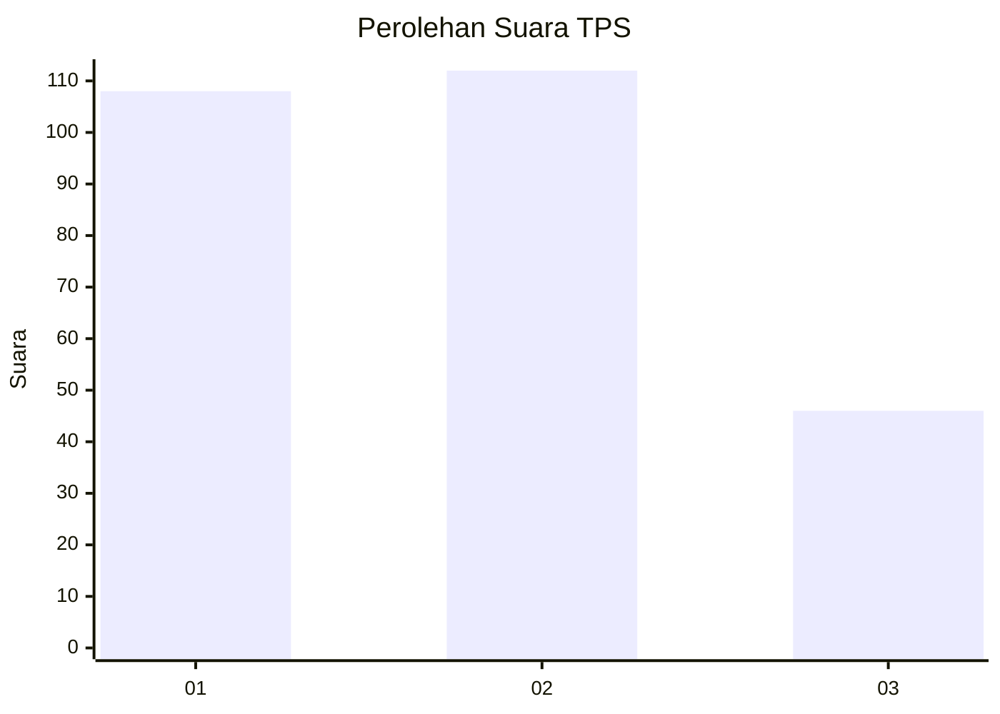
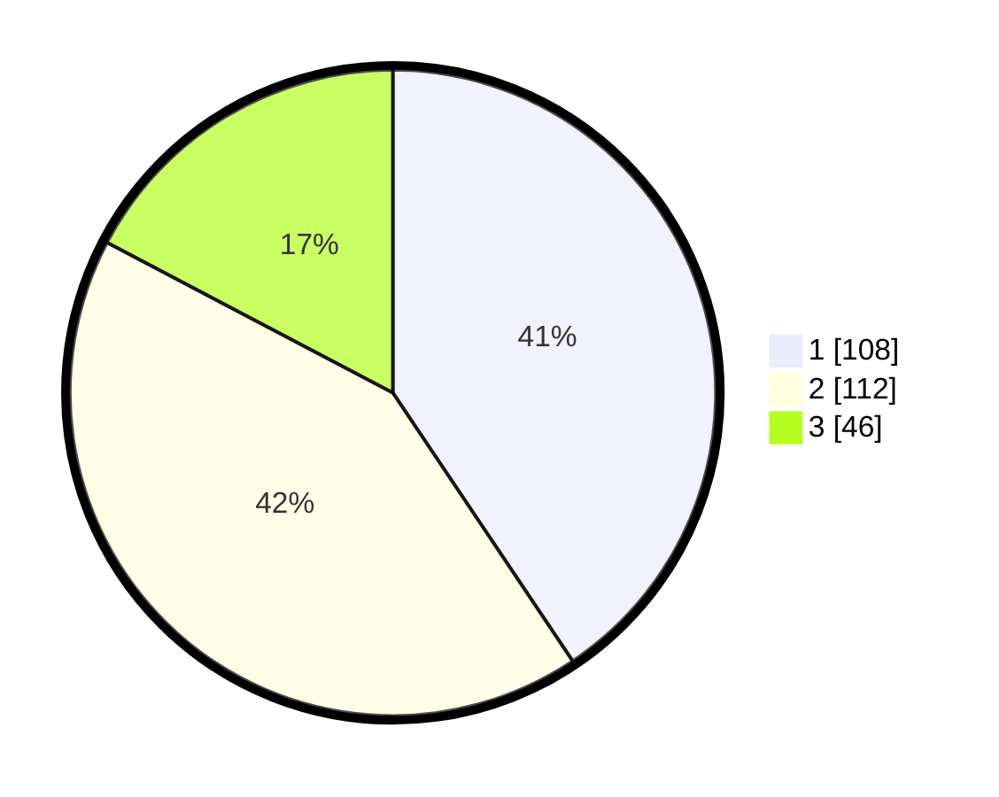

# Hasil

## Grafik

## Tabel

| No. | Nama Paslon    | Suara | Suara (raw) | Persentase |
|:--- |:-------------- | -----:| -----------:| ----------:|
| 1   | ANIES MUHAIMIN | 108   | [108][p-1]  | 40,60      |
| 2   | PRABOWO GIBRAN | 112   | [112][p-2]  | 42,11      |
| 3   | GANJAR MAHFUD  | 46    | [46][p-3]   | 17,29      |

[p-1]: https://github.com/gigit-pemilu/pemilu-2024-32-jawa-barat/blob/main/pilpres/hitung-suara/sub/32-jawa-barat/sub/71-kota-bogor/sub/05-bogor-utara/sub/1008-cimahpar/sub/030-tps/sub/paslon-1.txt
[p-2]: https://github.com/gigit-pemilu/pemilu-2024-32-jawa-barat/blob/main/pilpres/hitung-suara/sub/32-jawa-barat/sub/71-kota-bogor/sub/05-bogor-utara/sub/1008-cimahpar/sub/030-tps/sub/paslon-2.txt
[p-3]: https://github.com/gigit-pemilu/pemilu-2024-32-jawa-barat/blob/main/pilpres/hitung-suara/sub/32-jawa-barat/sub/71-kota-bogor/sub/05-bogor-utara/sub/1008-cimahpar/sub/030-tps/sub/paslon-3.txt

## Foto C Plano

https://sirekap-obj-formc.kpu.go.id/1311/pemilu/ppwp/32/71/05/10/08/3271051008030-20240215-190656--44f3ba13-b949-426f-88ff-216e4598f742.jpg

https://sirekap-obj-formc.kpu.go.id/1311/pemilu/ppwp/32/71/05/10/08/3271051008030-20240215-202336--ad8f550a-b1ca-4d1e-af79-992605d7e427.jpg

https://sirekap-obj-formc.kpu.go.id/1311/pemilu/ppwp/32/71/05/10/08/3271051008030-20240215-203538--8dfae67c-f907-4379-902e-728d503664fa.jpg

## Metadata

| Key        | Value               |
| ---------- | ------------------- |
| Time Stamp | 2024-02-16 02:00:27 |

