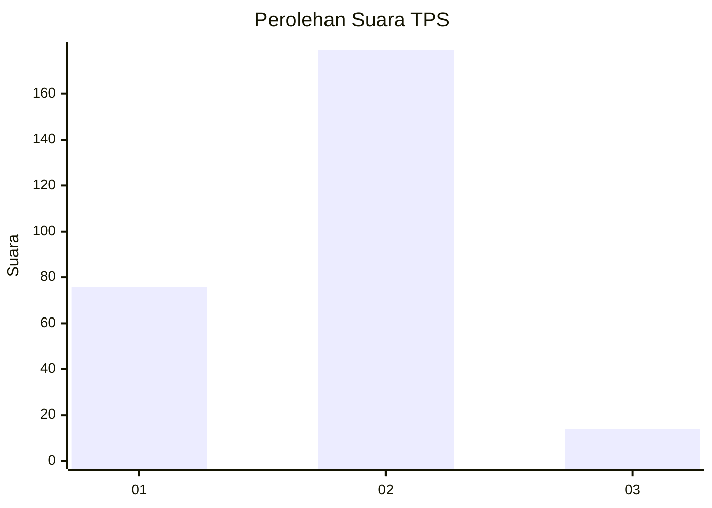
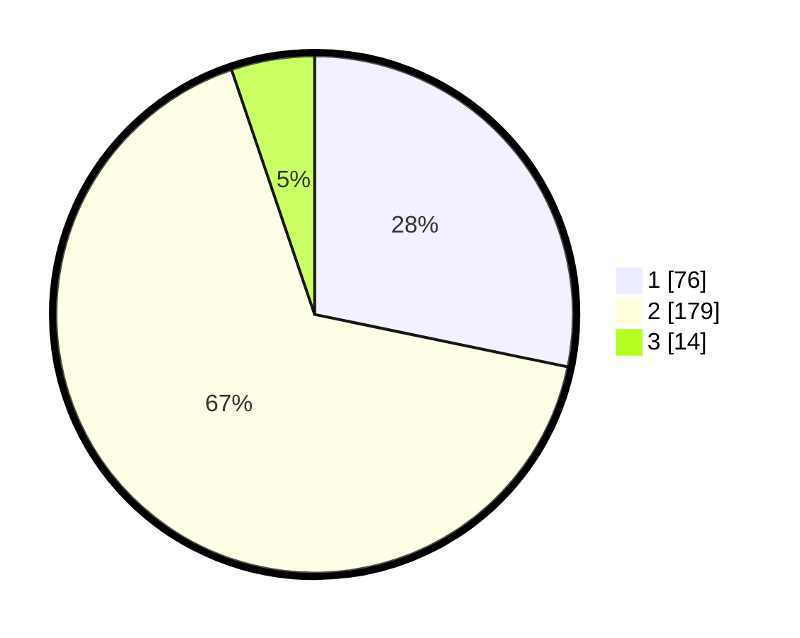

# Hasil

## Grafik

## Tabel

| No. | Nama Paslon    | Suara | Suara (raw) | Persentase |
|:--- |:-------------- | -----:| -----------:| ----------:|
| 1   | ANIES MUHAIMIN | 76    | [76][p-1]   | 28,25      |
| 2   | PRABOWO GIBRAN | 179   | [179][p-2]  | 66,54      |
| 3   | GANJAR MAHFUD  | 14    | [14][p-3]   | 5,20       |

[p-1]: https://github.com/gigit-pemilu/pemilu-2024/blob/main/pilpres/hitung-suara/sub/32-jawa-barat/sub/71-kota-bogor/sub/06-tanah-sareal/sub/1010-kayu-manis/sub/021-tps/sub/paslon-1.txt
[p-2]: https://github.com/gigit-pemilu/pemilu-2024/blob/main/pilpres/hitung-suara/sub/32-jawa-barat/sub/71-kota-bogor/sub/06-tanah-sareal/sub/1010-kayu-manis/sub/021-tps/sub/paslon-2.txt
[p-3]: https://github.com/gigit-pemilu/pemilu-2024/blob/main/pilpres/hitung-suara/sub/32-jawa-barat/sub/71-kota-bogor/sub/06-tanah-sareal/sub/1010-kayu-manis/sub/021-tps/sub/paslon-3.txt

## Foto C Plano

https://sirekap-obj-formc.kpu.go.id/bbd9/pemilu/ppwp/32/71/06/10/10/3271061010021-20240216-210634--5f200f8c-bdd4-4eae-89d2-c75b6aa87cbf.jpg

https://sirekap-obj-formc.kpu.go.id/bbd9/pemilu/ppwp/32/71/06/10/10/3271061010021-20240214-223334--f15defb8-dd95-458c-ba85-4707d3c141e3.jpg

https://sirekap-obj-formc.kpu.go.id/bbd9/pemilu/ppwp/32/71/06/10/10/3271061010021-20240214-223602--9f34ca32-fc61-48fe-8588-ad0761189a21.jpg

## Metadata

| Key        | Value               |
| ---------- | ------------------- |
| Time Stamp | 2024-02-16 22:01:00 |

