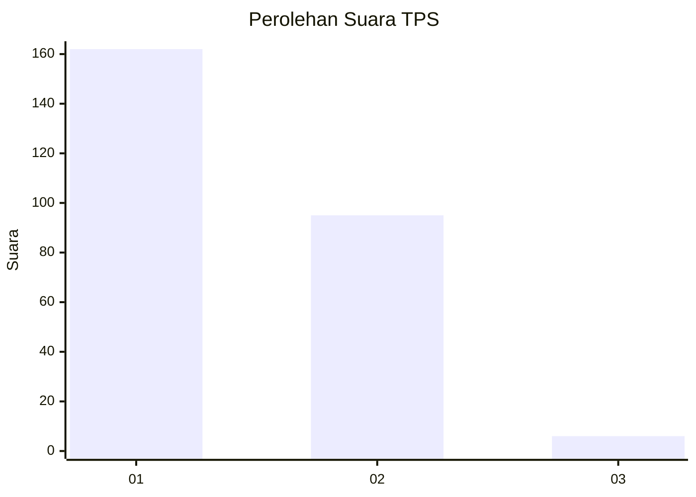
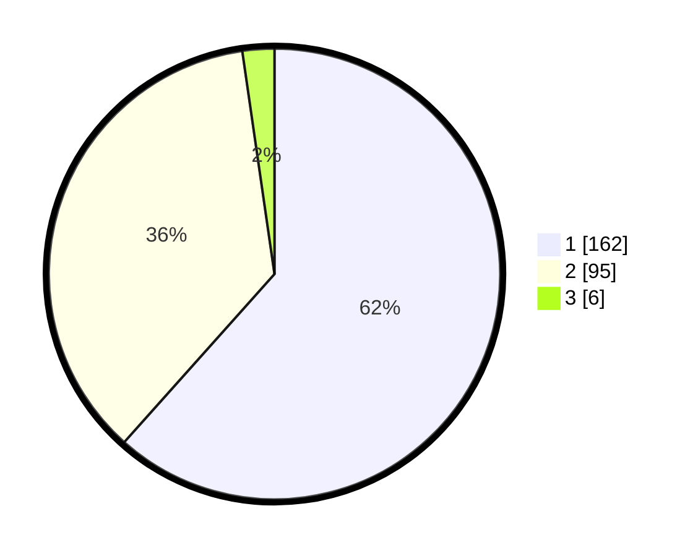

# Hasil

## Grafik

## Tabel

| No. | Nama Paslon    | Suara | Suara (raw) | Persentase |
|:--- |:-------------- | -----:| -----------:| ----------:|
| 1   | ANIES MUHAIMIN | 162   | [162][p-1]  | 61,60      |
| 2   | PRABOWO GIBRAN | 95    | [95][p-2]   | 36,12      |
| 3   | GANJAR MAHFUD  | 6     | [6][p-3]    | 2,28       |

[p-1]: https://github.com/gigit-pemilu/pemilu-2024-32-jawa-barat/blob/main/pilpres/hitung-suara/sub/32-jawa-barat/sub/72-kota-sukabumi/sub/01-gunung-puyuh/sub/1002-karamat/sub/005-tps/sub/paslon-1.txt
[p-2]: https://github.com/gigit-pemilu/pemilu-2024-32-jawa-barat/blob/main/pilpres/hitung-suara/sub/32-jawa-barat/sub/72-kota-sukabumi/sub/01-gunung-puyuh/sub/1002-karamat/sub/005-tps/sub/paslon-2.txt
[p-3]: https://github.com/gigit-pemilu/pemilu-2024-32-jawa-barat/blob/main/pilpres/hitung-suara/sub/32-jawa-barat/sub/72-kota-sukabumi/sub/01-gunung-puyuh/sub/1002-karamat/sub/005-tps/sub/paslon-3.txt

## Foto C Plano

https://sirekap-obj-formc.kpu.go.id/56ee/pemilu/ppwp/32/72/01/10/02/3272011002005-20240217-123702--7401635d-6d5e-4245-aa82-75287dd66d51.jpg

https://sirekap-obj-formc.kpu.go.id/56ee/pemilu/ppwp/32/72/01/10/02/3272011002005-20240217-123525--159f9033-4c90-4e06-af8f-0031edf67ab7.jpg

https://sirekap-obj-formc.kpu.go.id/56ee/pemilu/ppwp/32/72/01/10/02/3272011002005-20240217-120220--855be2e3-70ca-4d34-9950-a74e1f0fb998.jpg

## Metadata

| Key        | Value               |
| ---------- | ------------------- |
| Time Stamp | 2024-02-17 13:37:34 |

## DATA PEMILIH TETAP

Jumlah pemilih dalam DPT: **296**.
 * L: **752**.
 * P: **344**.

## DATA PENGGUNA HAK PILIH

Jumlah pengguna hak pilih dalam DPT: **253**.
 * L: **525**.
 * P: **628**.

Jumlah pengguna hak pilih dalam DPTb: **808**.
 * L: **887**.
 * P: **88**.

Jumlah pengguna hak pilih dalam DPK: **83**.
 * L: **880**.
 * P: **3**.

Jumlah pengguna hak pilih: **264**.
 * L: **432**.
 * P: **332**.

## JUMLAH SUARA SAH DAN TIDAK SAH

JUMLAH SELURUH SUARA SAH: **263**.

JUMLAH SUARA TIDAK SAH: **1**.

JUMLAH SELURUH SUARA SAH DAN SUARA TIDAK SAH: **264**.

