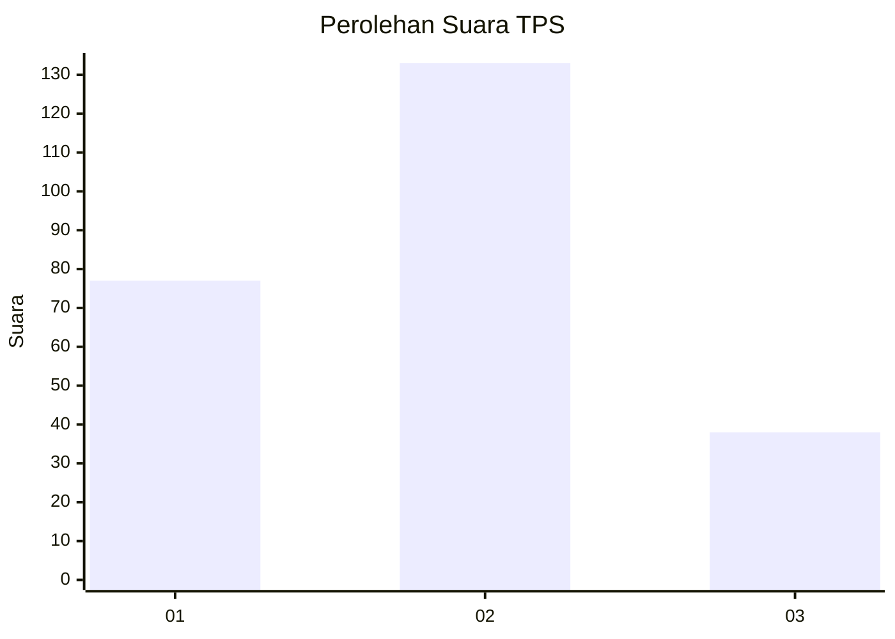
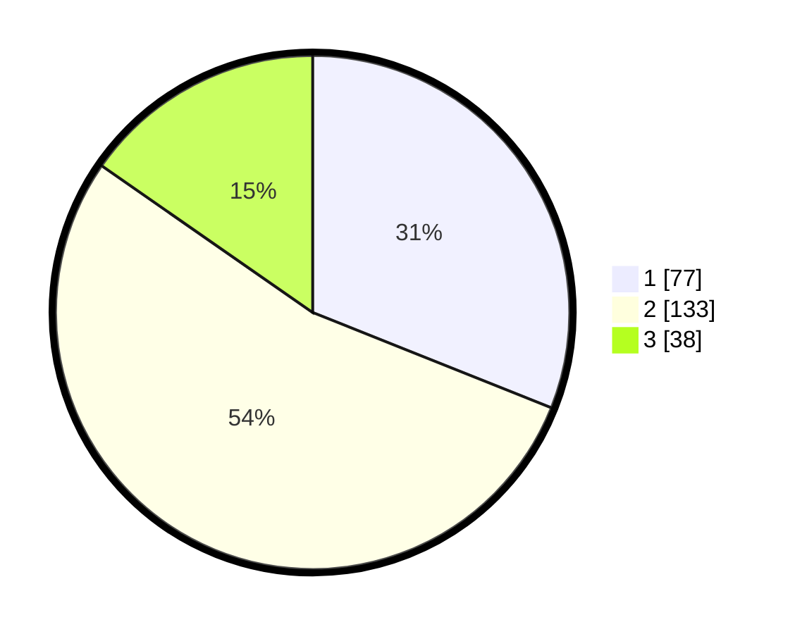

# Hasil

## Grafik

## Tabel

| No. | Nama Paslon    | Suara | Suara (raw) | Persentase |
|:--- |:-------------- | -----:| -----------:| ----------:|
| 1   | ANIES MUHAIMIN | 77    | [77][p-1]   | 31,05      |
| 2   | PRABOWO GIBRAN | 133   | [133][p-2]  | 53,63      |
| 3   | GANJAR MAHFUD  | 38    | [38][p-3]   | 15,32      |

[p-1]: https://github.com/gigit-pemilu/pemilu-2024-32-jawa-barat/blob/main/pilpres/hitung-suara/sub/32-jawa-barat/sub/72-kota-sukabumi/sub/02-cikole/sub/1001-cikole/sub/003-tps/sub/paslon-1.txt
[p-2]: https://github.com/gigit-pemilu/pemilu-2024-32-jawa-barat/blob/main/pilpres/hitung-suara/sub/32-jawa-barat/sub/72-kota-sukabumi/sub/02-cikole/sub/1001-cikole/sub/003-tps/sub/paslon-2.txt
[p-3]: https://github.com/gigit-pemilu/pemilu-2024-32-jawa-barat/blob/main/pilpres/hitung-suara/sub/32-jawa-barat/sub/72-kota-sukabumi/sub/02-cikole/sub/1001-cikole/sub/003-tps/sub/paslon-3.txt

## Foto C Plano

https://sirekap-obj-formc.kpu.go.id/b147/pemilu/ppwp/32/72/02/10/01/3272021001003-20240219-153815--6169a3c1-9dfb-4ef3-b448-e0737705cfcf.jpg

https://sirekap-obj-formc.kpu.go.id/b147/pemilu/ppwp/32/72/02/10/01/3272021001003-20240217-154547--726d50be-ce51-43e6-b1df-a6ff8f48c667.jpg

https://sirekap-obj-formc.kpu.go.id/b147/pemilu/ppwp/32/72/02/10/01/3272021001003-20240217-154615--0fd33d0c-59a8-4593-98a5-1a8821c7d3a8.jpg

## Metadata

| Key        | Value               |
| ---------- | ------------------- |
| Time Stamp | 2024-02-19 16:00:00 |

