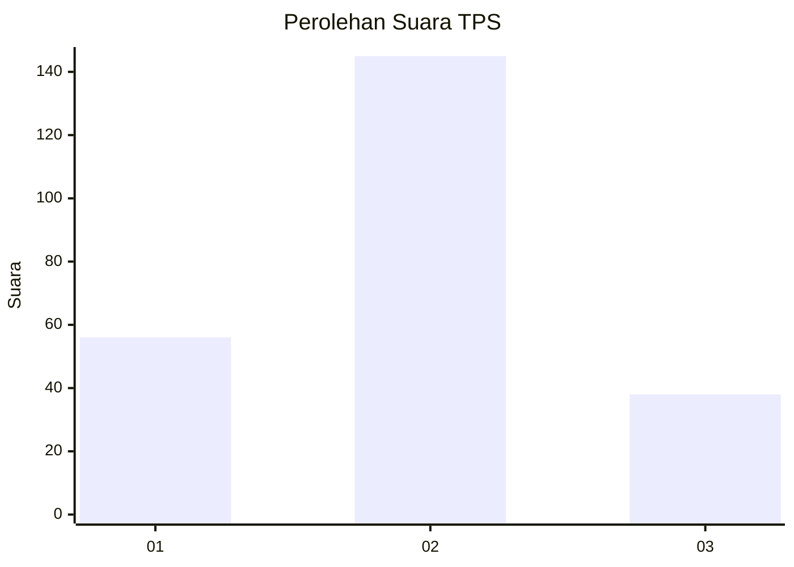

# Hasil

## Grafik

## Tabel

| No. | Nama Paslon    | Suara | Suara (raw) | Persentase |
|:--- |:-------------- | -----:| -----------:| ----------:|
| 1   | ANIES MUHAIMIN | 56    | [56][p-1]   | 23,43      |
| 2   | PRABOWO GIBRAN | 145   | [145][p-2]  | 60,67      |
| 3   | GANJAR MAHFUD  | 38    | [38][p-3]   | 15,90      |

[p-1]: https://github.com/gigit-pemilu/pemilu-2024/blob/main/pilpres/hitung-suara/sub/32-jawa-barat/sub/72-kota-sukabumi/sub/02-cikole/sub/1001-cikole/sub/004-tps/sub/paslon-1.txt
[p-2]: https://github.com/gigit-pemilu/pemilu-2024/blob/main/pilpres/hitung-suara/sub/32-jawa-barat/sub/72-kota-sukabumi/sub/02-cikole/sub/1001-cikole/sub/004-tps/sub/paslon-2.txt
[p-3]: https://github.com/gigit-pemilu/pemilu-2024/blob/main/pilpres/hitung-suara/sub/32-jawa-barat/sub/72-kota-sukabumi/sub/02-cikole/sub/1001-cikole/sub/004-tps/sub/paslon-3.txt

## Foto C Plano

https://sirekap-obj-formc.kpu.go.id/6b4f/pemilu/ppwp/32/72/02/10/01/3272021001004-20240214-155721--a7ee1a70-23f8-4e9e-ad1c-4745a5f655c0.jpg

https://sirekap-obj-formc.kpu.go.id/6b4f/pemilu/ppwp/32/72/02/10/01/3272021001004-20240214-155728--fd21a731-b264-42c7-8717-0885202984d8.jpg

https://sirekap-obj-formc.kpu.go.id/6b4f/pemilu/ppwp/32/72/02/10/01/3272021001004-20240214-155733--f2295a13-2145-49a1-9a76-e55b33b4a82b.jpg

## Metadata

| Key        | Value               |
| ---------- | ------------------- |
| Time Stamp | 2024-02-15 00:41:44 |

