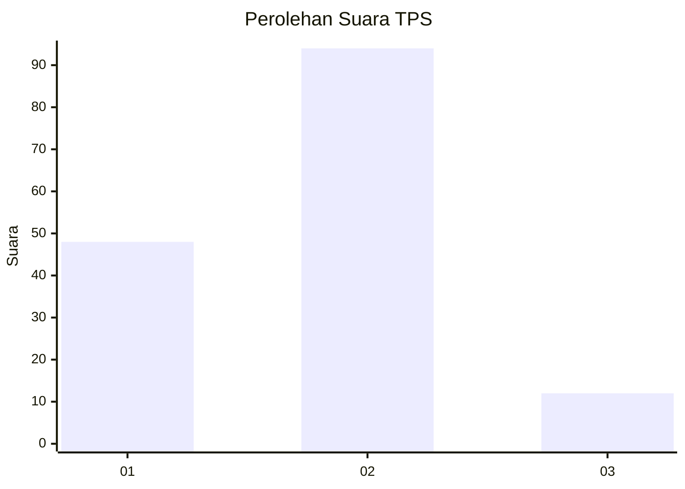
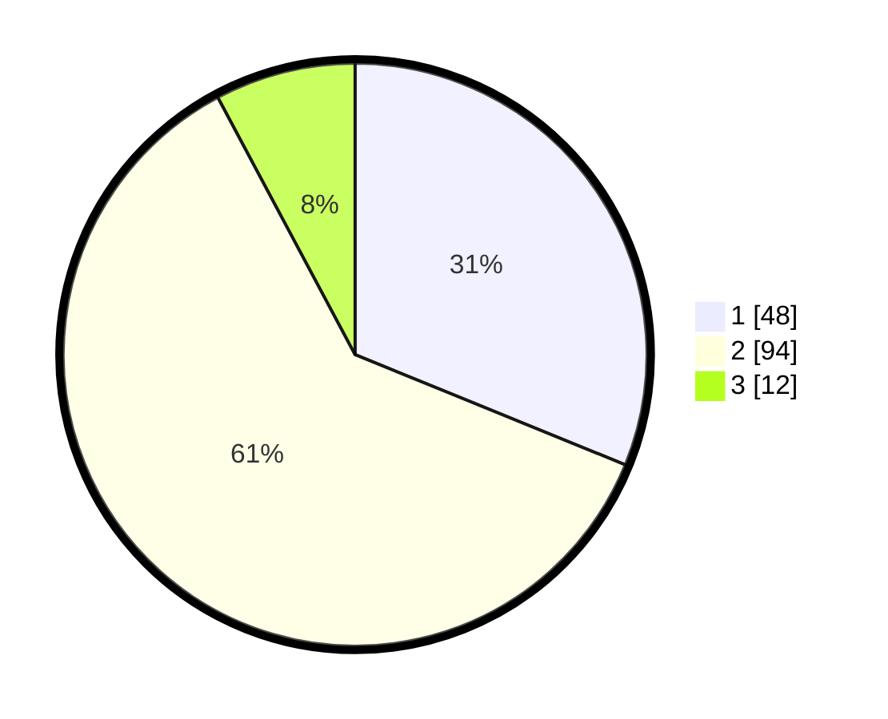

# Hasil

## Grafik

## Tabel

| No. | Nama Paslon    | Suara | Suara (raw) | Persentase |
|:--- |:-------------- | -----:| -----------:| ----------:|
| 1   | ANIES MUHAIMIN | 48    | [48][p-1]   | 31,17      |
| 2   | PRABOWO GIBRAN | 94    | [94][p-2]   | 61,04      |
| 3   | GANJAR MAHFUD  | 12    | [12][p-3]   | 7,79       |

[p-1]: https://github.com/gigit-pemilu/pemilu-2024/blob/main/pilpres/hitung-suara/sub/32-jawa-barat/sub/72-kota-sukabumi/sub/02-cikole/sub/1005-cisarua/sub/015-tps/sub/paslon-1.txt
[p-2]: https://github.com/gigit-pemilu/pemilu-2024/blob/main/pilpres/hitung-suara/sub/32-jawa-barat/sub/72-kota-sukabumi/sub/02-cikole/sub/1005-cisarua/sub/015-tps/sub/paslon-2.txt
[p-3]: https://github.com/gigit-pemilu/pemilu-2024/blob/main/pilpres/hitung-suara/sub/32-jawa-barat/sub/72-kota-sukabumi/sub/02-cikole/sub/1005-cisarua/sub/015-tps/sub/paslon-3.txt

## Foto C Plano

https://sirekap-obj-formc.kpu.go.id/9a41/pemilu/ppwp/32/72/02/10/05/3272021005015-20240218-021314--8bf99565-04f0-484c-9138-192711d051e7.jpg

https://sirekap-obj-formc.kpu.go.id/9a41/pemilu/ppwp/32/72/02/10/05/3272021005015-20240218-021330--7971cc16-26c7-4fdb-8fd0-997a4961ee7e.jpg

https://sirekap-obj-formc.kpu.go.id/9a41/pemilu/ppwp/32/72/02/10/05/3272021005015-20240217-145347--207b6da6-fd4d-4e17-8889-094b8534b84f.jpg

## Metadata

| Key        | Value               |
| ---------- | ------------------- |
| Time Stamp | 2024-02-19 06:16:00 |

## DATA PEMILIH TETAP

Jumlah pemilih dalam DPT: **411**.
 * L: **207**.
 * P: **441**.

## DATA PENGGUNA HAK PILIH

Jumlah pengguna hak pilih dalam DPT: **15**.
 * L: **7**.
 * P: **255**.

Jumlah pengguna hak pilih dalam DPTb: **431**.
 * L: **222**.
 * P: **544**.

Jumlah pengguna hak pilih dalam DPK: **621**.
 * L: **444**.
 * P: **444**.

Jumlah pengguna hak pilih: **500**.
 * L: **444**.
 * P: **525**.

## JUMLAH SUARA SAH DAN TIDAK SAH

JUMLAH SELURUH SUARA SAH: **162**.

JUMLAH SUARA TIDAK SAH: **4**.

JUMLAH SELURUH SUARA SAH DAN SUARA TIDAK SAH: **166**.

