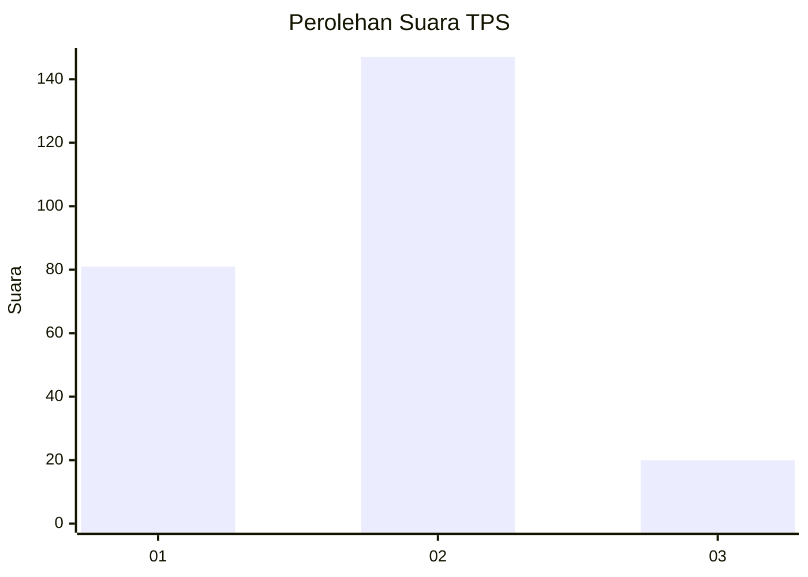
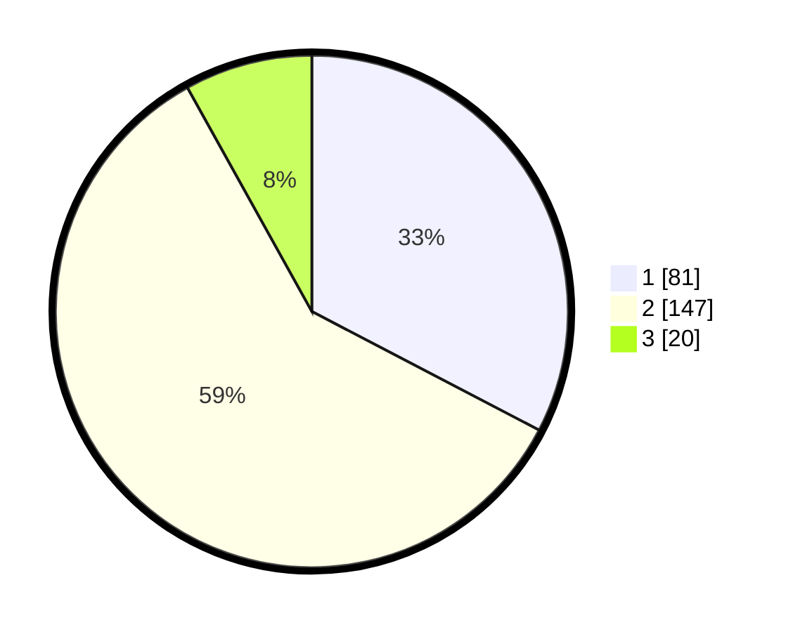

# Hasil

## Grafik

## Tabel

| No. | Nama Paslon    | Suara | Suara (raw) | Persentase |
|:--- |:-------------- | -----:| -----------:| ----------:|
| 1   | ANIES MUHAIMIN | 81    | [81][p-1]   | 32,66      |
| 2   | PRABOWO GIBRAN | 147   | [147][p-2]  | 59,27      |
| 3   | GANJAR MAHFUD  | 20    | [20][p-3]   | 8,06       |

[p-1]: https://github.com/gigit-pemilu/pemilu-2024/blob/main/pilpres/hitung-suara/sub/32-jawa-barat/sub/72-kota-sukabumi/sub/04-warudoyong/sub/1001-warudoyong/sub/003-tps/sub/paslon-1.txt
[p-2]: https://github.com/gigit-pemilu/pemilu-2024/blob/main/pilpres/hitung-suara/sub/32-jawa-barat/sub/72-kota-sukabumi/sub/04-warudoyong/sub/1001-warudoyong/sub/003-tps/sub/paslon-2.txt
[p-3]: https://github.com/gigit-pemilu/pemilu-2024/blob/main/pilpres/hitung-suara/sub/32-jawa-barat/sub/72-kota-sukabumi/sub/04-warudoyong/sub/1001-warudoyong/sub/003-tps/sub/paslon-3.txt

## Foto C Plano

https://sirekap-obj-formc.kpu.go.id/6bc1/pemilu/ppwp/32/72/04/10/01/3272041001003-20240220-160718--403c40e6-a6fc-4a2d-b730-9a52b50d2690.jpg

https://sirekap-obj-formc.kpu.go.id/6bc1/pemilu/ppwp/32/72/04/10/01/3272041001003-20240219-145224--916e0acb-5654-4e7f-9442-6f4c1086af02.jpg

https://sirekap-obj-formc.kpu.go.id/6bc1/pemilu/ppwp/32/72/04/10/01/3272041001003-20240219-145553--c4034989-bb83-469b-ab6b-2fa70d397e4c.jpg

## Metadata

| Key        | Value               |
| ---------- | ------------------- |
| Time Stamp | 2024-02-25 11:00:00 |

