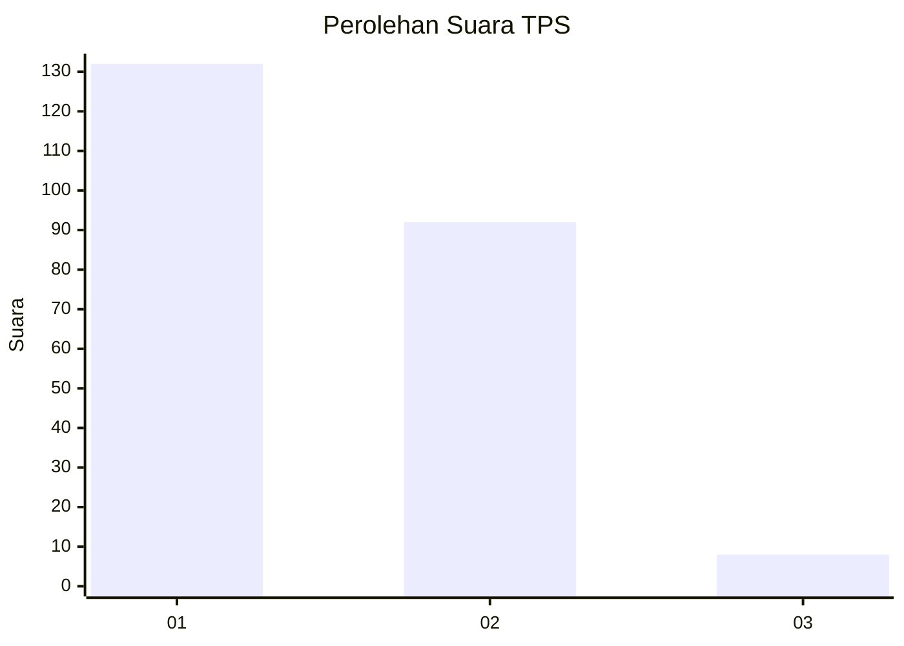
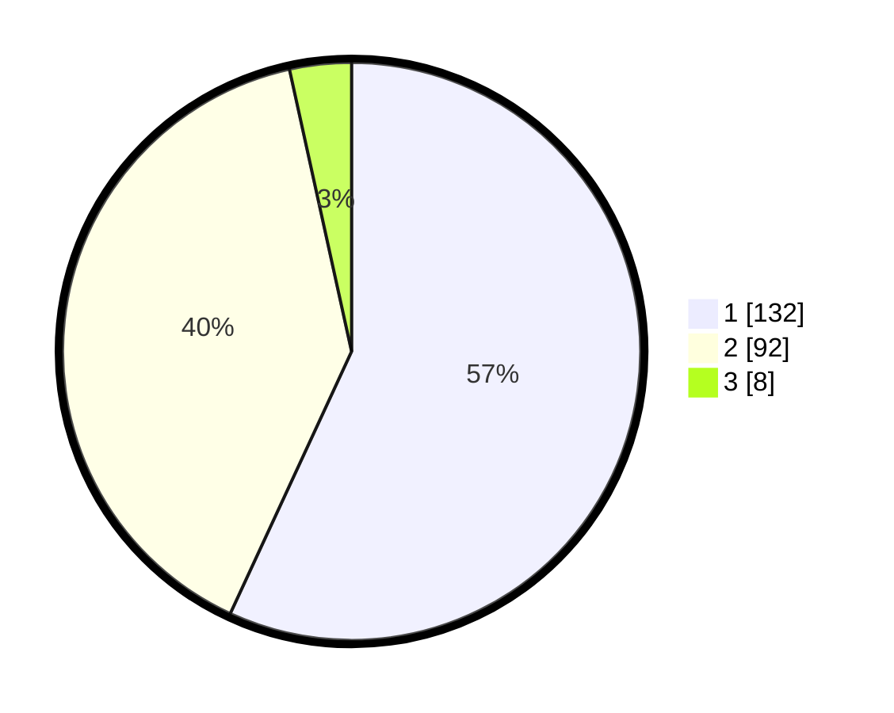

# Hasil

## Grafik

## Tabel

| No. | Nama Paslon    | Suara | Suara (raw) | Persentase |
|:--- |:-------------- | -----:| -----------:| ----------:|
| 1   | ANIES MUHAIMIN | 132   | [132][p-1]  | 56,90      |
| 2   | PRABOWO GIBRAN | 92    | [92][p-2]   | 39,66      |
| 3   | GANJAR MAHFUD  | 8     | [8][p-3]    | 3,45       |

[p-1]: https://github.com/gigit-pemilu/pemilu-2024-32-jawa-barat/blob/main/pilpres/hitung-suara/sub/32-jawa-barat/sub/72-kota-sukabumi/sub/05-baros/sub/1001-baros/sub/006-tps/sub/paslon-1.txt
[p-2]: https://github.com/gigit-pemilu/pemilu-2024-32-jawa-barat/blob/main/pilpres/hitung-suara/sub/32-jawa-barat/sub/72-kota-sukabumi/sub/05-baros/sub/1001-baros/sub/006-tps/sub/paslon-2.txt
[p-3]: https://github.com/gigit-pemilu/pemilu-2024-32-jawa-barat/blob/main/pilpres/hitung-suara/sub/32-jawa-barat/sub/72-kota-sukabumi/sub/05-baros/sub/1001-baros/sub/006-tps/sub/paslon-3.txt

## Foto C Plano

https://sirekap-obj-formc.kpu.go.id/3bb0/pemilu/ppwp/32/72/05/10/01/3272051001006-20240219-093858--bce9dc2b-a0fc-428c-baa6-f57a85f4df91.jpg

https://sirekap-obj-formc.kpu.go.id/3bb0/pemilu/ppwp/32/72/05/10/01/3272051001006-20240214-210420--32b0eca7-d97f-4339-a21e-6a98fb5697d2.jpg

https://sirekap-obj-formc.kpu.go.id/3bb0/pemilu/ppwp/32/72/05/10/01/3272051001006-20240214-210518--989a8579-821f-4f72-bc9e-fa866445afea.jpg

## Metadata

| Key        | Value               |
| ---------- | ------------------- |
| Time Stamp | 2024-02-19 10:00:00 |

