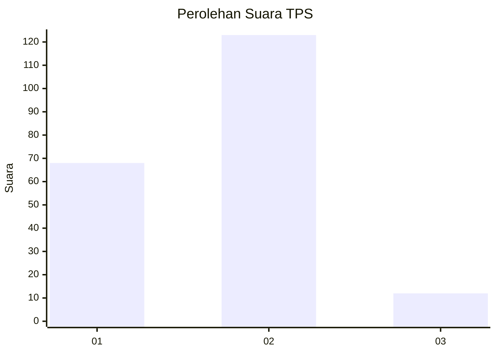
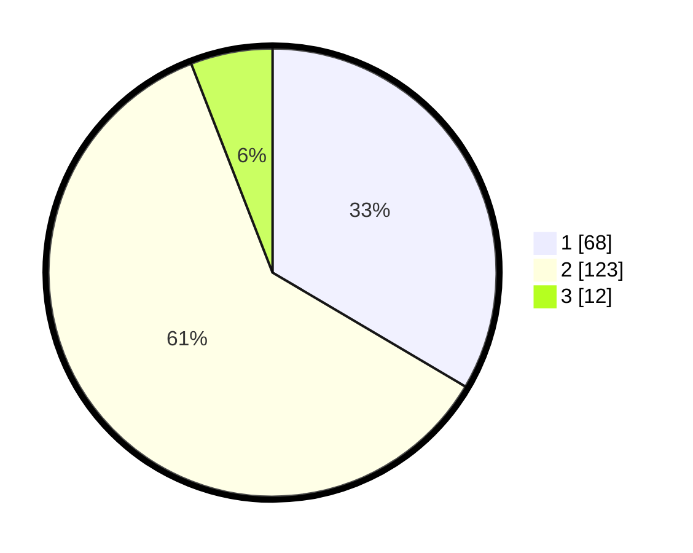

# Hasil

## Grafik

## Tabel

| No. | Nama Paslon    | Suara | Suara (raw) | Persentase |
|:--- |:-------------- | -----:| -----------:| ----------:|
| 1   | ANIES MUHAIMIN | 68    | [68][p-1]   | 33,50      |
| 2   | PRABOWO GIBRAN | 123   | [123][p-2]  | 60,59      |
| 3   | GANJAR MAHFUD  | 12    | [12][p-3]   | 5,91       |

[p-1]: https://github.com/gigit-pemilu/pemilu-2024-32-jawa-barat/blob/main/pilpres/hitung-suara/sub/32-jawa-barat/sub/72-kota-sukabumi/sub/07-cibeureum/sub/1001-cibeureum-hilir/sub/004-tps/sub/paslon-1.txt
[p-2]: https://github.com/gigit-pemilu/pemilu-2024-32-jawa-barat/blob/main/pilpres/hitung-suara/sub/32-jawa-barat/sub/72-kota-sukabumi/sub/07-cibeureum/sub/1001-cibeureum-hilir/sub/004-tps/sub/paslon-2.txt
[p-3]: https://github.com/gigit-pemilu/pemilu-2024-32-jawa-barat/blob/main/pilpres/hitung-suara/sub/32-jawa-barat/sub/72-kota-sukabumi/sub/07-cibeureum/sub/1001-cibeureum-hilir/sub/004-tps/sub/paslon-3.txt

## Foto C Plano

https://sirekap-obj-formc.kpu.go.id/9baf/pemilu/ppwp/32/72/07/10/01/3272071001004-20240219-102436--36753ce9-281a-4842-84a5-43cfe68a78bf.jpg

https://sirekap-obj-formc.kpu.go.id/9baf/pemilu/ppwp/32/72/07/10/01/3272071001004-20240219-102554--8df97c61-43f4-424e-96e5-424e0727d1a7.jpg

https://sirekap-obj-formc.kpu.go.id/9baf/pemilu/ppwp/32/72/07/10/01/3272071001004-20240219-102623--7a77fbcb-0e12-41e7-9ea4-e53f55c9a752.jpg

## Metadata

| Key        | Value               |
| ---------- | ------------------- |
| Time Stamp | 2024-02-25 11:00:00 |

