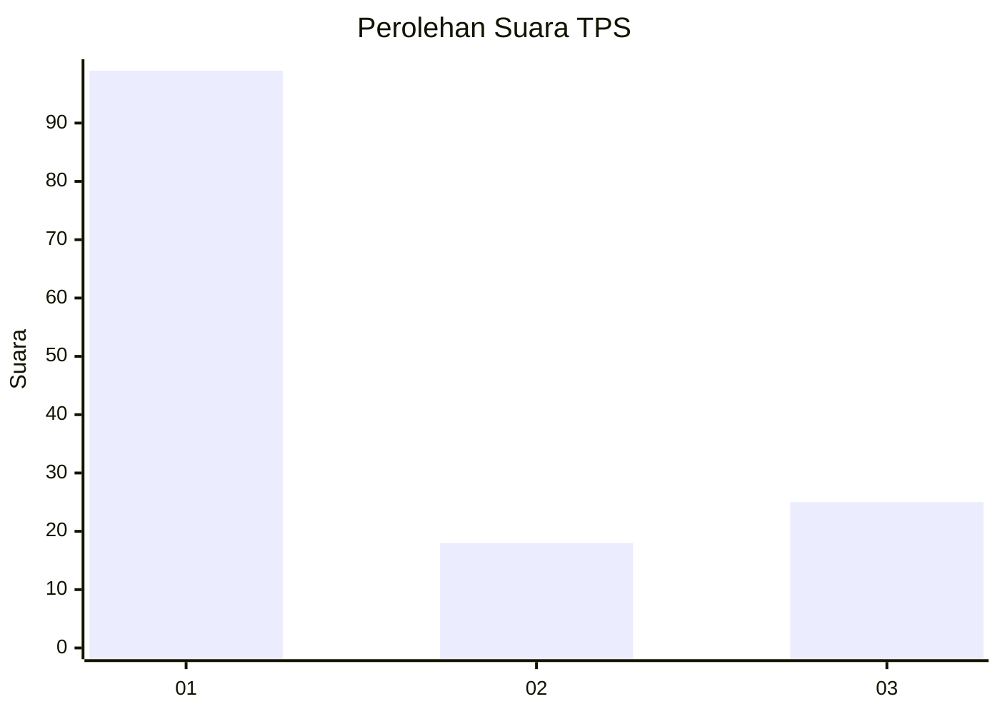
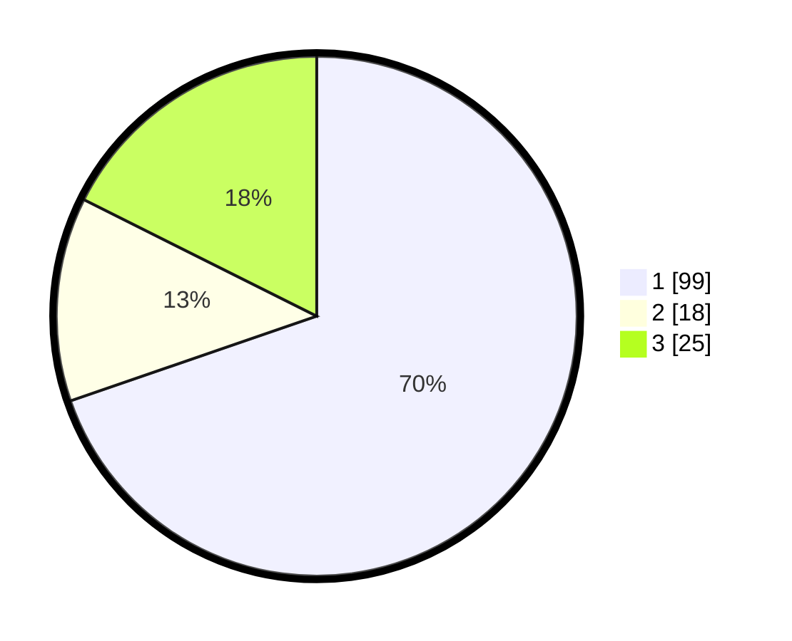

# Hasil

## Grafik

## Tabel

| No. | Nama Paslon    | Suara | Suara (raw) | Persentase |
|:--- |:-------------- | -----:| -----------:| ----------:|
| 1   | ANIES MUHAIMIN | 99    | [99][p-1]   | 69,72      |
| 2   | PRABOWO GIBRAN | 18    | [18][p-2]   | 12,68      |
| 3   | GANJAR MAHFUD  | 25    | [25][p-3]   | 17,61      |

[p-1]: https://github.com/gigit-pemilu/pemilu-2024/blob/main/pilpres/hitung-suara/sub/32-jawa-barat/sub/72-kota-sukabumi/sub/07-cibeureum/sub/1002-babakan/sub/024-tps/sub/paslon-1.txt
[p-2]: https://github.com/gigit-pemilu/pemilu-2024/blob/main/pilpres/hitung-suara/sub/32-jawa-barat/sub/72-kota-sukabumi/sub/07-cibeureum/sub/1002-babakan/sub/024-tps/sub/paslon-2.txt
[p-3]: https://github.com/gigit-pemilu/pemilu-2024/blob/main/pilpres/hitung-suara/sub/32-jawa-barat/sub/72-kota-sukabumi/sub/07-cibeureum/sub/1002-babakan/sub/024-tps/sub/paslon-3.txt

## Foto C Plano

https://sirekap-obj-formc.kpu.go.id/5ff2/pemilu/ppwp/32/72/07/10/02/3272071002024-20240217-143306--6ba22f55-f25b-4928-8c9a-c80ce21967d6.jpg

https://sirekap-obj-formc.kpu.go.id/5ff2/pemilu/ppwp/32/72/07/10/02/3272071002024-20240214-190400--bd807264-f621-4579-81e6-6dc3f33dada9.jpg

https://sirekap-obj-formc.kpu.go.id/5ff2/pemilu/ppwp/32/72/07/10/02/3272071002024-20240217-143541--a9b22ad4-9e83-466b-8067-09763bf37943.jpg

## Metadata

| Key        | Value               |
| ---------- | ------------------- |
| Time Stamp | 2024-02-17 16:52:47 |

