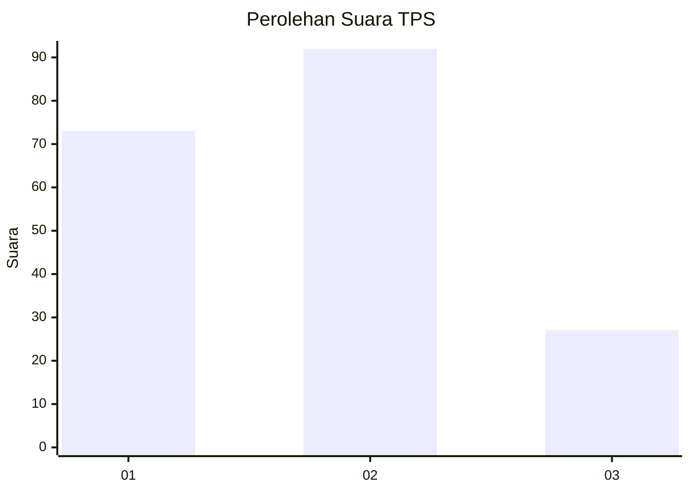
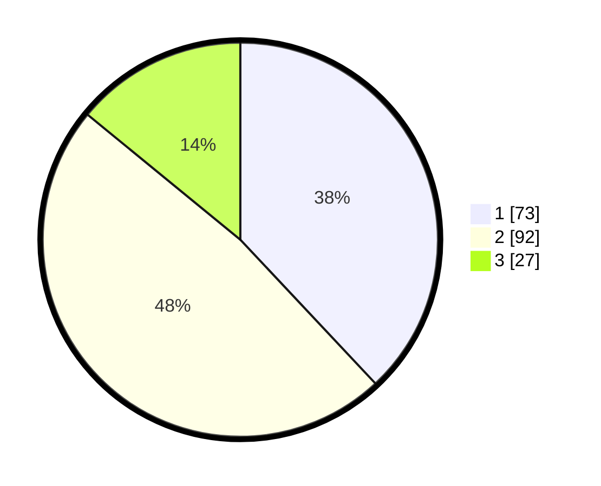

# Hasil

## Grafik

## Tabel

| No. | Nama Paslon    | Suara | Suara (raw) | Persentase |
|:--- |:-------------- | -----:| -----------:| ----------:|
| 1   | ANIES MUHAIMIN | 73    | [73][p-1]   | 38,02      |
| 2   | PRABOWO GIBRAN | 92    | [92][p-2]   | 47,92      |
| 3   | GANJAR MAHFUD  | 27    | [27][p-3]   | 14,06      |

[p-1]: https://github.com/gigit-pemilu/pemilu-2024-32-jawa-barat/blob/main/pilpres/hitung-suara/sub/32-jawa-barat/sub/73-kota-bandung/sub/01-sukasari/sub/1001-sukarasa/sub/001-tps/sub/paslon-1.txt
[p-2]: https://github.com/gigit-pemilu/pemilu-2024-32-jawa-barat/blob/main/pilpres/hitung-suara/sub/32-jawa-barat/sub/73-kota-bandung/sub/01-sukasari/sub/1001-sukarasa/sub/001-tps/sub/paslon-2.txt
[p-3]: https://github.com/gigit-pemilu/pemilu-2024-32-jawa-barat/blob/main/pilpres/hitung-suara/sub/32-jawa-barat/sub/73-kota-bandung/sub/01-sukasari/sub/1001-sukarasa/sub/001-tps/sub/paslon-3.txt

## Foto C Plano

https://sirekap-obj-formc.kpu.go.id/f694/pemilu/ppwp/32/73/01/10/01/3273011001001-20240214-195224--8dd5f729-2e7d-43e5-a9ab-f090fb52b553.jpg

https://sirekap-obj-formc.kpu.go.id/f694/pemilu/ppwp/32/73/01/10/01/3273011001001-20240214-195247--a5947bb7-080e-43d9-a504-c96c395cadcd.jpg

https://sirekap-obj-formc.kpu.go.id/f694/pemilu/ppwp/32/73/01/10/01/3273011001001-20240214-195303--a9f2d528-eb9b-467b-a96c-e19553b28511.jpg

## Metadata

| Key        | Value               |
| ---------- | ------------------- |
| Time Stamp | 2024-02-14 21:46:01 |

