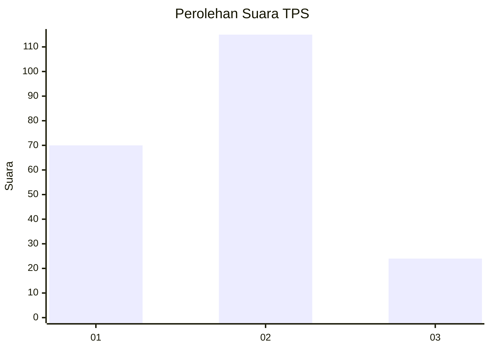
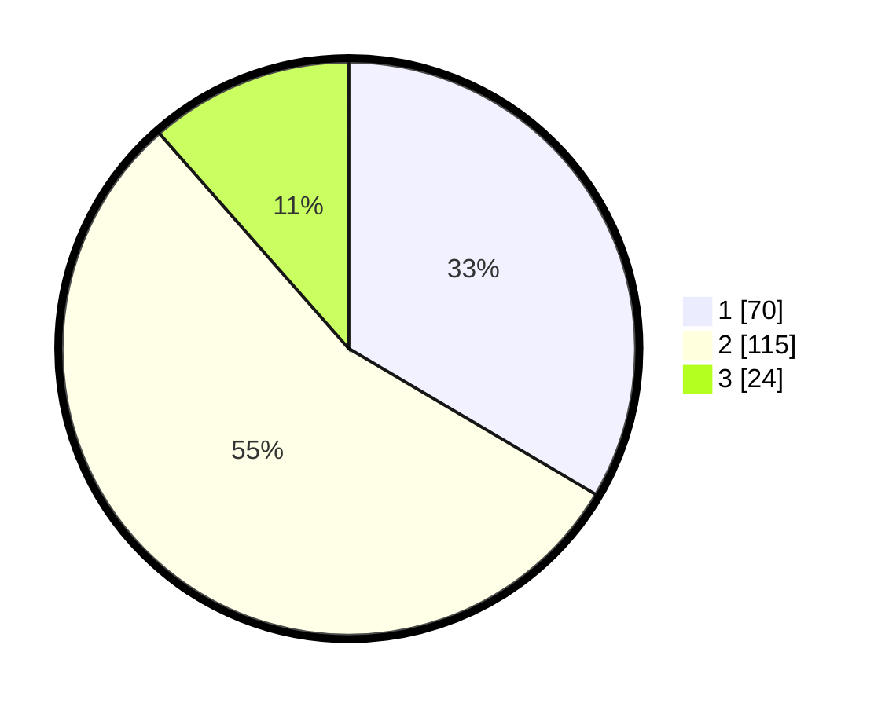

# Hasil

## Grafik

## Tabel

| No. | Nama Paslon    | Suara | Suara (raw) | Persentase |
|:--- |:-------------- | -----:| -----------:| ----------:|
| 1   | ANIES MUHAIMIN | 70    | [70][p-1]   | 33,49      |
| 2   | PRABOWO GIBRAN | 115   | [115][p-2]  | 55,02      |
| 3   | GANJAR MAHFUD  | 24    | [24][p-3]   | 11,48      |

[p-1]: https://github.com/gigit-pemilu/pemilu-2024-32-jawa-barat/blob/main/pilpres/hitung-suara/sub/32-jawa-barat/sub/73-kota-bandung/sub/01-sukasari/sub/1001-sukarasa/sub/003-tps/sub/paslon-1.txt
[p-2]: https://github.com/gigit-pemilu/pemilu-2024-32-jawa-barat/blob/main/pilpres/hitung-suara/sub/32-jawa-barat/sub/73-kota-bandung/sub/01-sukasari/sub/1001-sukarasa/sub/003-tps/sub/paslon-2.txt
[p-3]: https://github.com/gigit-pemilu/pemilu-2024-32-jawa-barat/blob/main/pilpres/hitung-suara/sub/32-jawa-barat/sub/73-kota-bandung/sub/01-sukasari/sub/1001-sukarasa/sub/003-tps/sub/paslon-3.txt

## Foto C Plano

https://sirekap-obj-formc.kpu.go.id/7610/pemilu/ppwp/32/73/01/10/01/3273011001003-20240214-190915--5c441f9d-f205-4ca6-9506-4df88765dac4.jpg

https://sirekap-obj-formc.kpu.go.id/7610/pemilu/ppwp/32/73/01/10/01/3273011001003-20240214-191349--984ebff3-827a-43d9-9e16-4b379d9aed1c.jpg

https://sirekap-obj-formc.kpu.go.id/7610/pemilu/ppwp/32/73/01/10/01/3273011001003-20240214-210330--97085173-d40f-475f-a0c7-6fcbd1b81f50.jpg

## Metadata

| Key        | Value               |
| ---------- | ------------------- |
| Time Stamp | 2024-02-15 02:10:27 |

