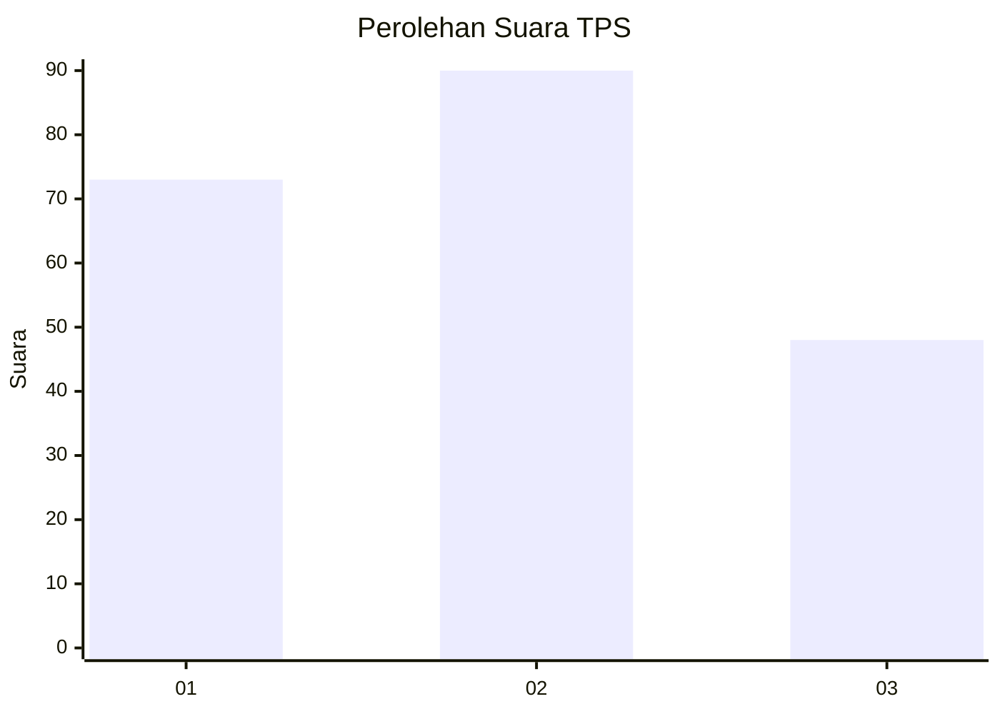
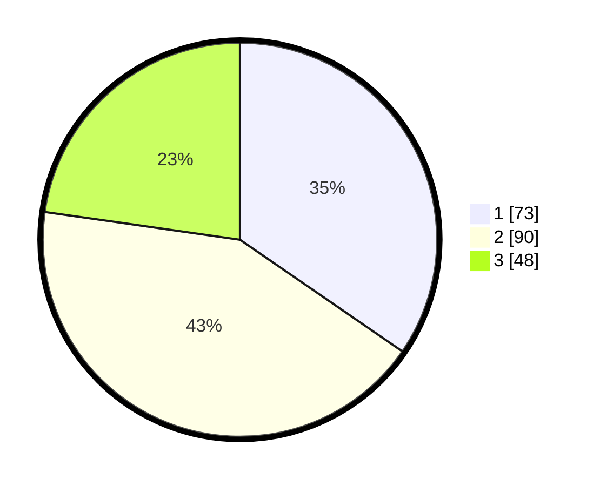

# Hasil

## Grafik

## Tabel

| No. | Nama Paslon    | Suara | Suara (raw) | Persentase |
|:--- |:-------------- | -----:| -----------:| ----------:|
| 1   | ANIES MUHAIMIN | 73    | [73][p-1]   | 34,60      |
| 2   | PRABOWO GIBRAN | 90    | [90][p-2]   | 42,65      |
| 3   | GANJAR MAHFUD  | 48    | [48][p-3]   | 22,75      |

[p-1]: https://github.com/gigit-pemilu/pemilu-2024/blob/main/pilpres/hitung-suara/sub/32-jawa-barat/sub/73-kota-bandung/sub/01-sukasari/sub/1001-sukarasa/sub/005-tps/sub/paslon-1.txt
[p-2]: https://github.com/gigit-pemilu/pemilu-2024/blob/main/pilpres/hitung-suara/sub/32-jawa-barat/sub/73-kota-bandung/sub/01-sukasari/sub/1001-sukarasa/sub/005-tps/sub/paslon-2.txt
[p-3]: https://github.com/gigit-pemilu/pemilu-2024/blob/main/pilpres/hitung-suara/sub/32-jawa-barat/sub/73-kota-bandung/sub/01-sukasari/sub/1001-sukarasa/sub/005-tps/sub/paslon-3.txt

## Foto C Plano

https://sirekap-obj-formc.kpu.go.id/dcc2/pemilu/ppwp/32/73/01/10/01/3273011001005-20240214-235530--0f11088f-195b-4c51-a764-ceee1033b6c9.jpg

https://sirekap-obj-formc.kpu.go.id/dcc2/pemilu/ppwp/32/73/01/10/01/3273011001005-20240214-224956--581c1f6d-a6e5-4295-94c0-fa0009b81957.jpg

https://sirekap-obj-formc.kpu.go.id/dcc2/pemilu/ppwp/32/73/01/10/01/3273011001005-20240214-224847--4e580932-cdc1-46f2-bffc-031ba75f00c9.jpg

## Metadata

| Key        | Value               |
| ---------- | ------------------- |
| Time Stamp | 2024-02-15 15:00:29 |

