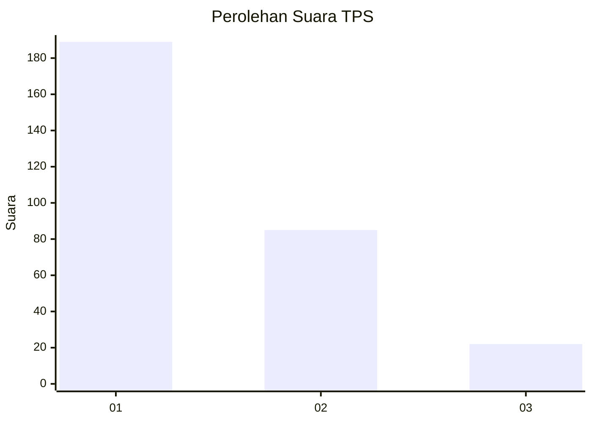
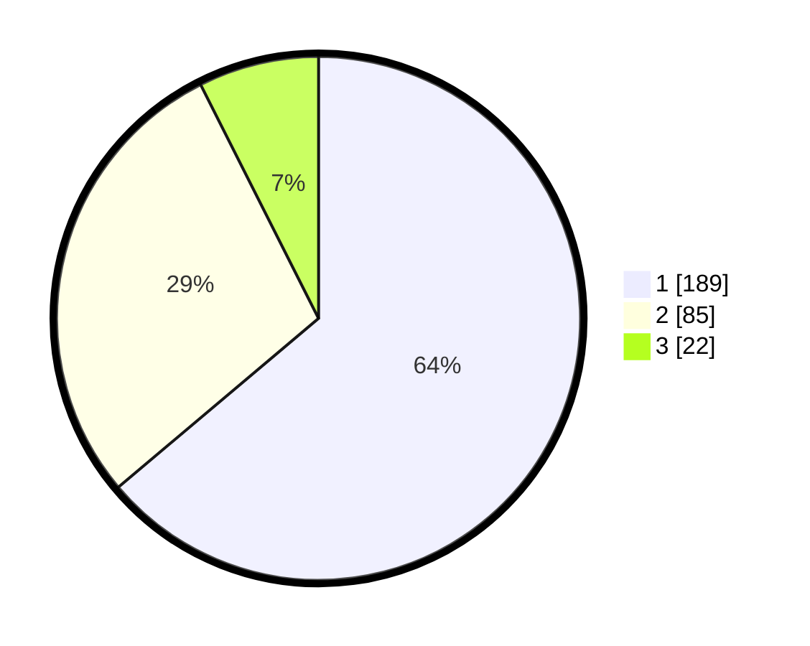

# Hasil

## Grafik

## Tabel

| No. | Nama Paslon    | Suara | Suara (raw) | Persentase |
|:--- |:-------------- | -----:| -----------:| ----------:|
| 1   | ANIES MUHAIMIN | 189   | [189][p-1]  | 63,85      |
| 2   | PRABOWO GIBRAN | 85    | [85][p-2]   | 28,72      |
| 3   | GANJAR MAHFUD  | 22    | [22][p-3]   | 7,43       |

[p-1]: https://github.com/gigit-pemilu/pemilu-2024-32-jawa-barat/blob/main/pilpres/hitung-suara/sub/32-jawa-barat/sub/73-kota-bandung/sub/01-sukasari/sub/1004-sarijadi/sub/035-tps/sub/paslon-1.txt
[p-2]: https://github.com/gigit-pemilu/pemilu-2024-32-jawa-barat/blob/main/pilpres/hitung-suara/sub/32-jawa-barat/sub/73-kota-bandung/sub/01-sukasari/sub/1004-sarijadi/sub/035-tps/sub/paslon-2.txt
[p-3]: https://github.com/gigit-pemilu/pemilu-2024-32-jawa-barat/blob/main/pilpres/hitung-suara/sub/32-jawa-barat/sub/73-kota-bandung/sub/01-sukasari/sub/1004-sarijadi/sub/035-tps/sub/paslon-3.txt

## Foto C Plano

https://sirekap-obj-formc.kpu.go.id/9d23/pemilu/ppwp/32/73/01/10/04/3273011004035-20240215-020401--5d3c92a1-cacb-4f4c-bd2b-985d5f1a459b.jpg

https://sirekap-obj-formc.kpu.go.id/9d23/pemilu/ppwp/32/73/01/10/04/3273011004035-20240215-020145--ed7cee61-a3ec-486e-bd52-b93ec0fbfe8f.jpg

https://sirekap-obj-formc.kpu.go.id/9d23/pemilu/ppwp/32/73/01/10/04/3273011004035-20240215-021040--ed61908d-4475-4854-913d-baff1233e5a6.jpg

## Metadata

| Key        | Value               |
| ---------- | ------------------- |
| Time Stamp | 2024-02-25 16:00:00 |

