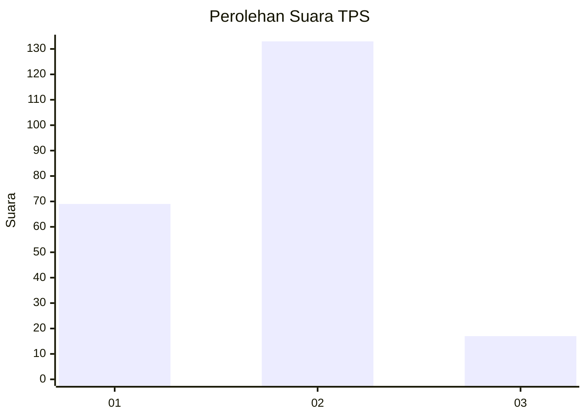
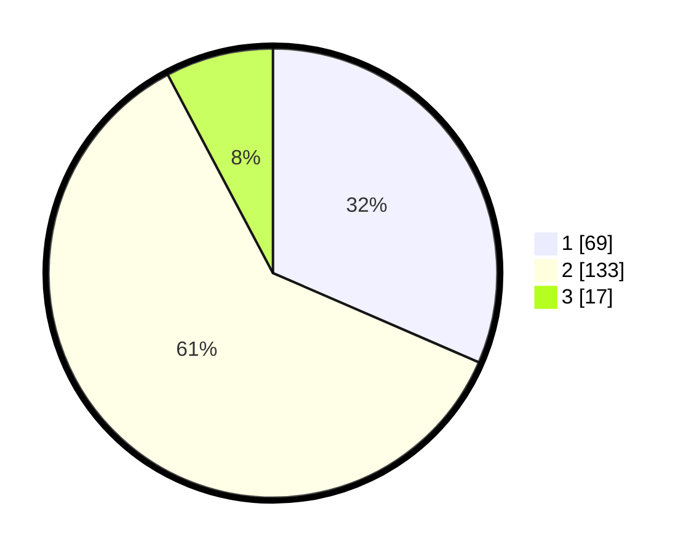

# Hasil

## Grafik

## Tabel

| No. | Nama Paslon    | Suara | Suara (raw) | Persentase |
|:--- |:-------------- | -----:| -----------:| ----------:|
| 1   | ANIES MUHAIMIN | 69    | [69][p-1]   | 31,51      |
| 2   | PRABOWO GIBRAN | 133   | [133][p-2]  | 60,73      |
| 3   | GANJAR MAHFUD  | 17    | [17][p-3]   | 7,76       |

[p-1]: https://github.com/gigit-pemilu/pemilu-2024/blob/main/pilpres/hitung-suara/sub/32-jawa-barat/sub/73-kota-bandung/sub/02-coblong/sub/1001-cipaganti/sub/002-tps/sub/paslon-1.txt
[p-2]: https://github.com/gigit-pemilu/pemilu-2024/blob/main/pilpres/hitung-suara/sub/32-jawa-barat/sub/73-kota-bandung/sub/02-coblong/sub/1001-cipaganti/sub/002-tps/sub/paslon-2.txt
[p-3]: https://github.com/gigit-pemilu/pemilu-2024/blob/main/pilpres/hitung-suara/sub/32-jawa-barat/sub/73-kota-bandung/sub/02-coblong/sub/1001-cipaganti/sub/002-tps/sub/paslon-3.txt

## Foto C Plano

https://sirekap-obj-formc.kpu.go.id/2c48/pemilu/ppwp/32/73/02/10/01/3273021001002-20240216-202435--89f43d4d-1912-4bfe-996d-0fa276826f8f.jpg

https://sirekap-obj-formc.kpu.go.id/2c48/pemilu/ppwp/32/73/02/10/01/3273021001002-20240216-203712--358ee71f-f2e2-49b6-b144-33a86ef497f5.jpg

https://sirekap-obj-formc.kpu.go.id/2c48/pemilu/ppwp/32/73/02/10/01/3273021001002-20240217-105654--302305fe-53a9-40bc-9afa-361a859219b0.jpg

## Metadata

| Key        | Value               |
| ---------- | ------------------- |
| Time Stamp | 2024-02-17 11:00:02 |

