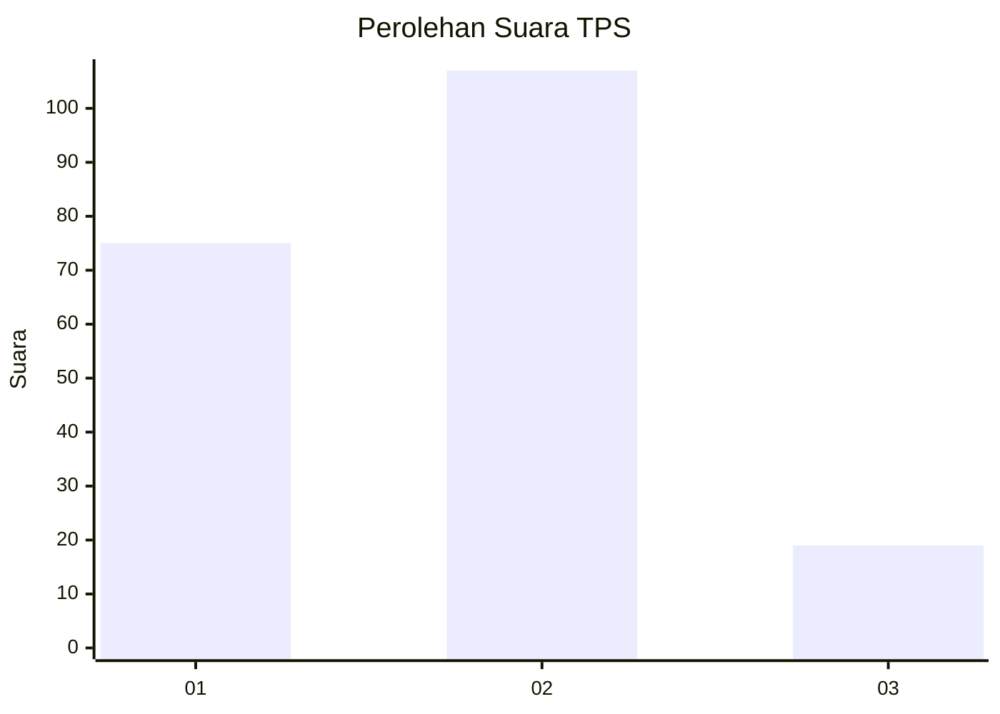

# Hasil

## Grafik

## Tabel

| No. | Nama Paslon    | Suara | Suara (raw) | Persentase |
|:--- |:-------------- | -----:| -----------:| ----------:|
| 1   | ANIES MUHAIMIN | 75    | [75][p-1]   | 37,31      |
| 2   | PRABOWO GIBRAN | 107   | [107][p-2]  | 53,23      |
| 3   | GANJAR MAHFUD  | 19    | [19][p-3]   | 9,45       |

[p-1]: https://github.com/gigit-pemilu/pemilu-2024/blob/main/pilpres/hitung-suara/sub/32-jawa-barat/sub/73-kota-bandung/sub/02-coblong/sub/1001-cipaganti/sub/004-tps/sub/paslon-1.txt
[p-2]: https://github.com/gigit-pemilu/pemilu-2024/blob/main/pilpres/hitung-suara/sub/32-jawa-barat/sub/73-kota-bandung/sub/02-coblong/sub/1001-cipaganti/sub/004-tps/sub/paslon-2.txt
[p-3]: https://github.com/gigit-pemilu/pemilu-2024/blob/main/pilpres/hitung-suara/sub/32-jawa-barat/sub/73-kota-bandung/sub/02-coblong/sub/1001-cipaganti/sub/004-tps/sub/paslon-3.txt

## Foto C Plano

https://sirekap-obj-formc.kpu.go.id/9991/pemilu/ppwp/32/73/02/10/01/3273021001004-20240214-221854--7595f51a-1b10-4350-b3af-96220ceb4db7.jpg

https://sirekap-obj-formc.kpu.go.id/9991/pemilu/ppwp/32/73/02/10/01/3273021001004-20240215-000947--3b64c9dc-48e6-46f2-ae5f-364b45d52cb1.jpg

https://sirekap-obj-formc.kpu.go.id/9991/pemilu/ppwp/32/73/02/10/01/3273021001004-20240215-001127--2ba6a39f-af3a-4d08-b222-0e5de560f950.jpg

## Metadata

| Key        | Value               |
| ---------- | ------------------- |
| Time Stamp | 2024-02-16 12:51:22 |

