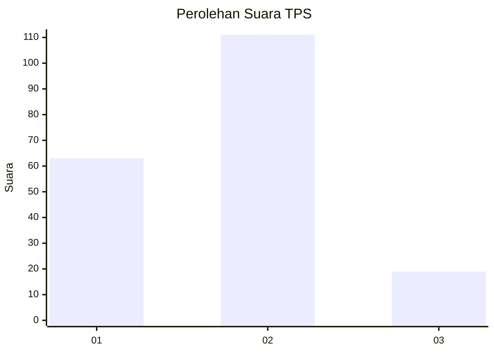
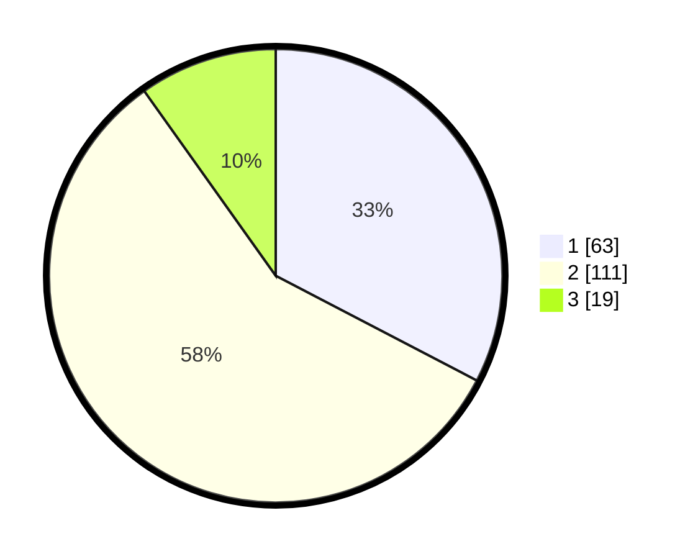

# Hasil

## Grafik

## Tabel

| No. | Nama Paslon    | Suara | Suara (raw) | Persentase |
|:--- |:-------------- | -----:| -----------:| ----------:|
| 1   | ANIES MUHAIMIN | 63    | [63][p-1]   | 32,64      |
| 2   | PRABOWO GIBRAN | 111   | [111][p-2]  | 57,51      |
| 3   | GANJAR MAHFUD  | 19    | [19][p-3]   | 9,84       |

[p-1]: https://github.com/gigit-pemilu/pemilu-2024-32-jawa-barat/blob/main/pilpres/hitung-suara/sub/32-jawa-barat/sub/73-kota-bandung/sub/02-coblong/sub/1001-cipaganti/sub/006-tps/sub/paslon-1.txt
[p-2]: https://github.com/gigit-pemilu/pemilu-2024-32-jawa-barat/blob/main/pilpres/hitung-suara/sub/32-jawa-barat/sub/73-kota-bandung/sub/02-coblong/sub/1001-cipaganti/sub/006-tps/sub/paslon-2.txt
[p-3]: https://github.com/gigit-pemilu/pemilu-2024-32-jawa-barat/blob/main/pilpres/hitung-suara/sub/32-jawa-barat/sub/73-kota-bandung/sub/02-coblong/sub/1001-cipaganti/sub/006-tps/sub/paslon-3.txt

## Foto C Plano

https://sirekap-obj-formc.kpu.go.id/fc63/pemilu/ppwp/32/73/02/10/01/3273021001006-20240215-185023--eb8d75f9-616d-4533-89dd-4855e72a4dd6.jpg

https://sirekap-obj-formc.kpu.go.id/fc63/pemilu/ppwp/32/73/02/10/01/3273021001006-20240214-231122--f704f73e-6e0e-463b-bb1e-22bf2686d806.jpg

https://sirekap-obj-formc.kpu.go.id/fc63/pemilu/ppwp/32/73/02/10/01/3273021001006-20240214-231427--2fdc4d44-13b3-44bf-8b34-da3dc2be2431.jpg

## Metadata

| Key        | Value               |
| ---------- | ------------------- |
| Time Stamp | 2024-02-15 19:00:26 |

