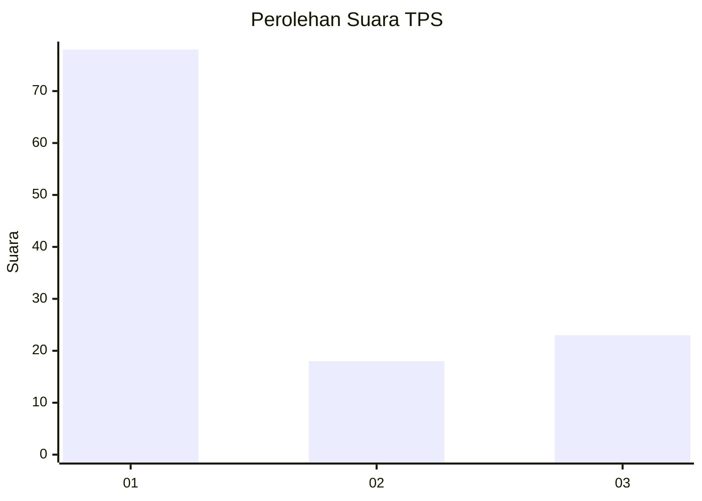
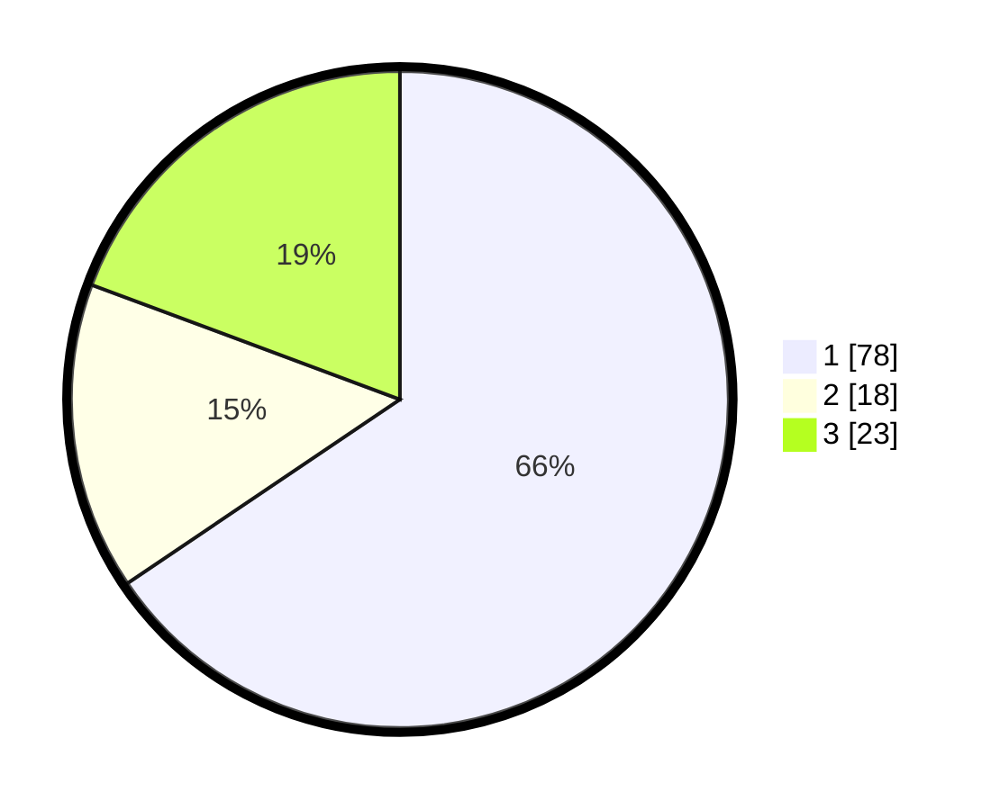

# Hasil

## Grafik

## Tabel

| No. | Nama Paslon    | Suara | Suara (raw) | Persentase |
|:--- |:-------------- | -----:| -----------:| ----------:|
| 1   | ANIES MUHAIMIN | 78    | [78][p-1]   | 65,55      |
| 2   | PRABOWO GIBRAN | 18    | [18][p-2]   | 15,13      |
| 3   | GANJAR MAHFUD  | 23    | [23][p-3]   | 19,33      |

[p-1]: https://github.com/gigit-pemilu/pemilu-2024-32-jawa-barat/blob/main/pilpres/hitung-suara/sub/32-jawa-barat/sub/73-kota-bandung/sub/02-coblong/sub/1003-sadang-serang/sub/058-tps/sub/paslon-1.txt
[p-2]: https://github.com/gigit-pemilu/pemilu-2024-32-jawa-barat/blob/main/pilpres/hitung-suara/sub/32-jawa-barat/sub/73-kota-bandung/sub/02-coblong/sub/1003-sadang-serang/sub/058-tps/sub/paslon-2.txt
[p-3]: https://github.com/gigit-pemilu/pemilu-2024-32-jawa-barat/blob/main/pilpres/hitung-suara/sub/32-jawa-barat/sub/73-kota-bandung/sub/02-coblong/sub/1003-sadang-serang/sub/058-tps/sub/paslon-3.txt

## Foto C Plano

https://sirekap-obj-formc.kpu.go.id/f9b3/pemilu/ppwp/32/73/02/10/03/3273021003058-20240217-130740--b36f98eb-4a30-45ae-94a0-cd10a13f4f5a.jpg

https://sirekap-obj-formc.kpu.go.id/f9b3/pemilu/ppwp/32/73/02/10/03/3273021003058-20240217-130926--f010b94a-6f44-448d-bc32-b0df1e5992cf.jpg

https://sirekap-obj-formc.kpu.go.id/f9b3/pemilu/ppwp/32/73/02/10/03/3273021003058-20240217-131028--226f4df2-4f5f-4126-98a7-9d1bd9279d5e.jpg

## Metadata

| Key        | Value               |
| ---------- | ------------------- |
| Time Stamp | 2024-02-17 16:00:02 |

