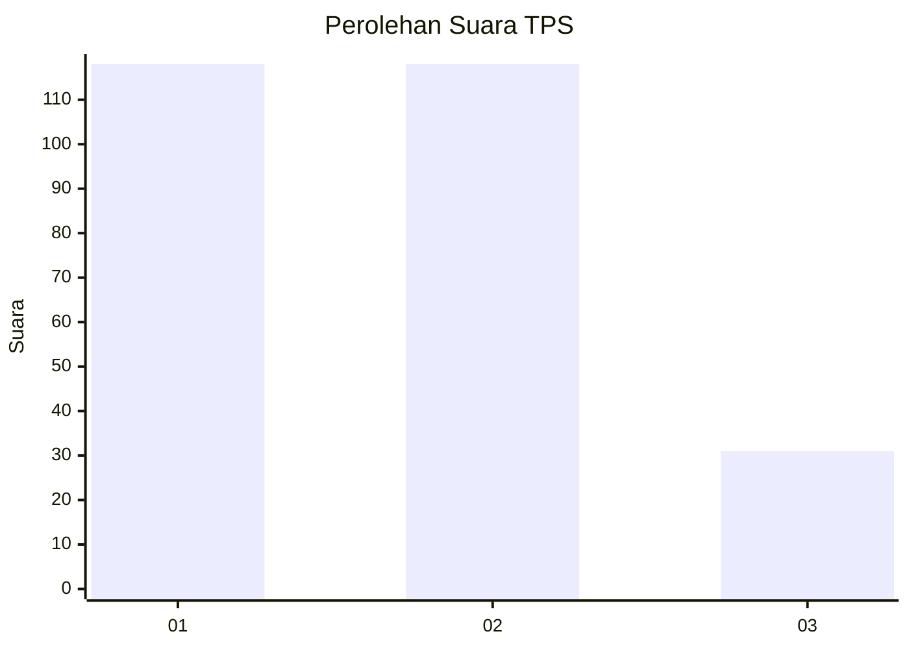
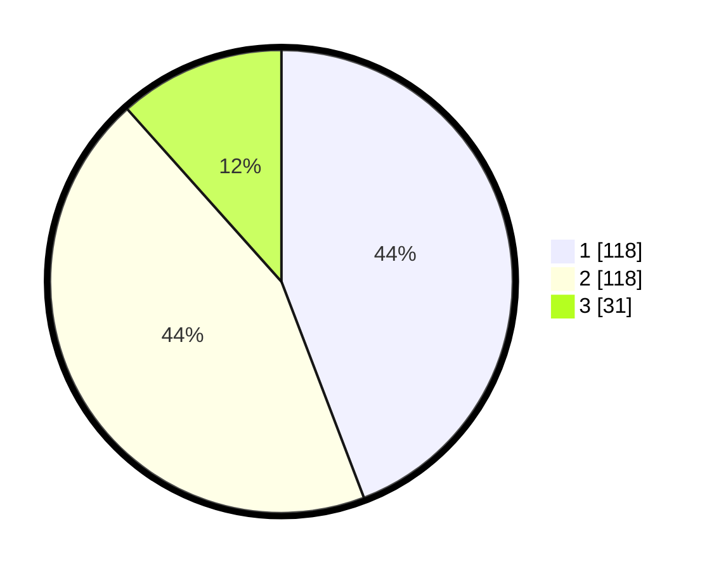

# Hasil

## Grafik

## Tabel

| No. | Nama Paslon    | Suara | Suara (raw) | Persentase |
|:--- |:-------------- | -----:| -----------:| ----------:|
| 1   | ANIES MUHAIMIN | 118   | [118][p-1]  | 44,19      |
| 2   | PRABOWO GIBRAN | 118   | [118][p-2]  | 44,19      |
| 3   | GANJAR MAHFUD  | 31    | [31][p-3]   | 11,61      |

[p-1]: https://github.com/gigit-pemilu/pemilu-2024/blob/main/pilpres/hitung-suara/sub/32-jawa-barat/sub/73-kota-bandung/sub/02-coblong/sub/1004-dago/sub/056-tps/sub/paslon-1.txt
[p-2]: https://github.com/gigit-pemilu/pemilu-2024/blob/main/pilpres/hitung-suara/sub/32-jawa-barat/sub/73-kota-bandung/sub/02-coblong/sub/1004-dago/sub/056-tps/sub/paslon-2.txt
[p-3]: https://github.com/gigit-pemilu/pemilu-2024/blob/main/pilpres/hitung-suara/sub/32-jawa-barat/sub/73-kota-bandung/sub/02-coblong/sub/1004-dago/sub/056-tps/sub/paslon-3.txt

## Foto C Plano

https://sirekap-obj-formc.kpu.go.id/3ac8/pemilu/ppwp/32/73/02/10/04/3273021004056-20240215-002906--55bcb5f9-9989-4885-a7ab-6854aad9e0f4.jpg

https://sirekap-obj-formc.kpu.go.id/3ac8/pemilu/ppwp/32/73/02/10/04/3273021004056-20240217-031027--1f2383f5-3264-47e8-8f94-916025d79979.jpg

https://sirekap-obj-formc.kpu.go.id/3ac8/pemilu/ppwp/32/73/02/10/04/3273021004056-20240215-212254--48ea1e61-b1e7-40c3-8d5d-fafe46daae5e.jpg

## Metadata

| Key        | Value               |
| ---------- | ------------------- |
| Time Stamp | 2024-02-25 10:00:00 |

