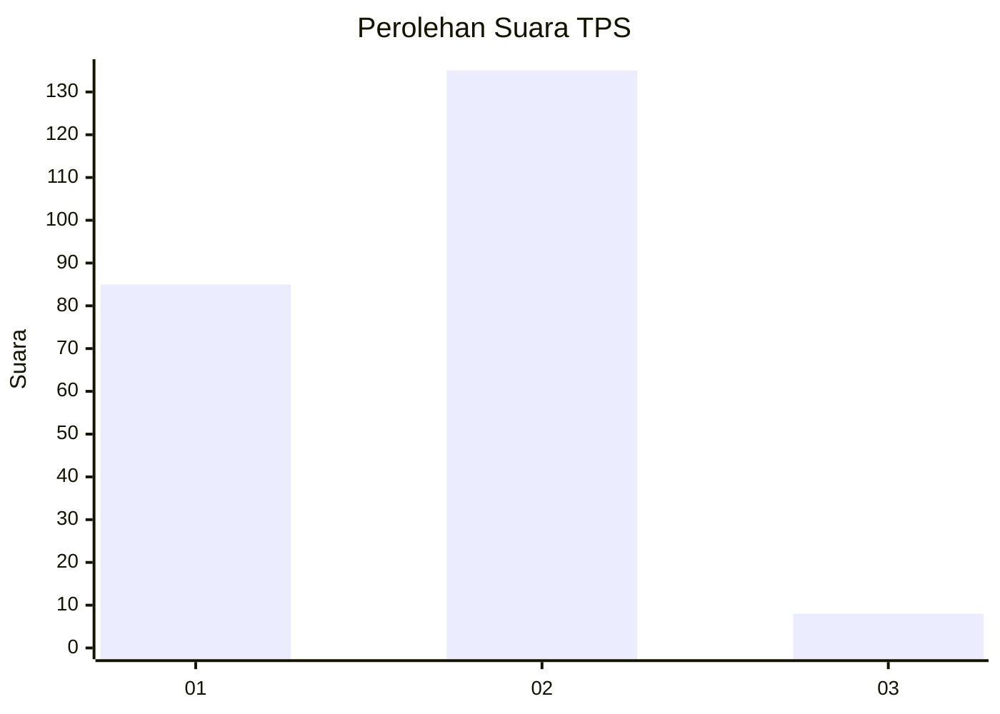
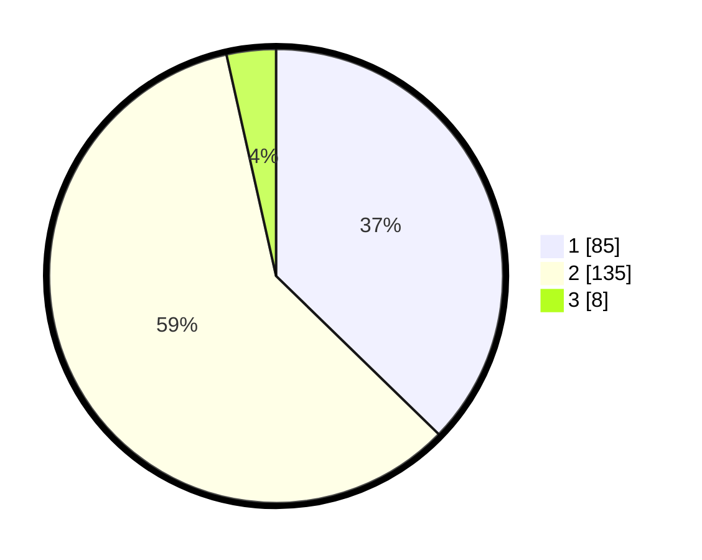

# Hasil

## Grafik

## Tabel

| No. | Nama Paslon    | Suara | Suara (raw) | Persentase |
|:--- |:-------------- | -----:| -----------:| ----------:|
| 1   | ANIES MUHAIMIN | 85    | [85][p-1]   | 37,28      |
| 2   | PRABOWO GIBRAN | 135   | [135][p-2]  | 59,21      |
| 3   | GANJAR MAHFUD  | 8     | [8][p-3]    | 3,51       |

[p-1]: https://github.com/gigit-pemilu/pemilu-2024/blob/main/pilpres/hitung-suara/sub/32-jawa-barat/sub/73-kota-bandung/sub/03-babakan-ciparay/sub/1001-babakan-ciparay/sub/007-tps/sub/paslon-1.txt
[p-2]: https://github.com/gigit-pemilu/pemilu-2024/blob/main/pilpres/hitung-suara/sub/32-jawa-barat/sub/73-kota-bandung/sub/03-babakan-ciparay/sub/1001-babakan-ciparay/sub/007-tps/sub/paslon-2.txt
[p-3]: https://github.com/gigit-pemilu/pemilu-2024/blob/main/pilpres/hitung-suara/sub/32-jawa-barat/sub/73-kota-bandung/sub/03-babakan-ciparay/sub/1001-babakan-ciparay/sub/007-tps/sub/paslon-3.txt

## Foto C Plano

https://sirekap-obj-formc.kpu.go.id/f26d/pemilu/ppwp/32/73/03/10/01/3273031001007-20240215-025315--5d8cd3d1-9508-490c-9566-fade383366bb.jpg

https://sirekap-obj-formc.kpu.go.id/f26d/pemilu/ppwp/32/73/03/10/01/3273031001007-20240215-025509--adcf8a3e-1014-425f-85d6-4e63598dc6e7.jpg

https://sirekap-obj-formc.kpu.go.id/f26d/pemilu/ppwp/32/73/03/10/01/3273031001007-20240215-030012--a26f578c-cfb7-4297-976e-21aa9f455adc.jpg

## Metadata

| Key        | Value               |
| ---------- | ------------------- |
| Time Stamp | 2024-02-15 15:00:29 |

