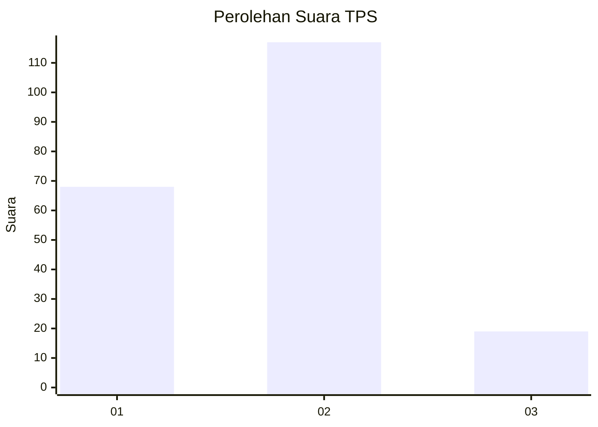
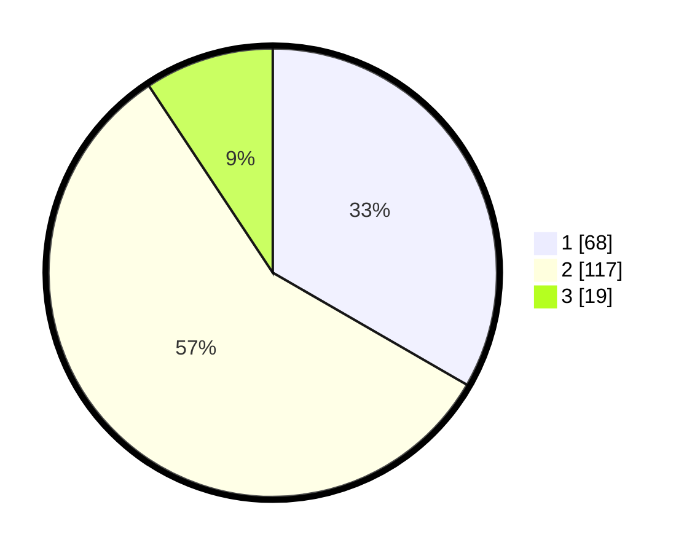

# Hasil

## Grafik

## Tabel

| No. | Nama Paslon    | Suara | Suara (raw) | Persentase |
|:--- |:-------------- | -----:| -----------:| ----------:|
| 1   | ANIES MUHAIMIN | 68    | [68][p-1]   | 33,33      |
| 2   | PRABOWO GIBRAN | 117   | [117][p-2]  | 57,35      |
| 3   | GANJAR MAHFUD  | 19    | [19][p-3]   | 9,31       |

[p-1]: https://github.com/gigit-pemilu/pemilu-2024-32-jawa-barat/blob/main/pilpres/hitung-suara/sub/32-jawa-barat/sub/73-kota-bandung/sub/03-babakan-ciparay/sub/1001-babakan-ciparay/sub/008-tps/sub/paslon-1.txt
[p-2]: https://github.com/gigit-pemilu/pemilu-2024-32-jawa-barat/blob/main/pilpres/hitung-suara/sub/32-jawa-barat/sub/73-kota-bandung/sub/03-babakan-ciparay/sub/1001-babakan-ciparay/sub/008-tps/sub/paslon-2.txt
[p-3]: https://github.com/gigit-pemilu/pemilu-2024-32-jawa-barat/blob/main/pilpres/hitung-suara/sub/32-jawa-barat/sub/73-kota-bandung/sub/03-babakan-ciparay/sub/1001-babakan-ciparay/sub/008-tps/sub/paslon-3.txt

## Foto C Plano

https://sirekap-obj-formc.kpu.go.id/f58a/pemilu/ppwp/32/73/03/10/01/3273031001008-20240215-010615--a67a73a0-31bf-428a-8b82-2006238ed4bd.jpg

https://sirekap-obj-formc.kpu.go.id/f58a/pemilu/ppwp/32/73/03/10/01/3273031001008-20240215-010916--90ac595d-b5c4-4d4e-a43e-ca4857d8ee49.jpg

https://sirekap-obj-formc.kpu.go.id/f58a/pemilu/ppwp/32/73/03/10/01/3273031001008-20240215-010933--2eac012a-5e4e-4e51-8b83-b41bfc58b1f8.jpg

## Metadata

| Key        | Value               |
| ---------- | ------------------- |
| Time Stamp | 2024-02-16 21:01:00 |

