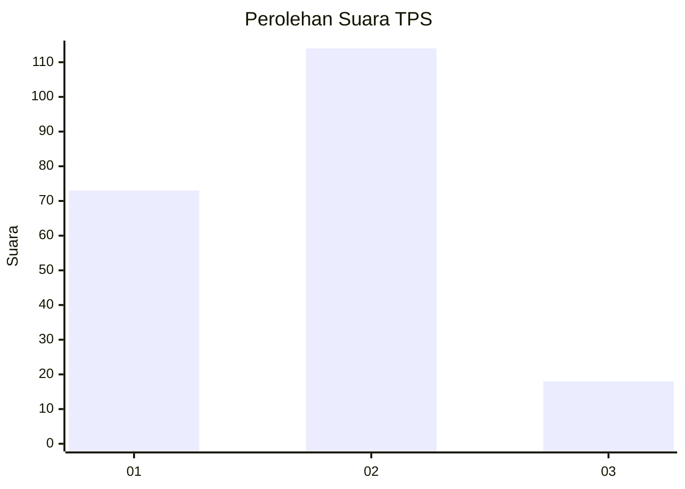

# Hasil

## Grafik

## Tabel

| No. | Nama Paslon    | Suara | Suara (raw) | Persentase |
|:--- |:-------------- | -----:| -----------:| ----------:|
| 1   | ANIES MUHAIMIN | 73    | [73][p-1]   | 35,61      |
| 2   | PRABOWO GIBRAN | 114   | [114][p-2]  | 55,61      |
| 3   | GANJAR MAHFUD  | 18    | [18][p-3]   | 8,78       |

[p-1]: https://github.com/gigit-pemilu/pemilu-2024-32-jawa-barat/blob/main/pilpres/hitung-suara/sub/32-jawa-barat/sub/73-kota-bandung/sub/03-babakan-ciparay/sub/1001-babakan-ciparay/sub/009-tps/sub/paslon-1.txt
[p-2]: https://github.com/gigit-pemilu/pemilu-2024-32-jawa-barat/blob/main/pilpres/hitung-suara/sub/32-jawa-barat/sub/73-kota-bandung/sub/03-babakan-ciparay/sub/1001-babakan-ciparay/sub/009-tps/sub/paslon-2.txt
[p-3]: https://github.com/gigit-pemilu/pemilu-2024-32-jawa-barat/blob/main/pilpres/hitung-suara/sub/32-jawa-barat/sub/73-kota-bandung/sub/03-babakan-ciparay/sub/1001-babakan-ciparay/sub/009-tps/sub/paslon-3.txt

## Foto C Plano

https://sirekap-obj-formc.kpu.go.id/cf64/pemilu/ppwp/32/73/03/10/01/3273031001009-20240215-030245--1040dc12-2a1a-4877-90e3-d61113db028f.jpg

https://sirekap-obj-formc.kpu.go.id/cf64/pemilu/ppwp/32/73/03/10/01/3273031001009-20240215-031129--4ccbe452-b017-44b7-9036-6c47c69b8ca3.jpg

https://sirekap-obj-formc.kpu.go.id/cf64/pemilu/ppwp/32/73/03/10/01/3273031001009-20240215-031301--13d05901-8617-4485-83e2-5c901c2f8697.jpg

## Metadata

| Key        | Value               |
| ---------- | ------------------- |
| Time Stamp | 2024-02-16 21:01:00 |

