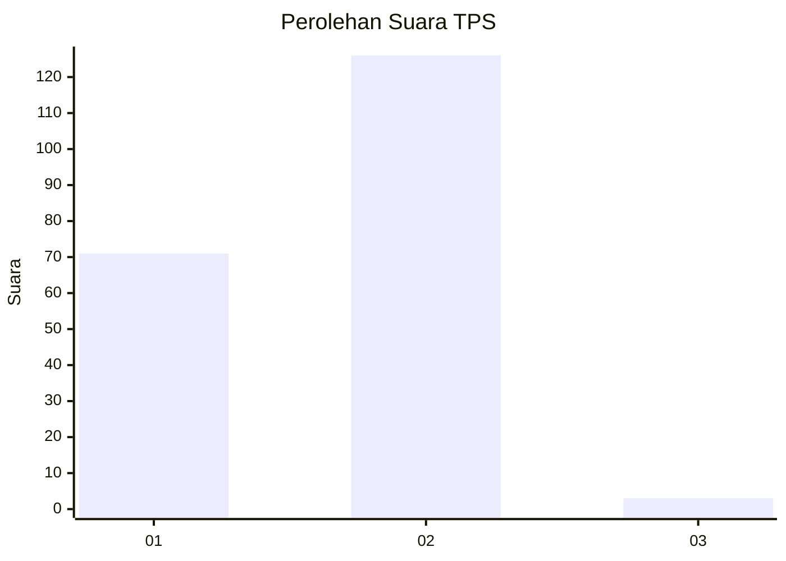
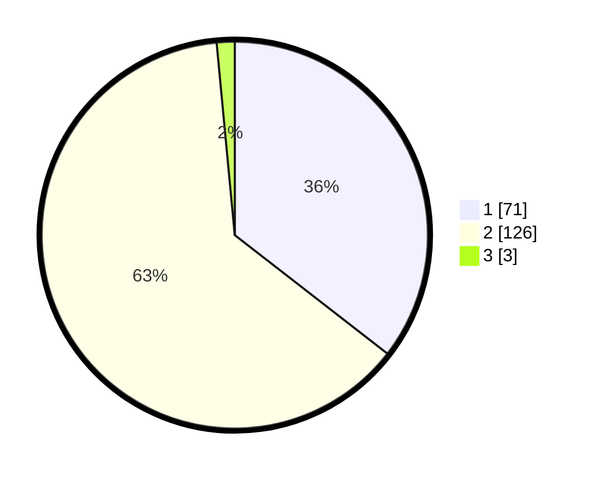

# Hasil

## Grafik

## Tabel

| No. | Nama Paslon    | Suara | Suara (raw) | Persentase |
|:--- |:-------------- | -----:| -----------:| ----------:|
| 1   | ANIES MUHAIMIN | 71    | [71][p-1]   | 35,50      |
| 2   | PRABOWO GIBRAN | 126   | [126][p-2]  | 63,00      |
| 3   | GANJAR MAHFUD  | 3     | [3][p-3]    | 1,50       |

[p-1]: https://github.com/gigit-pemilu/pemilu-2024/blob/main/pilpres/hitung-suara/sub/32-jawa-barat/sub/73-kota-bandung/sub/03-babakan-ciparay/sub/1001-babakan-ciparay/sub/010-tps/sub/paslon-1.txt
[p-2]: https://github.com/gigit-pemilu/pemilu-2024/blob/main/pilpres/hitung-suara/sub/32-jawa-barat/sub/73-kota-bandung/sub/03-babakan-ciparay/sub/1001-babakan-ciparay/sub/010-tps/sub/paslon-2.txt
[p-3]: https://github.com/gigit-pemilu/pemilu-2024/blob/main/pilpres/hitung-suara/sub/32-jawa-barat/sub/73-kota-bandung/sub/03-babakan-ciparay/sub/1001-babakan-ciparay/sub/010-tps/sub/paslon-3.txt

## Foto C Plano

https://sirekap-obj-formc.kpu.go.id/d343/pemilu/ppwp/32/73/03/10/01/3273031001010-20240215-023405--e08e5731-8adb-4362-96a7-9c616a5d8a1f.jpg

https://sirekap-obj-formc.kpu.go.id/d343/pemilu/ppwp/32/73/03/10/01/3273031001010-20240215-024218--b5b48f5e-2fa7-49e4-b9fa-089924587211.jpg

https://sirekap-obj-formc.kpu.go.id/d343/pemilu/ppwp/32/73/03/10/01/3273031001010-20240215-025328--2f012182-0ca2-40bf-a999-f5016287f79d.jpg

## Metadata

| Key        | Value               |
| ---------- | ------------------- |
| Time Stamp | 2024-02-15 15:00:29 |

