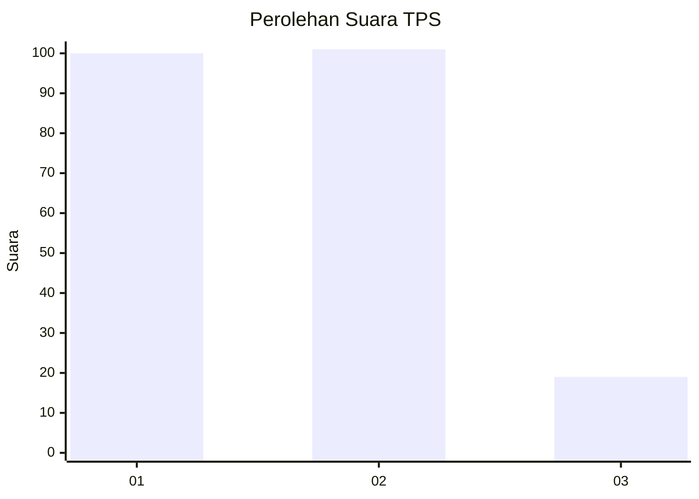
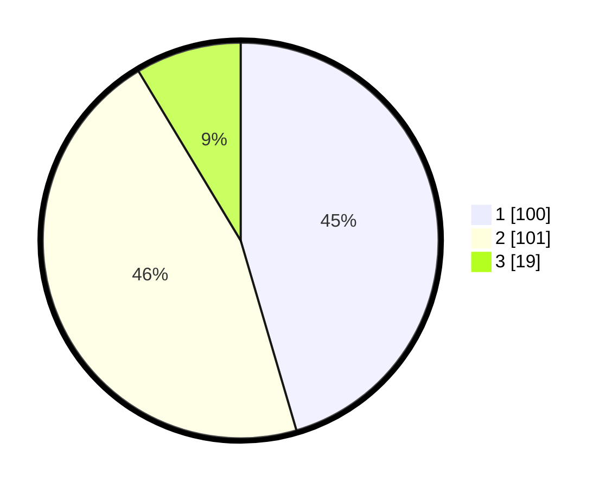

# Hasil

## Grafik

## Tabel

| No. | Nama Paslon    | Suara | Suara (raw) | Persentase |
|:--- |:-------------- | -----:| -----------:| ----------:|
| 1   | ANIES MUHAIMIN | 100   | [100][p-1]  | 45,45      |
| 2   | PRABOWO GIBRAN | 101   | [101][p-2]  | 45,91      |
| 3   | GANJAR MAHFUD  | 19    | [19][p-3]   | 8,64       |

[p-1]: https://github.com/gigit-pemilu/pemilu-2024/blob/main/pilpres/hitung-suara/sub/32-jawa-barat/sub/73-kota-bandung/sub/03-babakan-ciparay/sub/1001-babakan-ciparay/sub/011-tps/sub/paslon-1.txt
[p-2]: https://github.com/gigit-pemilu/pemilu-2024/blob/main/pilpres/hitung-suara/sub/32-jawa-barat/sub/73-kota-bandung/sub/03-babakan-ciparay/sub/1001-babakan-ciparay/sub/011-tps/sub/paslon-2.txt
[p-3]: https://github.com/gigit-pemilu/pemilu-2024/blob/main/pilpres/hitung-suara/sub/32-jawa-barat/sub/73-kota-bandung/sub/03-babakan-ciparay/sub/1001-babakan-ciparay/sub/011-tps/sub/paslon-3.txt

## Foto C Plano

https://sirekap-obj-formc.kpu.go.id/869b/pemilu/ppwp/32/73/03/10/01/3273031001011-20240215-031517--d2cc8c6d-3d07-4e15-a332-c380cd1aa967.jpg

https://sirekap-obj-formc.kpu.go.id/869b/pemilu/ppwp/32/73/03/10/01/3273031001011-20240215-031627--65917c77-7df6-4fdd-af9e-b76269b8d900.jpg

https://sirekap-obj-formc.kpu.go.id/869b/pemilu/ppwp/32/73/03/10/01/3273031001011-20240215-031716--b6d80299-83bb-443a-b6dd-623f500bc97a.jpg

## Metadata

| Key        | Value               |
| ---------- | ------------------- |
| Time Stamp | 2024-02-15 15:00:29 |

