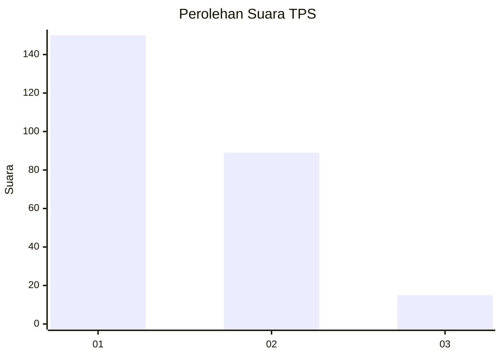
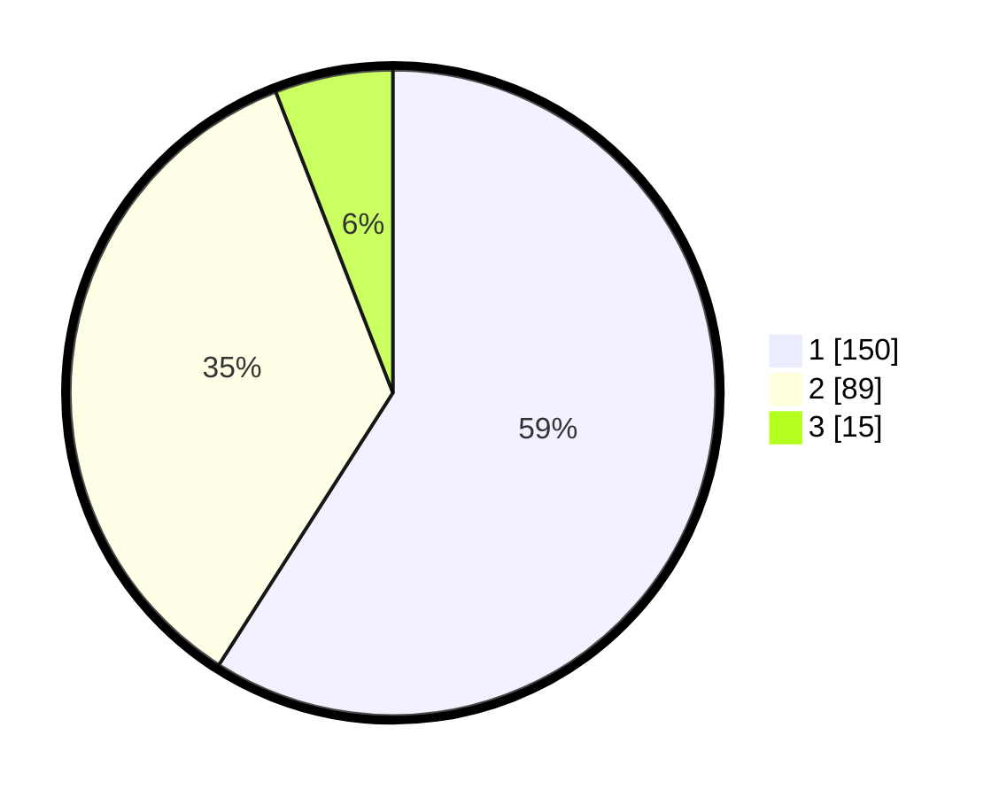

# Hasil

## Grafik

## Tabel

| No. | Nama Paslon    | Suara | Suara (raw) | Persentase |
|:--- |:-------------- | -----:| -----------:| ----------:|
| 1   | ANIES MUHAIMIN | 150   | [150][p-1]  | 59,06      |
| 2   | PRABOWO GIBRAN | 89    | [89][p-2]   | 35,04      |
| 3   | GANJAR MAHFUD  | 15    | [15][p-3]   | 5,91       |

[p-1]: https://github.com/gigit-pemilu/pemilu-2024/blob/main/pilpres/hitung-suara/sub/32-jawa-barat/sub/73-kota-bandung/sub/03-babakan-ciparay/sub/1002-babakan/sub/038-tps/sub/paslon-1.txt
[p-2]: https://github.com/gigit-pemilu/pemilu-2024/blob/main/pilpres/hitung-suara/sub/32-jawa-barat/sub/73-kota-bandung/sub/03-babakan-ciparay/sub/1002-babakan/sub/038-tps/sub/paslon-2.txt
[p-3]: https://github.com/gigit-pemilu/pemilu-2024/blob/main/pilpres/hitung-suara/sub/32-jawa-barat/sub/73-kota-bandung/sub/03-babakan-ciparay/sub/1002-babakan/sub/038-tps/sub/paslon-3.txt

## Foto C Plano

https://sirekap-obj-formc.kpu.go.id/7181/pemilu/ppwp/32/73/03/10/02/3273031002038-20240214-194941--3c5533ba-e157-47be-aa21-9e9ee342ab14.jpg

https://sirekap-obj-formc.kpu.go.id/7181/pemilu/ppwp/32/73/03/10/02/3273031002038-20240214-195323--fea8c81d-4117-453f-a5d6-c9cccaadc6b9.jpg

https://sirekap-obj-formc.kpu.go.id/7181/pemilu/ppwp/32/73/03/10/02/3273031002038-20240214-213522--4887735c-1075-4ef3-898e-2c21ed9d323e.jpg

## Metadata

| Key        | Value               |
| ---------- | ------------------- |
| Time Stamp | 2024-02-15 15:00:29 |

