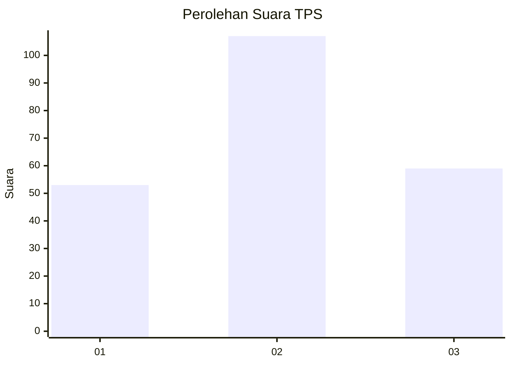
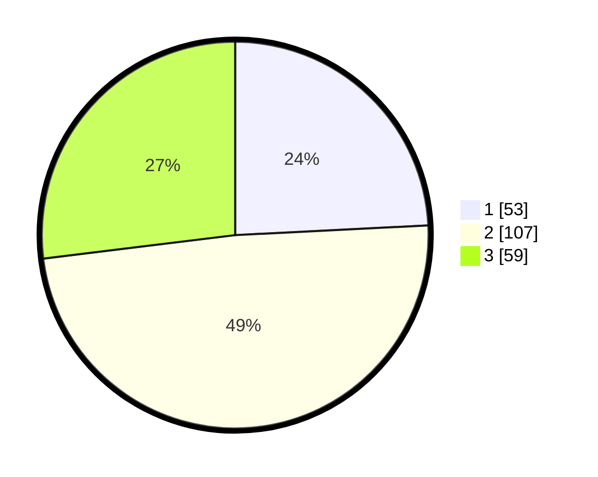

# Hasil

## Grafik

## Tabel

| No. | Nama Paslon    | Suara | Suara (raw) | Persentase |
|:--- |:-------------- | -----:| -----------:| ----------:|
| 1   | ANIES MUHAIMIN | 53    | [53][p-1]   | 24,20      |
| 2   | PRABOWO GIBRAN | 107   | [107][p-2]  | 48,86      |
| 3   | GANJAR MAHFUD  | 59    | [59][p-3]   | 26,94      |

[p-1]: https://github.com/gigit-pemilu/pemilu-2024/blob/main/pilpres/hitung-suara/sub/32-jawa-barat/sub/73-kota-bandung/sub/03-babakan-ciparay/sub/1004-margahayu-utara/sub/060-tps/sub/paslon-1.txt
[p-2]: https://github.com/gigit-pemilu/pemilu-2024/blob/main/pilpres/hitung-suara/sub/32-jawa-barat/sub/73-kota-bandung/sub/03-babakan-ciparay/sub/1004-margahayu-utara/sub/060-tps/sub/paslon-2.txt
[p-3]: https://github.com/gigit-pemilu/pemilu-2024/blob/main/pilpres/hitung-suara/sub/32-jawa-barat/sub/73-kota-bandung/sub/03-babakan-ciparay/sub/1004-margahayu-utara/sub/060-tps/sub/paslon-3.txt

## Foto C Plano

https://sirekap-obj-formc.kpu.go.id/277f/pemilu/ppwp/32/73/03/10/04/3273031004060-20240214-155014--bb81ffe6-f583-47c3-846f-b285de4a2bc4.jpg

https://sirekap-obj-formc.kpu.go.id/277f/pemilu/ppwp/32/73/03/10/04/3273031004060-20240214-155228--a5616f1b-b79e-4f61-8958-89ea95d05252.jpg

https://sirekap-obj-formc.kpu.go.id/277f/pemilu/ppwp/32/73/03/10/04/3273031004060-20240214-155520--691d94f2-f0ec-4e49-95f1-46eb4e46fabe.jpg

## Metadata

| Key        | Value               |
| ---------- | ------------------- |
| Time Stamp | 2024-02-15 15:30:25 |

## DATA PEMILIH TETAP

Jumlah pemilih dalam DPT: **257**.
 * L: **22**.
 * P: **22**.

## DATA PENGGUNA HAK PILIH

Jumlah pengguna hak pilih dalam DPT: **740**.
 * L: **23**.
 * P: **462**.

Jumlah pengguna hak pilih dalam DPTb: **883**.
 * L: **886**.
 * P: **882**.

Jumlah pengguna hak pilih dalam DPK: **80**.
 * L: **84**.
 * P: **882**.

Jumlah pengguna hak pilih: **229**.
 * L: **54**.
 * P: **645**.

## JUMLAH SUARA SAH DAN TIDAK SAH

JUMLAH SELURUH SUARA SAH: **219**.

JUMLAH SUARA TIDAK SAH: **1**.

JUMLAH SELURUH SUARA SAH DAN SUARA TIDAK SAH: **220**.

