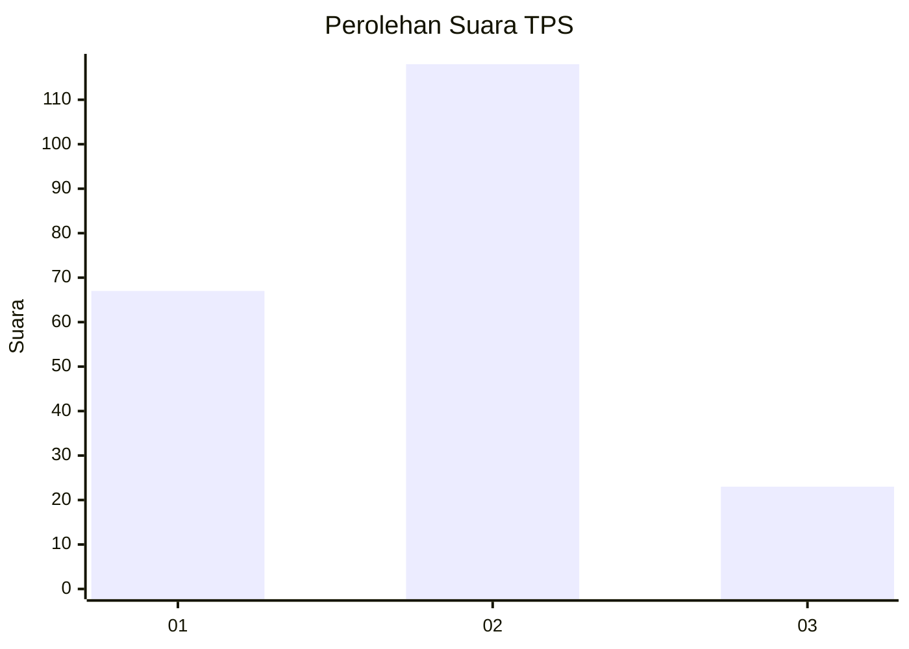
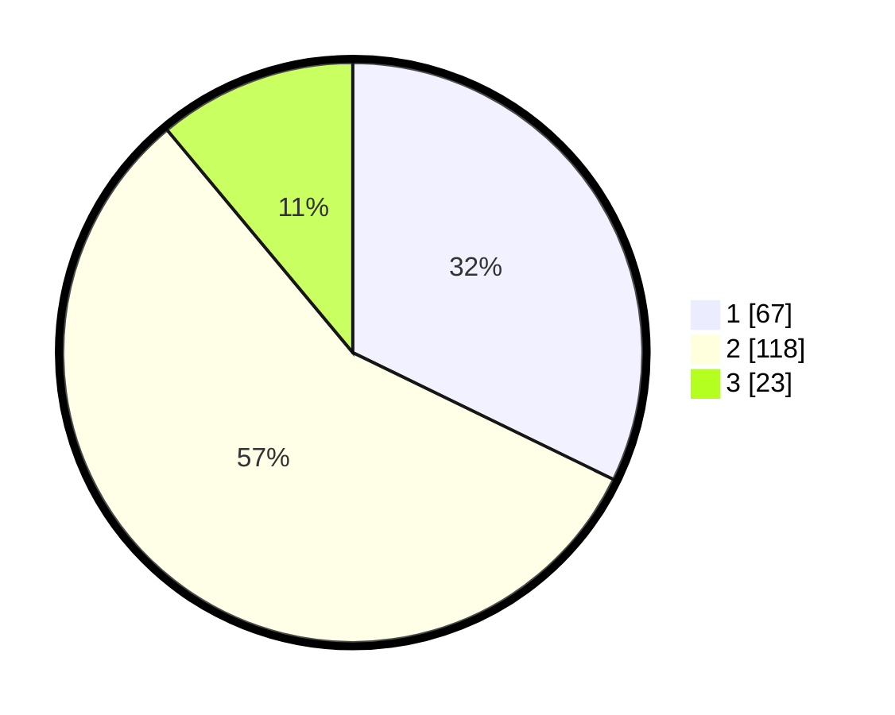

# Hasil

## Grafik

## Tabel

| No. | Nama Paslon    | Suara | Suara (raw) | Persentase |
|:--- |:-------------- | -----:| -----------:| ----------:|
| 1   | ANIES MUHAIMIN | 67    | [67][p-1]   | 32,21      |
| 2   | PRABOWO GIBRAN | 118   | [118][p-2]  | 56,73      |
| 3   | GANJAR MAHFUD  | 23    | [23][p-3]   | 11,06      |

[p-1]: https://github.com/gigit-pemilu/pemilu-2024/blob/main/pilpres/hitung-suara/sub/32-jawa-barat/sub/73-kota-bandung/sub/04-bojongloa-kaler/sub/1001-kopo/sub/005-tps/sub/paslon-1.txt
[p-2]: https://github.com/gigit-pemilu/pemilu-2024/blob/main/pilpres/hitung-suara/sub/32-jawa-barat/sub/73-kota-bandung/sub/04-bojongloa-kaler/sub/1001-kopo/sub/005-tps/sub/paslon-2.txt
[p-3]: https://github.com/gigit-pemilu/pemilu-2024/blob/main/pilpres/hitung-suara/sub/32-jawa-barat/sub/73-kota-bandung/sub/04-bojongloa-kaler/sub/1001-kopo/sub/005-tps/sub/paslon-3.txt

## Foto C Plano

https://sirekap-obj-formc.kpu.go.id/2a5b/pemilu/ppwp/32/73/04/10/01/3273041001005-20240214-190248--b7905fdc-ac87-48e6-bd2c-caab8b6b8bae.jpg

https://sirekap-obj-formc.kpu.go.id/2a5b/pemilu/ppwp/32/73/04/10/01/3273041001005-20240214-185608--4f5f727c-18f7-447d-a7b9-669375a8c2bd.jpg

https://sirekap-obj-formc.kpu.go.id/2a5b/pemilu/ppwp/32/73/04/10/01/3273041001005-20240214-191643--6e5c9d4a-9551-4e95-a62b-dfa62c9c240a.jpg

## Metadata

| Key        | Value               |
| ---------- | ------------------- |
| Time Stamp | 2024-02-15 18:00:26 |

