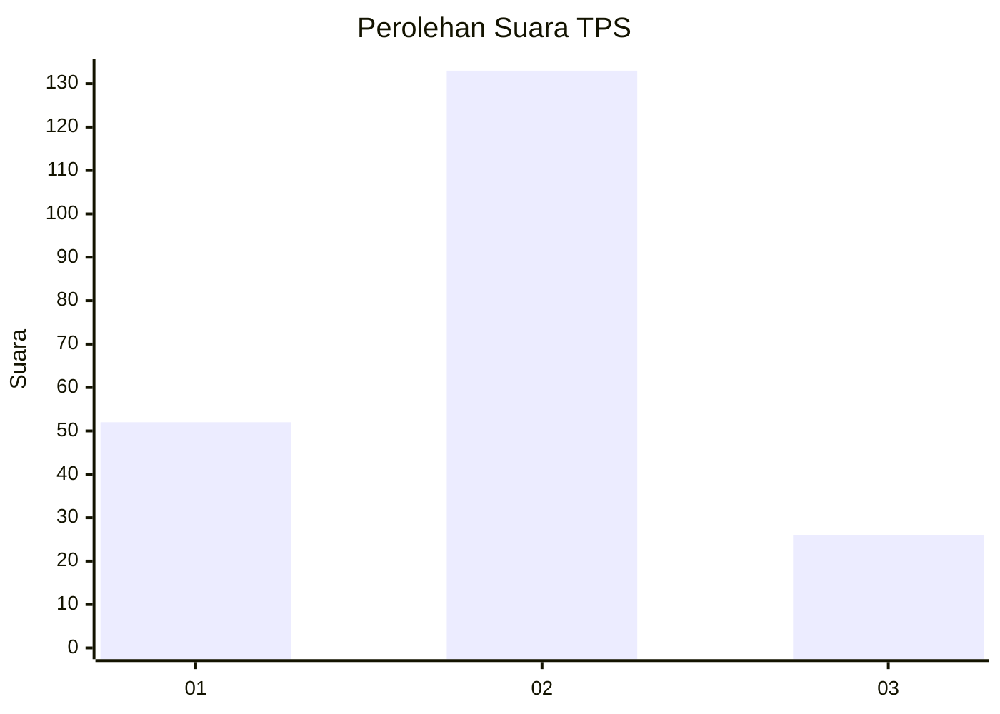
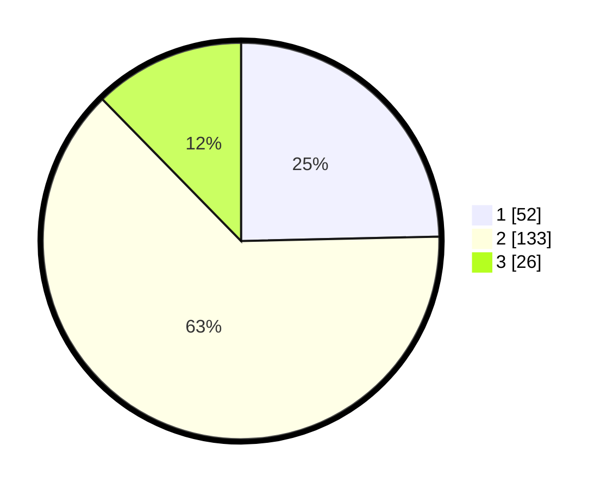

# Hasil

## Grafik

## Tabel

| No. | Nama Paslon    | Suara | Suara (raw) | Persentase |
|:--- |:-------------- | -----:| -----------:| ----------:|
| 1   | ANIES MUHAIMIN | 52    | [52][p-1]   | 24,64      |
| 2   | PRABOWO GIBRAN | 133   | [133][p-2]  | 63,03      |
| 3   | GANJAR MAHFUD  | 26    | [26][p-3]   | 12,32      |

[p-1]: https://github.com/gigit-pemilu/pemilu-2024-32-jawa-barat/blob/main/pilpres/hitung-suara/sub/32-jawa-barat/sub/73-kota-bandung/sub/04-bojongloa-kaler/sub/1001-kopo/sub/006-tps/sub/paslon-1.txt
[p-2]: https://github.com/gigit-pemilu/pemilu-2024-32-jawa-barat/blob/main/pilpres/hitung-suara/sub/32-jawa-barat/sub/73-kota-bandung/sub/04-bojongloa-kaler/sub/1001-kopo/sub/006-tps/sub/paslon-2.txt
[p-3]: https://github.com/gigit-pemilu/pemilu-2024-32-jawa-barat/blob/main/pilpres/hitung-suara/sub/32-jawa-barat/sub/73-kota-bandung/sub/04-bojongloa-kaler/sub/1001-kopo/sub/006-tps/sub/paslon-3.txt

## Foto C Plano

https://sirekap-obj-formc.kpu.go.id/1cd5/pemilu/ppwp/32/73/04/10/01/3273041001006-20240215-005719--7a4c0f61-7e5e-4582-aefd-26e5b9fbaac0.jpg

https://sirekap-obj-formc.kpu.go.id/1cd5/pemilu/ppwp/32/73/04/10/01/3273041001006-20240215-005732--9013e991-77f6-4263-94bb-a68e54684bfe.jpg

https://sirekap-obj-formc.kpu.go.id/1cd5/pemilu/ppwp/32/73/04/10/01/3273041001006-20240215-005744--f71fb1c2-ab42-4063-b326-e5c9ad404210.jpg

## Metadata

| Key        | Value               |
| ---------- | ------------------- |
| Time Stamp | 2024-02-25 15:00:00 |

