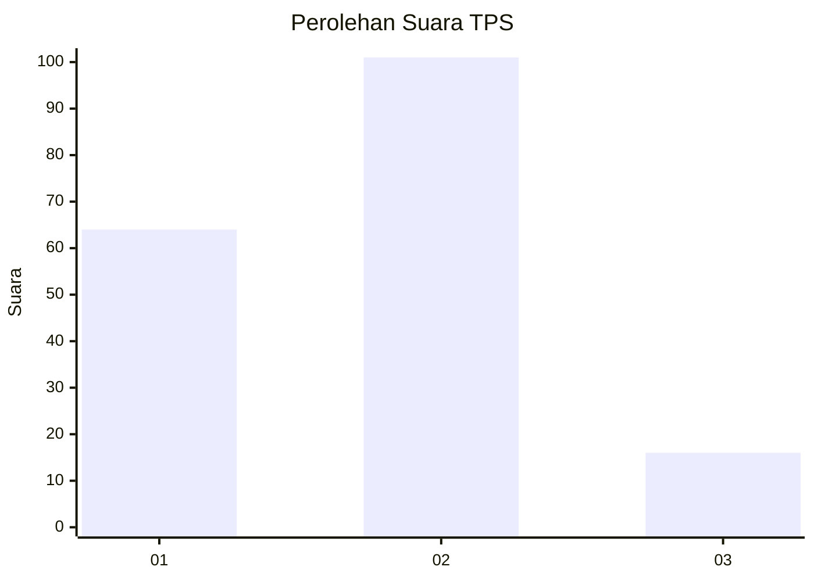

# Hasil

## Grafik

## Tabel

| No. | Nama Paslon    | Suara | Suara (raw) | Persentase |
|:--- |:-------------- | -----:| -----------:| ----------:|
| 1   | ANIES MUHAIMIN | 64    | [64][p-1]   | 35,36      |
| 2   | PRABOWO GIBRAN | 101   | [101][p-2]  | 55,80      |
| 3   | GANJAR MAHFUD  | 16    | [16][p-3]   | 8,84       |

[p-1]: https://github.com/gigit-pemilu/pemilu-2024/blob/main/pilpres/hitung-suara/sub/32-jawa-barat/sub/73-kota-bandung/sub/05-andir/sub/1001-maleber/sub/008-tps/sub/paslon-1.txt
[p-2]: https://github.com/gigit-pemilu/pemilu-2024/blob/main/pilpres/hitung-suara/sub/32-jawa-barat/sub/73-kota-bandung/sub/05-andir/sub/1001-maleber/sub/008-tps/sub/paslon-2.txt
[p-3]: https://github.com/gigit-pemilu/pemilu-2024/blob/main/pilpres/hitung-suara/sub/32-jawa-barat/sub/73-kota-bandung/sub/05-andir/sub/1001-maleber/sub/008-tps/sub/paslon-3.txt

## Foto C Plano

https://sirekap-obj-formc.kpu.go.id/1705/pemilu/ppwp/32/73/05/10/01/3273051001008-20240214-225851--ca9b394f-3e23-4f5b-bc79-b236527e66e4.jpg

https://sirekap-obj-formc.kpu.go.id/1705/pemilu/ppwp/32/73/05/10/01/3273051001008-20240214-225911--d09418bd-2757-4946-be45-1377c0e08a8a.jpg

https://sirekap-obj-formc.kpu.go.id/1705/pemilu/ppwp/32/73/05/10/01/3273051001008-20240214-225935--b1aaf4cb-e90b-4218-8c78-a797c09e8655.jpg

## Metadata

| Key        | Value               |
| ---------- | ------------------- |
| Time Stamp | 2024-02-15 15:00:29 |

