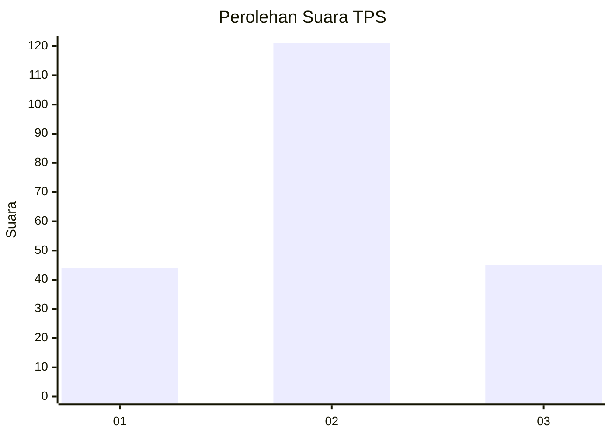
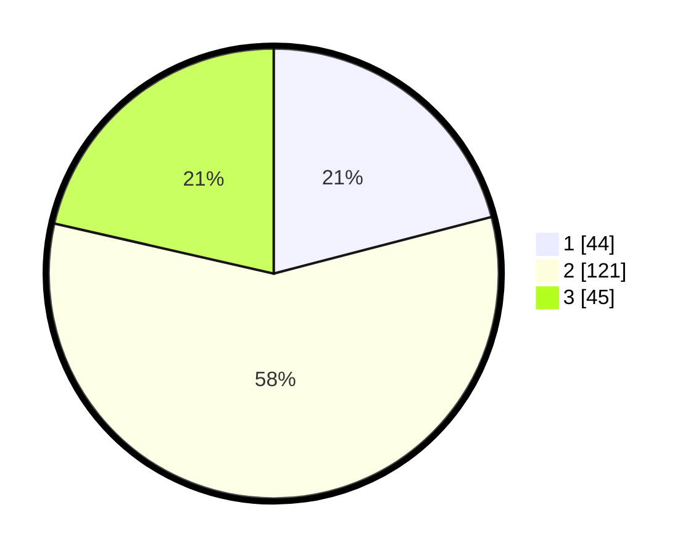

# Hasil

## Grafik

## Tabel

| No. | Nama Paslon    | Suara | Suara (raw) | Persentase |
|:--- |:-------------- | -----:| -----------:| ----------:|
| 1   | ANIES MUHAIMIN | 44    | [44][p-1]   | 20,95      |
| 2   | PRABOWO GIBRAN | 121   | [121][p-2]  | 57,62      |
| 3   | GANJAR MAHFUD  | 45    | [45][p-3]   | 21,43      |

[p-1]: https://github.com/gigit-pemilu/pemilu-2024/blob/main/pilpres/hitung-suara/sub/32-jawa-barat/sub/73-kota-bandung/sub/05-andir/sub/1001-maleber/sub/017-tps/sub/paslon-1.txt
[p-2]: https://github.com/gigit-pemilu/pemilu-2024/blob/main/pilpres/hitung-suara/sub/32-jawa-barat/sub/73-kota-bandung/sub/05-andir/sub/1001-maleber/sub/017-tps/sub/paslon-2.txt
[p-3]: https://github.com/gigit-pemilu/pemilu-2024/blob/main/pilpres/hitung-suara/sub/32-jawa-barat/sub/73-kota-bandung/sub/05-andir/sub/1001-maleber/sub/017-tps/sub/paslon-3.txt

## Foto C Plano

https://sirekap-obj-formc.kpu.go.id/3fcf/pemilu/ppwp/32/73/05/10/01/3273051001017-20240214-204417--7ac20879-83f7-4f7b-b52d-7199b98c1324.jpg

https://sirekap-obj-formc.kpu.go.id/3fcf/pemilu/ppwp/32/73/05/10/01/3273051001017-20240214-204505--577ef309-a1cb-4251-891e-6fd2bf5982a1.jpg

https://sirekap-obj-formc.kpu.go.id/3fcf/pemilu/ppwp/32/73/05/10/01/3273051001017-20240214-204604--eca3a3e0-d1fe-4fdd-bc32-5183ecfcb713.jpg

## Metadata

| Key        | Value               |
| ---------- | ------------------- |
| Time Stamp | 2024-02-15 15:00:29 |

