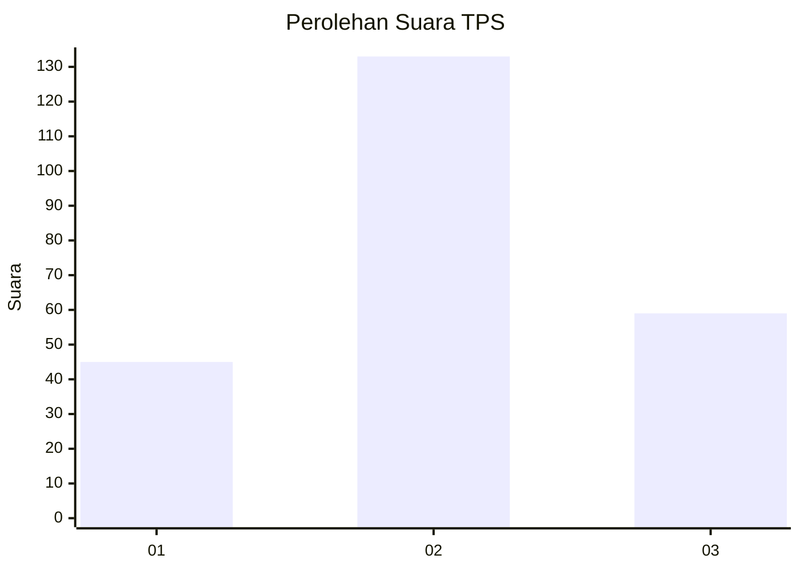
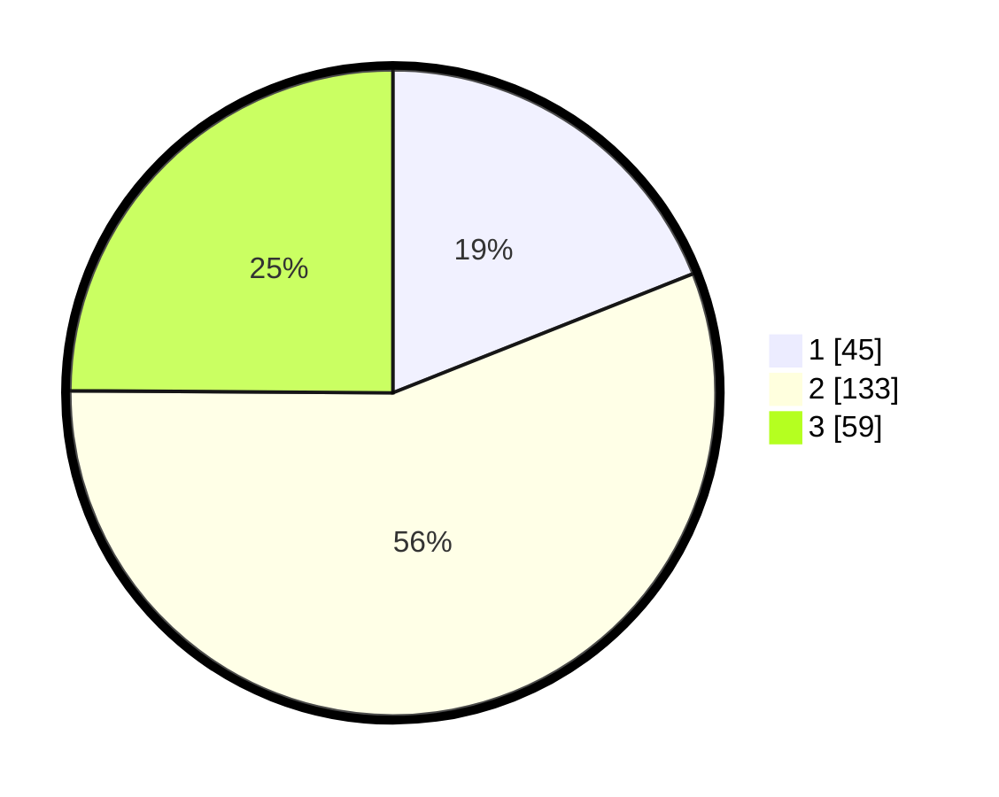

# Hasil

## Grafik

## Tabel

| No. | Nama Paslon    | Suara | Suara (raw) | Persentase |
|:--- |:-------------- | -----:| -----------:| ----------:|
| 1   | ANIES MUHAIMIN | 45    | [45][p-1]   | 18,99      |
| 2   | PRABOWO GIBRAN | 133   | [133][p-2]  | 56,12      |
| 3   | GANJAR MAHFUD  | 59    | [59][p-3]   | 24,89      |

[p-1]: https://github.com/gigit-pemilu/pemilu-2024-32-jawa-barat/blob/main/pilpres/hitung-suara/sub/32-jawa-barat/sub/73-kota-bandung/sub/05-andir/sub/1001-maleber/sub/019-tps/sub/paslon-1.txt
[p-2]: https://github.com/gigit-pemilu/pemilu-2024-32-jawa-barat/blob/main/pilpres/hitung-suara/sub/32-jawa-barat/sub/73-kota-bandung/sub/05-andir/sub/1001-maleber/sub/019-tps/sub/paslon-2.txt
[p-3]: https://github.com/gigit-pemilu/pemilu-2024-32-jawa-barat/blob/main/pilpres/hitung-suara/sub/32-jawa-barat/sub/73-kota-bandung/sub/05-andir/sub/1001-maleber/sub/019-tps/sub/paslon-3.txt

## Foto C Plano

https://sirekap-obj-formc.kpu.go.id/55d1/pemilu/ppwp/32/73/05/10/01/3273051001019-20240215-013522--f106ad8d-2987-4fa2-81a1-515e900fc7df.jpg

https://sirekap-obj-formc.kpu.go.id/55d1/pemilu/ppwp/32/73/05/10/01/3273051001019-20240215-013718--834e4d89-6f07-4e2d-8d42-018e2a834a52.jpg

https://sirekap-obj-formc.kpu.go.id/55d1/pemilu/ppwp/32/73/05/10/01/3273051001019-20240215-013820--83014b0b-b3d8-43ae-b994-0a997e5fd3c9.jpg

## Metadata

| Key        | Value               |
| ---------- | ------------------- |
| Time Stamp | 2024-02-15 15:30:25 |

