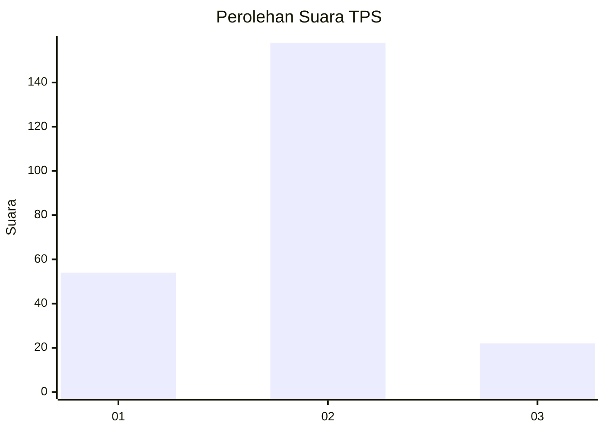

# Hasil

## Grafik

## Tabel

| No. | Nama Paslon    | Suara | Suara (raw) | Persentase |
|:--- |:-------------- | -----:| -----------:| ----------:|
| 1   | ANIES MUHAIMIN | 54    | [54][p-1]   | 23,08      |
| 2   | PRABOWO GIBRAN | 158   | [158][p-2]  | 67,52      |
| 3   | GANJAR MAHFUD  | 22    | [22][p-3]   | 9,40       |

[p-1]: https://github.com/gigit-pemilu/pemilu-2024-32-jawa-barat/blob/main/pilpres/hitung-suara/sub/32-jawa-barat/sub/73-kota-bandung/sub/06-cicendo/sub/1001-husein-sastranegara/sub/002-tps/sub/paslon-1.txt
[p-2]: https://github.com/gigit-pemilu/pemilu-2024-32-jawa-barat/blob/main/pilpres/hitung-suara/sub/32-jawa-barat/sub/73-kota-bandung/sub/06-cicendo/sub/1001-husein-sastranegara/sub/002-tps/sub/paslon-2.txt
[p-3]: https://github.com/gigit-pemilu/pemilu-2024-32-jawa-barat/blob/main/pilpres/hitung-suara/sub/32-jawa-barat/sub/73-kota-bandung/sub/06-cicendo/sub/1001-husein-sastranegara/sub/002-tps/sub/paslon-3.txt

## Foto C Plano

https://sirekap-obj-formc.kpu.go.id/6318/pemilu/ppwp/32/73/06/10/01/3273061001002-20240214-213456--bac8359d-e5da-4636-879a-723ee7251147.jpg

https://sirekap-obj-formc.kpu.go.id/6318/pemilu/ppwp/32/73/06/10/01/3273061001002-20240214-214147--fda9fe62-6a01-491a-bc42-4109b7326a00.jpg

https://sirekap-obj-formc.kpu.go.id/6318/pemilu/ppwp/32/73/06/10/01/3273061001002-20240214-214415--4fdf5d7c-41fd-479a-89ec-a18cb928df05.jpg

## Metadata

| Key        | Value               |
| ---------- | ------------------- |
| Time Stamp | 2024-02-15 15:00:29 |

